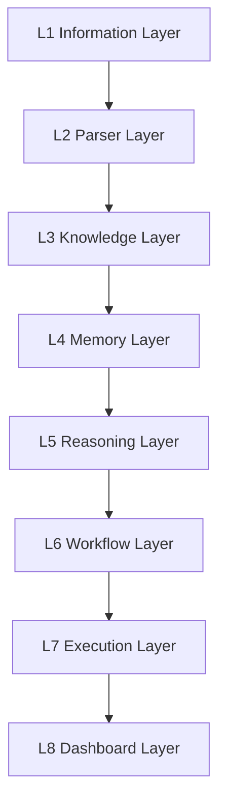

# Howard AIOS Product Vision

> 本文档是 Howard AIOS 的产品愿景蓝图。
> 它定义了 AIOS 是什么、为什么存在、为谁服务、如何解决真实世界的问题。
> 本文档与 [AIOS Constitution v1.0](../Constitution/AIOS-Constitution-v1.0.md) 共同构成 AIOS 的顶层设计。
> Constitution 定义原则，本文档定义产品方向。

版本：v1.0
状态：Active
创建日期：2026-07-07
作者：Howard Zhang

---

## 1. AIOS 是什么

Howard AIOS（Howard Artificial Intelligence Operating System）是一套 Founder Operating System——创始人智能操作系统。

它不是聊天机器人。它不会像 ChatGPT 那样回答一次性问题然后忘记上下文。

它不是知识库。它不会像 Notion 那样只是存放文档和笔记。

它不是办公协作工具。它不会像钉钉那样只做消息和审批。

它不是代码编辑器。它不会像 Cursor 那样帮你写代码。

AIOS 是一个持续运行的智能系统。它接收创始人的所有信息——会议录音、微信消息、邮件、文档、网页、传感器数据——然后将这些信息转化为结构化知识，建立跨实体的关系图谱，提供 AI 驱动的分析和建议，自动执行工作流程，最终通过统一的 Dashboard 让创始人掌控一切。

AIOS 的核心特征是三个「持续」：

- **持续学习**：每一条新信息都让系统变得更聪明。
- **持续思考**：AI 在后台不断分析趋势、识别风险、发现机会。
- **持续执行**：工作流程不需要人工触发，系统自动运转。

用一个比喻：如果 ChatGPT 是一个随时可以提问的顾问，那 AIOS 就是一个全天候运行的智能合伙人——它主动工作，主动学习，主动提醒你。

---

## 2. AIOS 为什么存在

### 2.1 创始人面临的真实困境

今天的创始人同时面临多重挑战：

**信息过载**：创始人每天要处理几十条微信消息、十几封邮件、多个会议、若干文档。信息散落在不同工具中，没有一个统一的地方可以看到"今天发生了什么"。

**知识碎片化**：上个月和客户聊了什么？半年前团队做了什么决策？去年那个项目为什么失败了？这些知识存在于创始人的大脑中，但大脑不是数据库——它会遗忘、会混淆、会丢失。

**决策压力**：创始人需要在信息不完整的情况下快速做出高风险决策。没有人帮他整理所有相关信息，没有人帮他分析历史案例，没有人帮他预测可能的结果。

**执行瓶颈**：会议结束了，待办事项谁来跟踪？项目风险升高了，谁来预警？新员工入职了，谁来传递组织知识？这些执行层面的事情消耗了创始人大量精力。

**多业务协同**：很多创始人同时经营多个业务。每个业务有自己的团队、自己的流程、自己的问题。跨业务的信息关联和战略协同几乎不可能手动完成。

### 2.2 现有工具的局限

市面上没有一个工具能解决上述所有问题：

- 微信、钉钉、飞书是通讯工具，不是智能系统。
- Notion、语雀是文档工具，不是决策引擎。
- ChatGPT、Claude 是问答工具，不是持续运行的操作系统。
- PLAUD、Otter 是会议记录工具，不是知识管理系统。
- Zapier、n8n 是自动化工具，不是 AI 推理平台。

AIOS 的存在，是为了填补这个空白：**一个真正为创始人设计的、以 AI 为核心驱动力的、覆盖信息到决策到执行全链路的智能操作系统。**

---

## 3. Founder 为什么需要 AIOS

创始人需要 AIOS，因为创始人最稀缺的资源不是金钱，而是**注意力和决策质量**。

**注意力保护**：AIOS 自动处理信息归类、待办生成、状态跟踪、风险预警。创始人不需要花时间在"整理信息"上，只需要花时间在"做决策"上。

**决策质量提升**：AIOS 积累了所有历史信息，能够在新决策场景中调取相关背景、历史案例和潜在风险。创始人不再凭直觉做决策，而是基于完整的知识体系。

**知识传承**：创始人的商业洞察、管理经验、人脉关系，这些隐性知识通常只存在于创始人的大脑中。AIOS 将这些知识结构化、持久化，使其成为组织的资产而非个人的记忆。

**时间杠杆**：一个使用 AIOS 的创始人，相当于拥有一个全天候工作的分析团队、一个不会遗忘的知识管理系统、一个自动执行工作流程的自动化引擎。这不是效率提升，这是能力的数量级跃迁。

---

## 4. 企业为什么需要 AIOS

### 4.1 知识是企业最重要的资产

大多数企业的知识散落在员工大脑、邮件、文档、聊天记录中。员工离职，知识流失。项目结束，经验遗失。AIOS 将所有信息持久化、结构化、关联化，让知识真正成为企业资产。

### 4.2 决策速度决定企业竞争力

在信息时代，能够快速做出正确决策的企业胜出。AIOS 通过 Knowledge Engine 和 Reasoning Engine，将分散的信息整合成决策支持视图，让管理层能够在几分钟内看到全局，而非花几天时间手工收集信息。

### 4.3 多团队协作的效率瓶颈

跨部门、跨团队的信息传递通常依赖会议和文档。AIOS 的 Workflow Engine 能够自动将会议结论转化为待办事项，将项目状态同步给所有相关人，将风险信号推送给需要关注的人。减少信息传递的延迟和失真。

### 4.4 中小企业更需要 AI 杠杆

大型企业有专职的战略部门、知识管理部门、数据分析团队。中小企业没有这些资源。AIOS 用 AI 替代了这些职能部门的部分能力，让中小企业也能拥有系统化的知识管理和决策支持。

---

## 5. AIOS 的使命

AIOS 的使命可以用一句话概括：

**让每一个创始人都拥有一个全天候的智能运营系统。**

具体展开：

- **统一信息管理**：将分散在十几个工具中的信息汇聚到一个系统。
- **构建组织知识**：将碎片化的信息转化为结构化的知识图谱。
- **增强人类决策**：用 AI 提供分析和建议，让创始人做出更好的决策。
- **自动化执行**：将重复性工作交给系统，释放创始人的时间。
- **持续进化**：随着使用时间增长，系统越来越理解创始人，越来越智能。

---

## 6. AIOS 的核心价值

### 价值一：信息永不丢失

每条信息进入 AIOS 后永久保存。三个月前的会议录音、半年前的微信消息、去年的邮件——系统都能在几秒内检索到，并关联到当前的决策场景。

### 价值二：知识自动涌现

用户不需要手动整理知识。AIOS 的 Parser Layer 和 Knowledge Layer 自动从原始信息中提取人物、公司、项目、会议、任务、决策等实体，并建立它们之间的关系网络。

### 价值三：决策有据可依

当创始人面临决策时，AIOS 能够自动调取相关的所有背景信息——这个客户的历史互动记录、这个项目的进度和风险、类似场景的历史决策和结果。决策从"拍脑袋"变成"看数据"。

### 价值四：执行自动完成

会议结束，待办自动生成并分配。项目风险升高，预警自动发送。日报周报，自动汇总生成。AIOS 把"知道该做什么"和"实际去做"之间的距离缩短到零。

### 价值五：多业务全局视角

对于同时管理多个公司的创始人，AIOS 提供跨公司的全局视图。不同公司之间的信息关联、资源分配、战略协同，一目了然。

---

## 7. AIOS 的目标用户

### 7.1 创业者

创业者是最需要 AIOS 的群体。他们资源有限、时间紧迫、决策压力大。AIOS 帮助创业者：

- 统一管理多个渠道的信息，不再在微信、邮件、飞书之间来回切换。
- 自动记录会议内容和决策，不再依赖"下次再聊"。
- 获得 AI 驱动的业务分析，弥补没有专职战略团队的短板。

### 7.2 企业老板

中小企业的老板通常身兼数职——管理、销售、财务、人事。AIOS 帮助老板：

- 在一个地方看到所有业务的运营状态。
- 自动跟踪团队的任务完成情况。
- 识别业务风险并提前预警。

### 7.3 CEO

大中型企业的 CEO 需要全局视角和快速决策能力。AIOS 帮助 CEO：

- 将分散在各部门的信息汇聚成统一的决策视图。
- 通过 Knowledge Graph 发现跨部门的关联和机会。
- 通过 Workflow Engine 确保决策能够快速落地执行。

### 7.4 管理团队

C-Level 高管和部门负责人同样受益于 AIOS：

- 自动化的会议记录和待办跟踪。
- 项目进度的实时可视化。
- 基于历史数据的决策支持。

### 7.5 知识工作者

顾问、投资人、自由职业者等知识工作者：

- 将所有客户信息、项目资料、行业洞察集中在一个系统。
- 通过 AI 搜索快速找到历史信息。
- 让 AIOS 自动生成报告、摘要和行动建议。

---

## 8. AIOS 与 ChatGPT 的区别

ChatGPT 是一个通用 AI 问答工具。用户提出问题，ChatGPT 给出回答，对话结束后上下文消失。

AIOS 与 ChatGPT 有本质区别：

**持久记忆 vs 无状态对话**：ChatGPT 每次对话都是全新的开始。AIOS 拥有持久记忆，它能记住三个月前的会议内容、半年前的决策背景、去年的项目状态。

**主动工作 vs 被动回答**：ChatGPT 等待用户提问。AIOS 在后台持续分析数据、识别风险、发现机会，主动向创始人推送洞察。

**个人系统 vs 通用工具**：ChatGPT 对所有用户一视同仁。AIOS 随着使用时间增长，越来越理解创始人的业务、偏好和决策风格。

**全链路 vs 单点能力**：ChatGPT 只负责回答。AIOS 覆盖从信息接收、知识构建、AI 推理、工作流执行到 Dashboard 展示的完整链路。

**多租户 vs 单用户**：ChatGPT 是个人工具。AIOS 支持多租户、多公司、多团队，适合企业级使用。

---

## 9. AIOS 与 Notion 的区别

Notion 是一个文档和项目管理工具。它擅长存储和组织信息，但不理解信息的含义。

AIOS 与 Notion 的核心区别：

**理解 vs 存储**：Notion 存储文档，但不理解文档内容。AIOS 通过 Parser Layer 理解信息，提取实体和关系，构建知识图谱。

**智能 vs 被动**：Notion 等待用户搜索。AIOS 主动推送相关信息、风险预警和行动建议。

**自动化 vs 手动**：Notion 需要用户手动更新状态、手动创建待办。AIOS 的 Workflow Engine 自动完成这些工作。

**AI 原生 vs 传统软件**：Notion 后来添加了 AI 功能。AIOS 从第一天就以 AI 为核心设计——每一层架构都考虑了 AI 的集成。

---

## 10. AIOS 与 PLAUD 的区别

PLAUD 是一个 AI 会议记录设备。它擅长录音和转写，但只覆盖会议这一个场景。

AIOS 与 PLAUD 的关系：

**全场景 vs 单场景**：PLAUD 只处理会议。AIOS 处理所有信息源——会议、微信、邮件、文档、网页、OCR、API。

**知识 vs 记录**：PLAUD 生成会议记录。AIOS 将会议记录转化为知识——提取待办事项、识别决策、关联项目、更新知识图谱。

**持续 vs 离散**：每次 PLAUD 录音是一个独立事件。AIOS 将所有会议记录关联起来，发现跨会议的趋势和模式。

PLAUD 是 AIOS 的重要信息源之一。AIOS 的 Information Engine 原生支持 PLAUD 作为输入源（SourceType: PLAUD），PLAUD 的录音和转写内容进入 AIOS 后，会被 Parser 层进一步处理，最终转化为知识和行动。

---

## 11. AIOS 与 DingTalk AI 的区别

钉钉是阿里巴巴推出的企业协作平台，近年来添加了 AI 功能。

AIOS 与钉钉 AI 的核心区别：

**创始人视角 vs 团队协作视角**：钉钉的设计中心是团队协作——消息、审批、考勤。AIOS 的设计中心是创始人决策——知识、分析、战略。

**跨平台 vs 单平台**：钉钉是封闭生态。AIOS 连接所有平台——微信、企业微信、飞书、邮件、Notion、GitHub，不绑定任何单一生态。

**知识图谱 vs 功能堆砌**：钉钉 AI 是在现有功能上叠加 AI。AIOS 从底层架构就以知识图谱为核心，每一层都在为构建知识服务。

**私有化 vs 平台依赖**：AIOS 的数据完全由用户控制。钉钉的数据在阿里巴巴的服务器上。

---

## 12. AIOS 与 Cursor / Qoder 的区别

Cursor 和 Qoder 是 AI 编程工具。它们帮助开发者更高效地写代码。

AIOS 与编程工具完全不同：

**管理操作系统 vs 代码编辑器**：Cursor/Qoder 解决"怎么写代码"的问题。AIOS 解决"怎么管理公司"的问题。

**创始人 vs 开发者**：Cursor/Qoder 面向程序员。AIOS 面向创始人和管理者。

**全业务 vs 单一领域**：编程工具只覆盖软件开发。AIOS 覆盖企业运营的全部领域——客户、项目、团队、财务、战略。

两者可以互补：AIOS 的 Execution Layer 未来可以通过 MCP（Model Context Protocol）与 Cursor/Qoder 集成，让 AIOS 的工作流能够触发代码生成、代码审查、部署等操作。

---

## 13. AIOS 与 MCP Agent 的关系

MCP（Model Context Protocol）是一种让 AI 模型与外部工具通信的协议。MCP Agent 是基于这个协议构建的智能代理。

AIOS 与 MCP Agent 的关系：

**平台 vs 工具**：AIOS 是一个完整的智能操作系统平台。MCP Agent 是可以被 AIOS 调用的工具。

**集成而非竞争**：AIOS 的 Execution Layer 原生支持 MCP 协议。这意味着 AIOS 可以调用任何 MCP Agent 来完成任务——查询数据库、调用 API、操作文件、生成报告。

**上游 vs 下游**：在 AIOS 的八层架构中，MCP Agent 位于 L7 Execution Layer。它们是 AIOS 的执行手臂，负责完成具体的操作任务。AIOS 的 Reasoning Layer 决定"做什么"，MCP Agent 负责"怎么做"。

---

## 14. AIOS 八层架构理念

AIOS 采用八层架构，每一层有明确的职责边界。信息从底层流入，逐层处理，最终在顶层呈现给创始人。

**L1 Information Layer**：接收和存储所有来源的原始信息。Information Engine 是本层核心。

**L2 Parser Layer**：解析原始信息，提取结构化实体和关系。

**L3 Knowledge Layer**：将实体组织成知识图谱，建立关系网络。

**L4 Memory Layer**：持久化记忆，支持语义搜索和上下文检索。

**L5 Reasoning Layer**：基于知识和记忆进行 AI 推理——分析、预测、建议。

**L6 Workflow Layer**：将推理结果转化为可执行的自动化工作流。

**L7 Execution Layer**：执行具体操作——发送通知、调用 API、更新外部系统。

**L8 Dashboard Layer**：可视化呈现，创始人通过 Dashboard 与系统交互。

详细的架构设计参见 [Architecture.md](../Architecture.md)。

---

## 15. AIOS 的核心能力

### 15.1 Information Engine

Information Engine 是 AIOS 的信息入口。它负责：

- 接收来自所有渠道的原始信息（PLAUD、微信、企业微信、邮件、飞书、文档、OCR、API、Webhook）
- 将原始信息归一化为统一的 Information 格式
- 持久化存储所有信息，确保信息永不丢失
- 为下游 Parser、Knowledge、Memory 层提供标准化数据源

Information Engine 是 AIOS 八层架构中 L1 层的核心实现。它只负责接收和存储，不做解析和推理。

### 15.2 Knowledge Engine

Knowledge Engine 是 AIOS 的知识中枢。它负责：

- 构建和维护 Knowledge Graph——人物、公司、项目、会议、任务、决策之间的关系网络
- 支持复杂的关系查询——"张三参加了哪些会议""这个项目有哪些风险"
- 跨实体的知识关联——发现人物之间、项目之间、公司之间的隐含关系
- 为 Reasoning Engine 提供知识上下文

Knowledge Engine 对应 L3 层。它将 Parser 提取的零散实体组织成有结构、有关系的知识网络。

### 15.3 Memory Engine

Memory Engine 是 AIOS 的长期记忆系统。它负责：

- 将所有信息和知识转化为可检索的记忆
- 支持向量语义搜索——"上次和客户李总聊了什么"
- 为 AI 推理提供上下文——让 Reasoning Engine 能够"回忆"历史信息
- 管理多租户的记忆隔离——A 公司的记忆不会泄露到 B 公司

Memory Engine 对应 L4 层。它是 AI 能够"理解"创始人业务的关键基础设施。

### 15.4 Reasoning Engine

Reasoning Engine 是 AIOS 的智能核心。它负责：

- 基于 Knowledge 和 Memory 进行逻辑推理
- 风险识别和预警——"这个项目进度落后 20%，建议关注"
- 趋势分析——"过去三个月客户投诉增加了 30%"
- 战略建议——"基于当前数据，建议优先进入 X 市场"
- 决策支持——为创始人呈现相关背景、历史案例、可能结果

Reasoning Engine 对应 L5 层。它是 AIOS 区别于其他工具的核心竞争力。

### 15.5 Workflow Engine

Workflow Engine 是 AIOS 的执行编排器。它负责：

- 将事件和推理结果转化为自动化工作流
- 定义工作流的触发条件、执行步骤、通知规则
- 管理工作流的生命周期——创建、暂停、恢复、终止
- 跨工作流的依赖管理和优先级调度

Workflow Engine 对应 L6 层。典型场景：会议结束 → 自动生成待办 → 分配给责任人 → 设置截止日期 → 发送通知。

### 15.6 Application Layer

Application Layer 是 AIOS 的外部接口层。它负责：

- 调用外部 API 和服务
- 执行 MCP Agent 任务
- 发送通知（企业微信、邮件、短信）
- 操作第三方工具（日历、Notion、GitHub）
- 管理连接器和集成

Application Layer 对应 L7 Execution Layer。它是 AIOS 与外部世界交互的执行手臂。

### 15.7 Interface Layer

Interface Layer 是 AIOS 的人机交互层。它负责：

- Founder Dashboard——企业状态、知识图谱、AI 建议、工作流进度
- 移动端聊天入口——通过微信或企业微信与 AIOS 对话
- 报告和可视化——自动生成日报、周报、月报
- 设置和配置——管理信息源、工作流、权限

Interface Layer 对应 L8 Dashboard Layer。它是创始人看到和使用 AIOS 的唯一入口。

---

## 16. AIOS 能解决哪些问题

以下是 AIOS 能解决的典型场景，涵盖信息管理、知识构建、决策支持和自动化执行四大类别。

### 信息管理类

**场景 1：跨平台信息聚合**
创始人在微信收到客户消息，在邮件收到合同，在 PLAUD 录制了会议，在飞书收到了项目报告。AIOS 将所有信息自动汇入一个系统，创始人不再需要在五个 APP 之间来回切换。

**场景 2：历史信息的精准检索**
创始人需要找到"三个月前和某客户讨论过的定价方案"。AIOS 通过语义搜索，在几秒内定位到相关信息——无论它最初来自微信、邮件还是会议录音。

**场景 3：会议内容的自动归档**
每次会议结束后，PLAUD 录音自动转写并进入 AIOS。系统自动提取参会人、讨论议题、决策事项和待办任务，归档到对应的项目和人员下。

**场景 4：文档的智能管理**
合同、报告、PPT、Excel——各种格式的文档进入 AIOS 后，系统自动提取关键信息（金额、日期、责任人、风险条款），建立文档之间的关联关系。

**场景 5：信息去重和冲突检测**
不同来源的信息可能重复甚至矛盾。AIOS 自动识别重复信息，标记矛盾内容，帮助创始人快速定位需要确认的事项。

### 知识构建类

**场景 6：自动构建人脉图谱**
AIOS 从所有交互中自动识别人物，建立人脉关系图——"张三认识李四，李四在王五的公司工作，王五是我们客户的股东"。

**场景 7：项目知识的自动积累**
项目从立项到结项的所有信息——会议、邮件、文档、任务——自动汇聚成项目知识库。新项目启动时，可以参考历史项目的经验。

**场景 8：客户 360 度视图**
对于每个客户，AIOS 自动汇总所有互动记录——会议、邮件、合同、付款、投诉、反馈——形成完整的客户画像。

**场景 9：组织知识的传承**
员工离职时，其与项目、客户、会议相关的所有知识保留在 AIOS 中。新员工可以通过 AIOS 快速了解历史背景和关系网络。

**场景 10：跨公司知识关联**
创始人管理多个公司时，AIOS 能够发现跨公司的知识关联——"A 公司的供应商也是 B 公司的潜在客户"。

### 决策支持类

**场景 11：会议决策追踪**
AIOS 自动追踪每次会议的决策事项——谁做了什么决策、基于什么背景、执行情况如何。三个月后可以回顾："这个决策的效果如何？"

**场景 12：风险预警**
AIOS 分析项目进度、客户互动、财务数据，主动识别风险信号——"项目 X 的进度落后 25%，按当前趋势可能延迟两周"。

**场景 13：投资决策支持**
考虑投资一个新项目时，AIOS 调取所有相关信息——行业趋势、竞争对手、团队能力、历史投资回报——帮助创始人做出更理性的判断。

**场景 14：人才招聘决策**
面试结束后，AIOS 整合面试官反馈、候选人历史、岗位需求，生成结构化的评估报告，辅助招聘决策。

**场景 15：战略复盘**
季度末，AIOS 自动生成战略复盘报告——本季度的目标完成情况、关键决策回顾、市场环境变化、下季度建议。

### 自动化执行类

**场景 16：会议待办自动分配**
会议结束，AIOS 自动提取待办事项，分配给责任人，设置截止日期，发送通知，并持续跟踪完成进度。

**场景 17：日报周报自动汇总**
AIOS 自动汇总本周的会议记录、任务完成情况、项目进展，生成周报发送给管理层。

**场景 18：客户跟进自动提醒**
基于客户互动历史，AIOS 自动设置跟进提醒——"距离上次和张三沟通已经两周，建议主动联系"。

**场景 19：合同到期自动预警**
AIOS 从合同文档中提取到期日期，在到期前自动发送预警，避免合同续签遗漏。

**场景 20：跨团队信息同步**
当项目 A 的状态发生变化时，AIOS 自动通知所有相关方——团队成员收到任务更新，管理层收到进度报告，客户收到状态通知。

**场景 21：日程智能管理**
AIOS 分析创始人的日程和会议安排，识别冲突、建议调整、自动发送会议邀请和准备材料。

**场景 22：新人入职自动化**
新员工入职时，AIOS 自动推送相关项目资料、团队成员介绍、组织规范和历史文档，加速融入。

**场景 23：多公司状态日报**
对于管理多个公司的创始人，AIOS 每天自动生成跨公司的综合状态日报——各公司的关键指标、风险事项、待处理决策。

---

## 17. AIOS 五年发展路线

### Year 1 — Foundation（基础建设）

目标：建立完整的技术基础设施和信息输入管道。

关键里程碑：

- TypeScript Monorepo 架构就绪
- 数据库 Schema 和多租户模型完成
- Information Engine 上线，支持 10 种信息源
- Parser Layer 基础版上线，支持文本和文档解析
- 基础 CRUD API 和权限体系
- 单元测试和集成测试覆盖

### Year 2 — MVP（最小可行产品）

目标：实现核心信息流管道，让创始人开始使用。

关键里程碑：

- PLAUD 连接器上线——会议录音自动进入 AIOS
- 企业微信连接器上线——消息和对话自动同步
- Knowledge Engine 基础版——自动提取实体和关系
- Memory Engine 基础版——语义搜索和历史检索
- 移动端聊天入口——通过微信与企业微信与 AIOS 交互
- Founder Dashboard 基础版——信息流、待办、搜索

### Year 3 — Version 1（正式版本）

目标：完整的知识管理和决策支持能力。

关键里程碑：

- Knowledge Graph 成熟——支持复杂关系查询和可视化
- Reasoning Engine 上线——风险分析、趋势预测、战略建议
- Workflow Engine 基础版——会议待办自动分配、跟进提醒
- 邮件连接器上线——自动分类和摘要
- OCR 连接器上线——图片和扫描件识别
- Dashboard 进阶版——知识图谱可视化、AI 建议面板

### Year 4 — Version 2（增强版本）

目标：全面的自动化执行和跨平台协同。

关键里程碑：

- Execution Layer 上线——MCP Agent 集成、第三方 API 调用
- Workflow Engine 成熟——复杂工作流编排、条件分支、错误处理
- 飞书连接器上线
- 钉钉连接器上线
- 自动化报告生成——日报、周报、月报
- 跨公司分析和协同功能
- 移动端原生 APP

### Year 5 — Enterprise（企业级）

目标：从个人工具发展为企业级平台。

关键里程碑：

- 多用户权限体系成熟——团队级别的访问控制
- 组织知识库——团队共享的知识和经验
- AI Agent 市场——可定制、可交易的 AI Agent
- API 开放平台——第三方开发者可以构建 AIOS 插件
- 安全审计和合规认证
- 企业级 SLA 和支持体系

### Year 6+ — AI Organization（AI 组织）

目标：从工具进化为智能组织的基础设施。

关键里程碑：

- AI Agent 自主管理日常运营
- 跨组织的知识共享和协同
- AI 辅助的组织和战略设计
- 预测性管理——系统预判需求并提前准备

### Year 7+ — Digital Founder（数字创始人）

目标：实现 Founder Digital Twin。

关键里程碑：

- AIOS 深度理解创始人的思维模式和决策风格
- 在创始人不在时能够维持系统的正常运转
- 在创始人在场时提供最优建议和替代方案
- 成为创始人不可替代的智能伙伴

---

## 18. AIOS 长期愿景

AIOS 的最终目标是成为 **Founder AI Operating System**——创始人的 AI 操作系统。

这不是一个工具。这是一个与创始人共同成长的智能系统。

**第一年**，它是一个信息收集器。创始人把所有信息扔进去，系统帮你保存和整理。

**第二年**，它是一个知识管理器。系统开始理解你的业务，记住你的客户、项目和团队。

**第三年**，它是一个决策顾问。系统主动告诉你风险、机会和建议。

**第四年**，它是一个执行伙伴。系统自动处理日常事务，让你专注于真正重要的事情。

**第五年**，它是你的数字孪生。系统理解你的思维方式，能够在某些场景下代替你做出合理的判断。

最终，AIOS 不只是一个产品。它是创始人经营生涯中积累的所有知识、关系、经验和决策逻辑的载体。它的价值随着使用时间的增长而指数级增长。

一个使用了五年的 AIOS，比任何顾问都更了解你的业务。
一个使用了十年的 AIOS，就是你自己的数字分身。

这就是 AIOS 的长期愿景：**让每一个创始人都拥有一个永不消失、永不遗忘、永不停歇的智能伙伴。**

---

> 本 Vision 文档与 [AIOS Constitution v1.0](../Constitution/AIOS-Constitution-v1.0.md) 保持一致。
> 如需更新本文档，请确保变更与 Constitution 的核心原则不冲突。
> 修改本文档需在 CHANGELOG.md 中记录。
