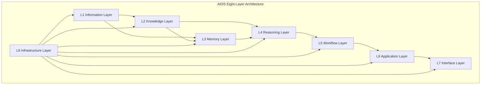
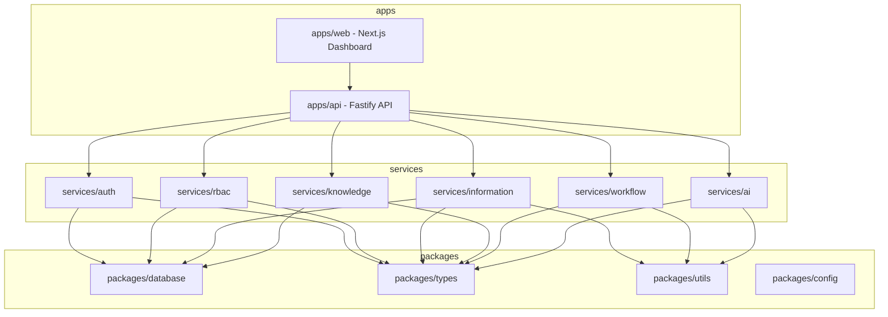
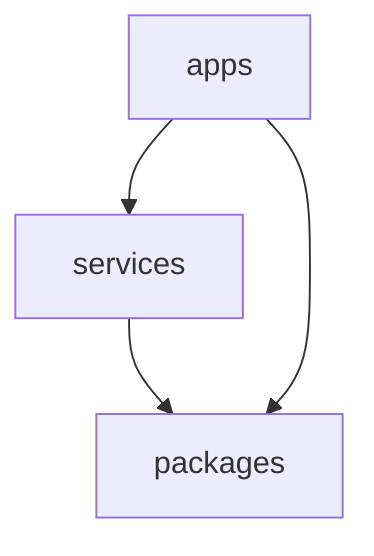
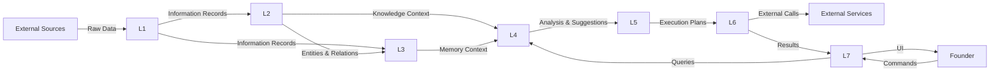

# Howard AIOS Architecture Blueprint

> 本文档是 Howard AIOS 架构的详细技术蓝图。
> 它定义了系统的分层结构、模块边界、依赖规则和数据流。
> 本文档与 [AIOS Constitution v1.0](../Constitution/AIOS-Constitution-v1.0.md) 和 [AIOS Vision](./00-Vision.md) 共同构成 AIOS 的完整设计体系。
> Constitution 定义原则，Vision 定义方向，本文档定义结构。

版本：v1.0
状态：Active
创建日期：2026-07-07
作者：Howard Zhang

---

## 1. Overview

Howard AIOS（Howard Artificial Intelligence Operating System）是一套面向创始人的 AI 智能操作系统。它从所有渠道接收信息，将信息转化为结构化知识，通过 AI 推理提供决策支持，并自动执行工作流程。

本文档从技术角度详细描述 AIOS 的架构设计。它涵盖系统分层、模块职责、数据边界、依赖规则、部署策略和未来演进方向。

本文档的目标读者是 AIOS 的开发团队和架构审查者。阅读完本文档后，读者应当能够理解：

- AIOS 的整体架构由哪些层组成
- 每一层的职责、输入、输出和边界
- 模块之间的依赖关系和通信方式
- 为什么选择当前的架构风格
- 系统如何随项目演进

---

## 2. Why AIOS Architecture

### 2.1 架构的核心目标

AIOS 的架构必须服务于一个核心目标：**把所有输入变成长期知识，把长期知识变成智能决策，把智能决策变成自动执行。**

这个目标决定了架构的三个基本需求：

**信息流必须连续**：从原始信息到知识，从知识到推理，从推理到执行——数据流不能在中间断裂。每一层必须是前一层的自然延续。

**系统必须可扩展**：今天可能只有 PLAUD 和企业微信两个信息源，明天可能有二十个。架构必须支持在不修改核心逻辑的情况下添加新的输入源、新的处理能力和新的输出通道。

**AI 必须是一等公民**：AI 不是附加在现有系统上的功能，而是系统的核心驱动力。每一层的设计都必须考虑 AI 的集成点，从信息解析到知识构建到推理决策到自动执行。

### 2.2 架构选型的关键考量

**为什么不用微服务？**

微服务架构适合大规模团队和需要独立部署的大型系统。AIOS 在当前阶段是一个由少数开发者构建的系统，微服务会引入不必要的复杂性：分布式事务、服务发现、网络通信开销、运维成本。过早采用微服务是创业项目的常见陷阱。

**为什么不用单体？**

传统单体架构将所有代码打包成一个应用，模块边界模糊，依赖关系混乱，难以维护和扩展。AIOS 需要处理多种不同类型的工作负载（信息解析、AI 推理、工作流执行），将它们混在一个代码库中会导致耦合过紧。

**为什么选择 Modular Monolith？**

AIOS 采用 **Modular Monolith**（模块化单体）架构：所有模块在同一个仓库中，共享同一个部署单元，但通过严格的模块边界和依赖规则保持松耦合。这种架构兼具单体的简单部署和微服务的模块独立性。

Modular Monolith 的优势：

- **原子变更**：跨模块修改在一个 PR 中完成，无需协调多服务版本。
- **简单部署**：一个 Docker 镜像，一个进程，无需服务发现或负载均衡。
- **类型安全**：TypeScript 类型在模块之间直接共享，无需 API 契约或代码生成。
- **渐进演进**：当某个模块真正需要独立部署时，可以将其提取为独立服务，而无需大规模重构。

### 2.3 架构风格融合

AIOS 融合了三种架构风格：

**Event Driven（事件驱动）**：每条信息的创建、更新、删除都是事件。事件触发下游处理管道。层与层之间通过事件通信，而非直接函数调用。

**Domain Driven（领域驱动）**：每个层对应一个明确的业务领域。模块按领域边界划分，而非按技术层级划分。

**AI Native（AI 原生）**：AI 不是后加的功能。每一层从设计之初就考虑了 AI 的集成点，从信息解析的 NLP 模型到知识图谱的实体识别到推理层的大语言模型。

---

## 3. Overall Architecture

AIOS 采用八层架构。信息从底层流入，逐层处理，最终在顶层呈现给创始人。

每一层有明确的职责边界。层与层之间通过定义良好的接口和事件进行通信。Infrastructure Layer 横切所有层，提供基础设施支撑。

---

## 4. Layer 1 — Information Layer

### 职责

Information Layer 是 AIOS 的信息入口层。它负责接收、归一化和存储所有来源的原始信息。本层是系统的数据源头——没有 Information Layer，就没有后续的知识构建和 AI 推理。

Information Layer 的核心职责：

- 接收来自所有渠道的原始信息（PLAUD、微信、企业微信、邮件、飞书、文档、OCR、API、Webhook）
- 将不同格式的信息归一化为统一的 Information 记录
- 持久化存储所有信息，确保信息永不丢失
- 为下游层提供标准化的数据访问接口
- 管理信息的生命周期状态（RECEIVED → NORMALIZED → STORED → ARCHIVED）

### 输入

Information Layer 接受以下类型的输入：

- **连接器推送**：来自第三方平台连接器的原始数据（微信消息、邮件内容、飞书文档）
- **API 调用**：通过 REST API 提交的结构化信息
- **Webhook 事件**：外部系统通过 Webhook 推送的事件数据
- **文件上传**：文档、图片、音频、视频等文件的直接上传
- **手动录入**：用户通过 Dashboard 手动输入的信息

所有输入必须包含来源标识（SourceType），确保信息的可追溯性。

### 输出

Information Layer 向下游层提供：

- **标准化 Information 记录**：统一格式的 Information 实体，包含来源、内容、状态、时间戳
- **信息创建事件**：每条新信息创建时发出的事件通知，触发下游 Parser 和 Knowledge 层处理
- **分页查询接口**：支持按来源、状态、时间范围的分页检索
- **原始数据访问**：保留原始 Payload，供 Parser 层进行深度解析

### 生命周期

Information 记录经历四个生命周期阶段：

- **RECEIVED**：信息刚刚被接收，尚未处理
- **NORMALIZED**：信息已完成格式归一化
- **STORED**：信息已持久化并建立了索引
- **ARCHIVED**：信息已归档，不再活跃但仍可检索

### 数据边界

Information Layer 的数据边界：

- 只存储原始信息和归一化后的信息
- 不做实体提取（由 Knowledge Layer 负责）
- 不做语义分析（由 Memory Layer 负责）
- 不做推理和决策（由 Reasoning Layer 负责）

Prisma 模型：`Information`（包含 title、content、sourceType、sourceDetail、rawPayload、status 等字段）。

枚举类型：`SourceType`（MANUAL、WECHAT、DINGTALK、FEISHU、EMAIL、PLAUD、FILE、OCR、API、WEBHOOK）、`InformationStatus`（RECEIVED、NORMALIZED、STORED、ARCHIVED）。

### 可扩展性

Information Layer 通过 SourceType 枚举实现信息源的可扩展性。添加新的信息源只需要：

1. 在 SourceType 枚举中添加新值
2. 创建对应的连接器（位于 `connectors/` 目录）
3. 连接器负责将外部数据转化为 Information 记录

当前已实现：`services/information/`，提供完整的 CRUD API、Repository 层、Service 层和单元测试。

### 未来规划

- 实现连接器 SDK，标准化连接器开发流程
- 支持批量信息导入和流式信息接收
- 添加信息去重和冲突检测机制
- 实现信息优先级排序，确保重要信息优先处理

---

## 5. Layer 2 — Knowledge Layer

### 职责

Knowledge Layer 是 AIOS 的知识中枢。它负责从 Information 中提取结构化实体，构建知识图谱，建立实体之间的关系网络。

Knowledge Layer 的核心职责：

- 从 Information 中识别和提取实体（人物、公司、项目、会议、任务、决策）
- 建立实体之间的关系（张三属于 A 公司、B 项目由李四负责、C 会议产生了 D 决策）
- 维护 Knowledge Graph 的一致性和完整性
- 提供关系查询能力——"张三参加了哪些会议""这个项目有哪些风险"
- 支持跨实体的知识关联和发现

### 输入

Knowledge Layer 接受以下输入：

- **Information 记录**：来自 Information Layer 的标准化信息
- **Parser 处理结果**：从原始信息中提取的实体和关系
- **人工标注**：用户通过 Dashboard 手动创建的实体和关系
- **外部数据导入**：从 CRM、ERP 等系统导入的结构化数据

### 输出

Knowledge Layer 向下游层提供：

- **Knowledge Graph 查询接口**：支持实体搜索、关系查询、路径发现
- **知识更新事件**：实体或关系变更时发出的事件
- **上下文数据**：为 Reasoning Layer 提供决策所需的知识上下文
- **统计视图**：实体数量、关系密度、知识覆盖度等指标

### 生命周期

Knowledge 实体的生命周期：

- **CREATED**：实体首次被创建
- **ENRICHED**：实体信息被后续数据丰富
- **LINKED**：实体与其他实体建立了关系
- **ACTIVE**：实体处于活跃状态
- **ARCHIVED**：实体不再活跃但保留在图谱中

### 数据边界

Knowledge Layer 的数据边界：

- 存储结构化实体和关系，不存储原始信息
- 存储关系图谱，不存储语义向量（由 Memory Layer 负责）
- 提供查询接口，不提供推理能力（由 Reasoning Layer 负责）

Prisma 模型：`User`、`Organization`、`Meeting`、`Task`、`Decision`、`Document`、`Message`。

枚举类型：`UserRole`（FOUNDER、ADMIN、MEMBER、VIEWER）、`TaskStatus`（TODO、IN_PROGRESS、DONE、CANCELLED）、`TaskPriority`（LOW、MEDIUM、HIGH、CRITICAL）、`DecisionStatus`（PROPOSED、DISCUSSED、DECIDED、ARCHIVED）。

### 可扩展性

Knowledge Layer 的可扩展性体现在：

- 新实体类型通过 Prisma Schema 扩展，自动生成类型和迁移
- 新关系类型通过 Prisma 关联定义
- 查询接口基于 Repository 模式，可以替换底层实现（例如从 PostgreSQL 迁移到图数据库）

当前已实现：Prisma Schema 定义了核心实体模型。`services/knowledge/` 为骨架服务，待后续 Sprint 实现完整功能。

### 未来规划

- 实现 Knowledge Graph 引擎，支持复杂关系查询和路径发现
- 引入向量数据库（Qdrant）支持实体嵌入和语义搜索
- 实现实体消歧和合并——识别不同信息中的同一实体
- 支持知识版本控制——追踪实体属性的历史变化
- 构建跨公司知识关联能力

---

## 6. Layer 3 — Memory Layer

### 职责

Memory Layer 是 AIOS 的长期记忆系统。它将信息和知识转化为可检索的记忆，支持语义搜索和上下文管理，为 AI 推理提供历史上下文。

Memory Layer 的核心职责：

- 将 Information 和 Knowledge 转化为持久化记忆
- 支持向量语义搜索——"上次和客户李总聊了什么"
- 管理记忆的组织结构——按时间、主题、实体组织
- 为 Reasoning Layer 提供上下文——让 AI 能够"回忆"历史信息
- 管理多租户的记忆隔离——A 公司的记忆不会泄露到 B 公司

### 输入

Memory Layer 接受以下输入：

- **Information 记录**：来自 Information Layer 的原始和归一化信息
- **Knowledge 实体**：来自 Knowledge Layer 的结构化实体和关系
- **AI 推理结果**：来自 Reasoning Layer 的分析和建议（记忆 AI 的输出）
- **用户标注**：用户手动创建的记忆条目和标签

### 输出

Memory Layer 向下游层提供：

- **语义搜索接口**：基于向量相似度的记忆检索
- **上下文包**：为特定查询或推理任务组装的上下文数据
- **记忆更新事件**：新记忆创建或现有记忆更新时的通知
- **记忆统计**：记忆数量、覆盖范围、检索频率

### 生命周期

Memory 记录的生命周期：

- **CREATED**：记忆首次被创建
- **INDEXED**：记忆已完成向量嵌入和索引
- **ACTIVE**：记忆处于活跃检索状态
- **DECAYED**：记忆因长时间未被访问而降低优先级
- **ARCHIVED**：记忆已归档，仅在显式查询时返回

### 数据边界

Memory Layer 的数据边界：

- 存储记忆记录和向量嵌入，不存储原始信息
- 存储语义索引，不存储关系图谱（由 Knowledge Layer 负责）
- 提供检索能力，不提供推理能力（由 Reasoning Layer 负责）

Prisma 模型：`Memory`（包含 content、source、tags、embedding 等字段）。每条 Memory 必须关联 Organization，确保多租户隔离。

### 可扩展性

Memory Layer 的可扩展性：

- 向量维度通过 Prisma 的 Float[] 类型支持，可对接 Qdrant 等专业向量数据库
- 记忆来源可扩展——任何层的数据都可以转化为记忆
- 标签系统支持自定义分类
- 未来可引入分层记忆——短期记忆（工作上下文）、中期记忆（近期交互）、长期记忆（历史知识）

当前已实现：Prisma Schema 定义了 Memory 模型，包含 embedding 字段和 tags 数组。`memory/` 目录为占位，待后续 Sprint 实现。

### 未来规划

- 实现 Memory Engine，提供完整的记忆创建、检索、更新、归档能力
- 集成 Qdrant 向量数据库，实现高性能语义搜索
- 实现记忆衰减机制——自动降低长期未访问记忆的优先级
- 实现上下文组装器——根据推理任务自动收集相关记忆
- 支持跨记忆关联——发现不同记忆之间的隐含联系

---

## 7. Layer 4 — Reasoning Layer

### 职责

Reasoning Layer 是 AIOS 的智能核心。它基于 Knowledge 和 Memory 提供的上下文，执行逻辑推理——分析趋势、识别风险、提供建议、预测结果。

Reasoning Layer 的核心职责：

- 基于知识图谱和记忆进行逻辑推理
- 风险识别和预警——"项目 X 进度落后 20%，建议关注"
- 趋势分析——"过去三个月客户投诉增加了 30%"
- 战略建议——"基于当前数据，建议优先进入 X 市场"
- 决策支持——为创始人呈现相关背景、历史案例、可能结果
- 多 Agent 协同——支持多个 AI Agent 协同完成复杂推理任务

### 输入

Reasoning Layer 接受以下输入：

- **Knowledge Graph 上下文**：来自 Knowledge Layer 的实体、关系和统计数据
- **Memory 上下文**：来自 Memory Layer 的历史记忆和语义搜索结果
- **用户查询**：创始人通过 Dashboard 或聊天接口提出的具体问题
- **事件触发**：特定事件（如项目状态变更、新客户创建）触发的自动分析

### 输出

Reasoning Layer 向下游层提供：

- **分析结果**：结构化的分析报告，包含数据、趋势、洞察
- **建议**：针对特定问题的行动建议，附带置信度和推理路径
- **预警**：识别到的风险和异常，附带严重程度和建议措施
- **推理日志**：完整的推理过程记录，满足可解释性要求
- **工作流建议**：建议触发的自动化工作流，传递给 Workflow Layer

### 生命周期

Reasoning 任务的生命周期：

- **TRIGGERED**：推理任务被触发（用户查询或事件驱动）
- **CONTEXT_GATHERED**：已收集所需的知识和记忆上下文
- **PROCESSING**：正在执行推理计算
- **COMPLETED**：推理完成，结果已生成
- **DELIVERED**：结果已传递给用户或下游系统

### 数据边界

Reasoning Layer 的数据边界：

- 读取 Knowledge 和 Memory 数据，不修改它们
- 生成分析结果和建议，不直接执行操作（由 Workflow Layer 负责）
- 推理过程必须可解释，不允许黑箱输出
- AI 调用必须可插拔，不绑定单一 LLM 供应商

当前已实现：`services/ai/` 为骨架服务，待后续 Sprint 实现完整推理能力。

### 可扩展性

Reasoning Layer 的可扩展性：

- LLM 提供者通过抽象接口支持多供应商（OpenAI、Claude、Gemini）
- 推理策略可配置——不同场景使用不同的推理方法
- 支持推理缓存——相似查询复用已有结果
- 支持多 Agent 编排——多个专用 Agent 协同完成复杂推理

### 未来规划

- 实现 Reasoning Engine，提供完整的推理 API
- 实现推理链（Chain of Reasoning）——复杂问题分步推理
- 实现反馈学习——根据用户对建议的采纳情况优化推理模型
- 实现跨公司推理——在多个公司之间发现模式和机会
- 构建推理结果的可解释性框架

---

## 8. Layer 5 — Workflow Layer

### 职责

Workflow Layer 是 AIOS 的执行编排器。它将事件和推理结果转化为可执行的自动化工作流，管理流程的生命周期。

Workflow Layer 的核心职责：

- 定义和管理自动化工作流
- 将事件和推理结果转化为具体的执行计划
- 管理工作流的触发条件、执行步骤和通知规则
- 管理工作流的生命周期——创建、暂停、恢复、终止
- 跨工作流的依赖管理和优先级调度
- 工作流执行状态追踪和异常处理

### 输入

Workflow Layer 接受以下输入：

- **事件**：来自各层的系统事件（信息创建、知识更新、风险预警）
- **Reasoning 输出**：来自 Reasoning Layer 的建议和工作流触发建议
- **用户指令**：创始人通过 Dashboard 手动创建或触发的工作流
- **定时任务**：基于时间调度的周期性工作流（日报、周报、月报）

### 输出

Workflow Layer 向下游层提供：

- **执行计划**：传递给 Application Layer 的具体执行指令
- **工作流状态**：每个工作流的当前状态和进度
- **执行日志**：工作流执行过程的完整记录
- **通知事件**：需要通知用户或外部系统的事件

### 生命周期

Workflow 的生命周期：

- **DEFINED**：工作流已定义，等待触发
- **TRIGGERED**：触发条件已满足，进入执行队列
- **RUNNING**：工作流正在执行
- **WAITING**：等待外部输入或人工确认
- **COMPLETED**：工作流执行完成
- **FAILED**：工作流执行失败
- **CANCELLED**：工作流被手动取消

### 数据边界

Workflow Layer 的数据边界：

- 管理流程定义和执行状态，不直接操作外部系统（由 Application Layer 负责）
- 编排执行顺序，不执行具体操作
- 记录执行日志，不存储业务数据

当前已实现：`services/workflow/` 为骨架服务，`workflows/` 目录为工作流定义的占位。

### 可扩展性

Workflow Layer 的可扩展性：

- 工作流通过声明式定义，支持 DSL 或 JSON 配置
- 支持条件分支、并行执行、错误重试
- 支持工作流模板——常见场景预定义模板
- 支持工作流版本管理——平滑升级正在运行的工作流

### 未来规划

- 实现完整的 Workflow Engine，支持 DAG（有向无环图）编排
- 实现人工审批节点——特定步骤需要人类确认后继续执行
- 实现工作流可视化编辑器——拖拽式创建工作流
- 实现工作流分析——识别瓶颈、优化执行路径
- 支持跨组织工作流——多个公司之间的协同流程

---

## 9. Layer 6 — Application Layer

### 职责

Application Layer 是 AIOS 的外部接口层。它负责调用外部 API、执行 MCP Agent 任务、发送通知、操作第三方工具。它是 AIOS 与外部世界交互的执行手臂。

Application Layer 的核心职责：

- 执行 Workflow Layer 定义的具体操作
- 调用外部 API 和服务（企业微信 API、邮件服务、日历服务）
- 管理 MCP Agent 的执行——通过 Model Context Protocol 与外部工具通信
- 发送通知（企业微信消息、邮件、短信、推送通知）
- 操作第三方工具（更新 Notion 页面、创建 GitHub Issue、更新日历事件）
- 管理连接器的生命周期和认证

### 输入

Application Layer 接受以下输入：

- **执行指令**：来自 Workflow Layer 的具体执行计划
- **API 请求**：来自 Interface Layer 的用户操作
- **系统事件**：需要外部通知的系统事件

### 输出

Application Layer 提供：

- **执行结果**：每个操作的执行结果和状态
- **外部数据**：从外部系统获取的数据，传递给 Information Layer
- **通知送达确认**：通知是否成功送达的反馈
- **错误报告**：执行失败的详细错误信息

### 生命周期

Application 操作的生命周期：

- **QUEUED**：操作已入队，等待执行
- **EXECUTING**：正在调用外部服务
- **COMPLETED**：操作成功完成
- **FAILED**：操作失败（可重试或不可重试）
- **RETRYING**：操作失败后进入重试

### 数据边界

Application Layer 的数据边界：

- 执行外部操作，不存储业务数据
- 管理连接器配置和认证信息
- 记录操作日志用于审计
- 不直接访问 Knowledge 或 Memory（通过 Workflow 编排）

当前已实现：`connectors/` 目录为连接器的占位目录。MCP 集成待后续 Sprint 实现。

### 可扩展性

Application Layer 的可扩展性：

- 每个外部服务对应一个连接器，连接器实现统一接口
- MCP Agent 通过标准协议通信，支持动态注册新的 Agent
- 操作队列支持优先级和并发控制
- 支持操作幂等性——重试不会导致重复执行

### 未来规划

- 实现 PLAUD 连接器——会议录音自动同步
- 实现企业微信连接器——消息和对话同步
- 实现邮件连接器——IMAP/SMTP 集成
- 实现 MCP 集成层——统一的 Agent 调用接口
- 构建连接器市场和 SDK

---

## 10. Layer 7 — Interface Layer

### 职责

Interface Layer 是 AIOS 的人机交互层。它是创始人看到和使用 AIOS 的唯一入口。本层负责呈现数据、接收用户输入、提供可视化界面。

Interface Layer 的核心职责：

- 提供 Founder Dashboard——企业状态、知识图谱、AI 建议、工作流进度
- 提供移动端聊天入口——通过微信或企业微信与 AIOS 对话
- 生成报告和可视化——日报、周报、月报
- 管理用户设置和偏好——信息源配置、通知规则、权限管理
- 提供搜索界面——全系统语义搜索和结构化查询

### 输入

Interface Layer 接受以下输入：

- **用户操作**：用户在界面上的点击、输入、导航操作
- **查询请求**：用户的搜索和查询请求
- **系统状态**：来自所有层的实时状态数据

### 输出

Interface Layer 提供：

- **可视化界面**：Dashboard、报告、图表
- **用户指令**：传递给下层处理的用户操作和查询
- **实时通知**：推送给用户的提醒和预警
- **交互反馈**：用户对 AI 建议的采纳或拒绝反馈

### 生命周期

Interface 会话的生命周期：

- **INITIALIZED**：用户打开界面，建立会话
- **ACTIVE**：用户正在与系统交互
- **IDLE**：用户暂停交互，系统保持会话
- **TERMINATED**：用户关闭界面或会话超时

### 数据边界

Interface Layer 的数据边界：

- 呈现数据，不存储业务数据
- 发送用户指令，不直接操作数据库
- 展示 AI 结果，不执行 AI 推理
- 管理 UI 状态，不管理业务状态

当前已实现：`apps/web/` 基于 Next.js 15 的骨架应用，包含基础布局和首页。

### 可扩展性

Interface Layer 的可扩展性：

- 基于 Next.js 的组件化架构，支持快速添加新页面和功能
- 响应式设计，支持桌面和移动端
- 支持主题和自定义布局
- 未来可扩展为 PWA 或原生 APP

### 未来规划

- 实现完整的 Founder Dashboard
- 实现知识图谱可视化——交互式关系图
- 实现 AI 对话界面——自然语言交互
- 实现报告生成器——自定义报告模板
- 实现实时推送——WebSocket 或 SSE 支持

---

## 11. Layer 8 — Infrastructure Layer

### 职责

Infrastructure Layer 横切所有层，提供基础设施支撑。它不是业务流程中的一环，而是所有层共享的基础能力。

Infrastructure Layer 的核心职责：

- **数据库管理**：PostgreSQL + Prisma 的数据持久化
- **认证与授权**：用户认证、多租户隔离、角色权限控制（RBAC）
- **日志与监控**：结构化日志、健康检查、性能指标
- **配置管理**：环境变量、功能开关、运行时配置
- **部署与运维**：Docker 容器化、CI/CD 管道、健康检查

### 输入

Infrastructure Layer 接受所有层的基础设施需求：

- 数据库读写请求
- 认证和授权检查
- 日志记录请求
- 配置查询

### 输出

Infrastructure Layer 向所有层提供：

- **数据访问**：通过 Prisma Client 提供类型安全的数据库访问
- **认证上下文**：当前用户身份、角色、组织信息
- **日志通道**：统一的日志记录接口
- **配置值**：运行时配置和开关

### 生命周期

基础设施组件的生命周期与系统整体生命周期一致——从系统启动到系统关闭持续运行。

### 数据边界

Infrastructure Layer 的数据边界：

- 管理基础设施配置，不管理业务数据
- 提供认证上下文，不做业务逻辑判断
- 记录系统日志，不记录业务日志

Prisma 模型：`Organization`（多租户基础）、`User`（认证基础）。

枚举类型：`UserRole`（FOUNDER、ADMIN、MEMBER、VIEWER）。

当前已实现：

- `packages/database/`：Prisma Schema + PostgreSQL 配置
- `services/auth/`：认证服务骨架
- `services/rbac/`：RBAC 服务骨架
- `docker/`：Dockerfile + docker-compose

### 可扩展性

Infrastructure Layer 的可扩展性：

- 数据库通过 Prisma Migration 支持 Schema 演进
- 认证服务支持多种策略（JWT、OAuth、SSO）
- 日志系统支持多种输出（控制台、文件、外部服务）
- 部署支持从单机 Docker 到 Kubernetes 集群的平滑过渡

### 未来规划

- 实现完整的认证流程（JWT 令牌、刷新令牌、会话管理）
- 实现 RBAC 权限模型（角色、权限、资源三级控制）
- 引入 Redis 缓存层，提升高频查询性能
- 实现健康检查和自动恢复
- 引入 Kubernetes 编排，支持水平扩展

---

## 12. Monorepo Architecture

AIOS 采用 pnpm workspace + Turbo 的 Monorepo 架构。整个代码库按职责划分为以下目录：

### apps/

应用层，包含可直接运行的应用：

- **apps/api**：Fastify API 服务。所有 HTTP 接口在此定义，路由注册、请求验证、响应格式化。API 是 services 的薄封装层，不包含业务逻辑。
- **apps/web**：Next.js 前端应用。Founder Dashboard 的实现，提供可视化界面和用户交互。

### packages/

共享包层，提供跨服务复用的基础能力：

- **packages/database**：Prisma ORM + PostgreSQL Schema。所有数据模型在此定义，通过 `prisma generate` 生成类型安全的 Client。
- **packages/types**：共享 TypeScript 类型。仅存放业务级共享类型（ApiResponse、Paginated 等），不定义与 Prisma 重复的实体。
- **packages/utils**：共享工具函数。Logger、ID 生成器、标准响应格式等。
- **packages/config**：共享配置。ESLint、TSConfig、Prettier 的统一预设。

### services/

业务服务层，每个目录对应一个业务领域：

- **services/auth**：认证服务——用户登录、令牌管理、会话管理
- **services/rbac**：权限控制服务——角色、权限、资源管理
- **services/information**：信息引擎服务——Information Engine 的核心实现（L1 层）
- **services/knowledge**：知识图谱服务——Knowledge Engine 的核心实现（L2 层）
- **services/workflow**：工作流服务——Workflow Engine 的核心实现（L5 层）
- **services/ai**：AI 推理服务——Reasoning Engine 的核心实现（L4 层）

### development/

开发管理层，包含项目管理文档：

- **development/README.md**：开发体系总览
- **development/CHANGELOG.md**：版本变更记录
- **development/TODO.md**：统一待办事项
- **development/DECISIONS.md**：架构决策记录（ADR）
- **development/AI-CTO.md**：AI 最高开发规范
- **development/SPRINTS/**：Sprint 模板和记录
- **development/PROMPTS/**：Prompt 版本管理
- **development/REPORTS/**：Sprint Report 体系
- **development/REVIEWS/**：Sprint Review 记录

### docs/

文档层，包含所有项目文档：

- **docs/Constitution/**：项目宪法——最高原则
- **docs/Blueprint/**：蓝图系列——Vision、Architecture、DataModel 等
- **docs/Architecture.md**：八层架构概览
- **docs/Roadmap.md**：项目路线图
- **docs/product.md**：产品规格
- **docs/development-guidelines.md**：开发指南

### 其他目录

- **connectors/**：第三方连接器（PLAUD、企业微信、邮件等）
- **agents/**：AI Agent 定义
- **prompts/**：LLM Prompt 模板
- **workflows/**：工作流定义文件
- **tests/**：端到端测试
- **scripts/**：构建和部署脚本
- **docker/**：Docker 配置

---

## 13. Dependency Rules

### 依赖方向

AIOS 的依赖方向严格遵循以下规则：

**apps → services → packages**。依赖只能从上层指向下层，不允许反向。

### 允许的引用关系

| 来源 | 可以引用 |
|------|----------|
| `apps/api` | 所有 `services/*`、所有 `packages/*` |
| `apps/web` | `apps/api`（通过 HTTP）|
| `services/auth` | `packages/database`、`packages/types`、`packages/utils` |
| `services/rbac` | `packages/database`、`packages/types`、`packages/utils` |
| `services/information` | `packages/database`、`packages/types`、`packages/utils` |
| `services/knowledge` | `packages/database`、`packages/types`、`packages/utils` |
| `services/workflow` | `packages/types`、`packages/utils` |
| `services/ai` | `packages/types`、`packages/utils` |
| `packages/database` | `packages/types`（可选）|
| `packages/utils` | `packages/types`（可选）|
| `packages/types` | 无外部依赖 |
| `packages/config` | 无外部依赖 |

### 禁止的引用关系

| 禁止方向 | 原因 |
|----------|------|
| `packages/*` → `services/*` | 底层不能依赖上层 |
| `packages/*` → `apps/*` | 底层不能依赖上层 |
| `services/*` → `apps/*` | 中层不能依赖上层 |
| `services/*` → `services/*`（直接） | 服务之间不直接依赖，通过 API 层或事件通信 |
| `packages/types` → 任何包 | types 是最底层，零依赖 |
| `packages/config` → 任何包 | config 是独立配置，零依赖 |

### Architecture Boundary

每个模块必须遵守以下架构边界：

**Service 间隔离**：Service 之间不允许直接导入。例如 `services/information` 不能直接 import `services/knowledge` 的代码。Service 之间的协作通过 `apps/api` 层编排，或通过事件系统异步通信。

**Package 纯净性**：`packages/types` 和 `packages/config` 必须是零依赖的纯包。它们不依赖项目中的任何其他包，只依赖外部 npm 包。

**App 编排职责**：`apps/api` 是唯一的编排层。它负责将多个 Service 组合起来完成一个完整的业务请求。业务逻辑的编排只发生在 App 层，不发生在 Service 层。

**循环依赖禁止**：任何情况下都不允许出现循环依赖。如果 A 依赖 B，则 B 不能依赖 A。Turbo 的任务编排依赖正确的依赖图，循环依赖会导致构建失败。

---

## 14. Data Flow

AIOS 的数据流描述了信息从输入到呈现的完整路径：

### 典型数据流：会议记录处理

1. **输入**：PLAUD 录制了一段会议，通过连接器将录音和转写文本推送到 AIOS。
2. **L1 Information**：Information Engine 接收数据，创建 Information 记录（sourceType: PLAUD，status: RECEIVED），归一化后状态变为 NORMALIZED。
3. **L2 Knowledge**：Parser 从会议文本中提取实体——参会人（张三、李四）、决策事项（产品 V2 延后两周）、待办任务（张三负责更新设计稿）。Knowledge Engine 将这些实体写入 Knowledge Graph，建立与项目和人员的关联。
4. **L3 Memory**：Memory Engine 将会议内容转化为记忆条目，生成向量嵌入，关联到相关人员和项目的记忆链。
5. **L4 Reasoning**：如果系统检测到"产品 V2 延后"与已有项目计划冲突，Reasoning Engine 生成风险预警。
6. **L5 Workflow**：Workflow Engine 根据会议决策创建工作流——将待办任务分配给张三，设置截止日期，发送通知。
7. **L6 Application**：Application Layer 执行具体操作——在企业微信中发送任务通知，在日历中创建提醒。
8. **L7 Interface**：Founder 在 Dashboard 上看到会议摘要、决策事项、风险预警和待办进度。

---

## 15. Architecture Decision

### 为什么不是微服务

微服务架构的核心优势是独立部署和团队自治。但 AIOS 在当前阶段面临以下现实：

- **团队规模**：1-3 人团队，不需要服务级别的团队划分
- **部署简单性**：单机部署，无需服务发现、负载均衡、分布式追踪
- **原子变更**：跨模块修改在同一个 PR 中完成，无需协调多服务版本
- **运维成本**：微服务需要 Kubernetes、服务网格、分布式日志等基础设施，运维成本远高于 Modular Monolith

过早微服务化会导致大量时间花在基础设施上，而非业务功能上。

### 为什么不是传统单体

传统单体架构将所有代码放在一个项目中，没有明确的模块边界。随着项目增长：

- 模块之间的依赖关系变得混乱
- 修改一个功能可能意外影响其他功能
- 测试变得困难，因为模块紧耦合
- 新成员难以理解系统的边界

传统单体不适合 AIOS 这种需要清晰领域边界的项目。

### 为什么采用 Modular Monolith

Modular Monolith 结合了单体的简单性和微服务的模块独立性：

**保留的优势**：
- 一个仓库、一个部署单元、一套 CI/CD
- TypeScript 类型在模块之间直接共享
- 跨模块修改在一个 PR 中完成

**获得的能力**：
- 严格的模块边界和依赖规则
- 每个模块可以独立测试
- 模块可以渐进式地提取为独立服务

**退出策略**：
- 当某个模块（如 Reasoning Layer）需要独立扩展时，可以将其提取为独立微服务
- 由于模块边界清晰、接口明确，提取的成本远低于传统单体

这是一个务实的选择：先用 Modular Monolith 快速构建，在真正需要时再演进到微服务。

---

## 16. Future Evolution

### 短期演进（6-12 个月）

**完善 Information Engine**：实现所有 10 种 SourceType 的连接器，支持批量导入和流式接收。

**构建 Knowledge Engine**：实现实体提取、关系构建和知识图谱查询。

**启动 Memory Engine**：集成 Qdrant，实现向量语义搜索。

### 中期演进（1-2 年）

**实现 Reasoning Engine**：接入 LLM，实现风险分析、趋势预测和战略建议。

**构建 Workflow Engine**：实现声明式工作流定义和 DAG 编排。

**完善 Dashboard**：实现完整的 Founder Dashboard，包括知识图谱可视化和 AI 对话界面。

### 长期演进（2-5 年）

**微服务提取**：当 Reasoning Engine 需要 GPU 资源独立扩展时，将其提取为独立服务。

**多区域部署**：当 AIOS 服务于全球用户时，实现多区域数据同步和低延迟访问。

**Agent 市场**：开放 AI Agent 市场，允许第三方开发者构建和销售 AIOS 插件。

**联邦学习**：实现跨组织的联邦学习——在不共享原始数据的情况下，多个组织共同训练更优的 AI 模型。

### 架构演进原则

- **不提前优化**：在真正需要之前，保持架构简单。
- **渐进式变化**：每次架构升级只改变一个维度，确保系统稳定性。
- **向后兼容**：新的架构层必须兼容已有层的接口和数据格式。
- **可逆性**：架构变更应该是可逆的。如果新的设计不如旧的，可以回退。

---

> 本 Architecture Blueprint 与 [AIOS Constitution v1.0](../Constitution/AIOS-Constitution-v1.0.md) 和 [AIOS Vision](./00-Vision.md) 保持一致。
> 如需更新本文档，请确保变更与 Constitution 的架构原则不冲突。
> 修改本文档需在 CHANGELOG.md 中记录，重大变更需新增 ADR。
