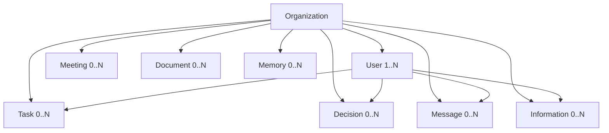
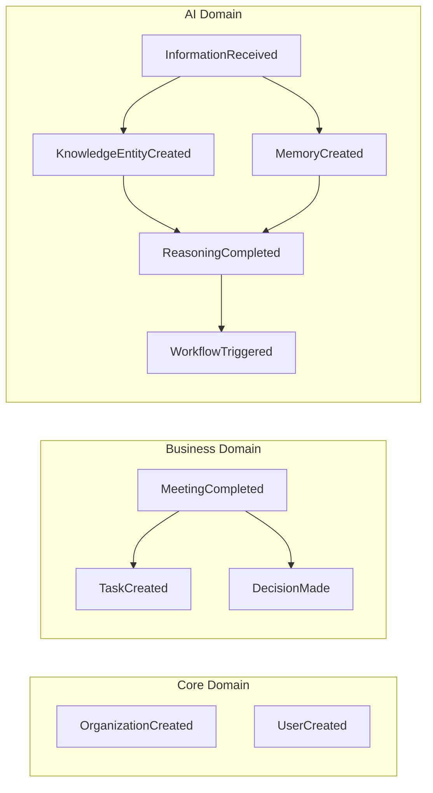
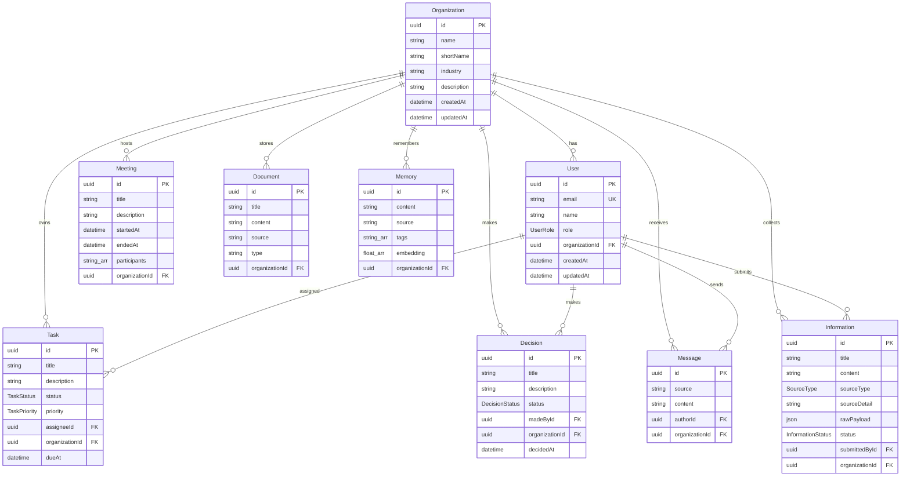
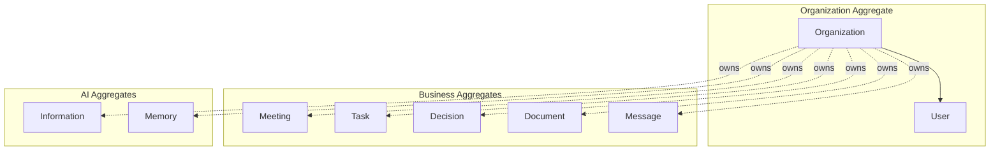
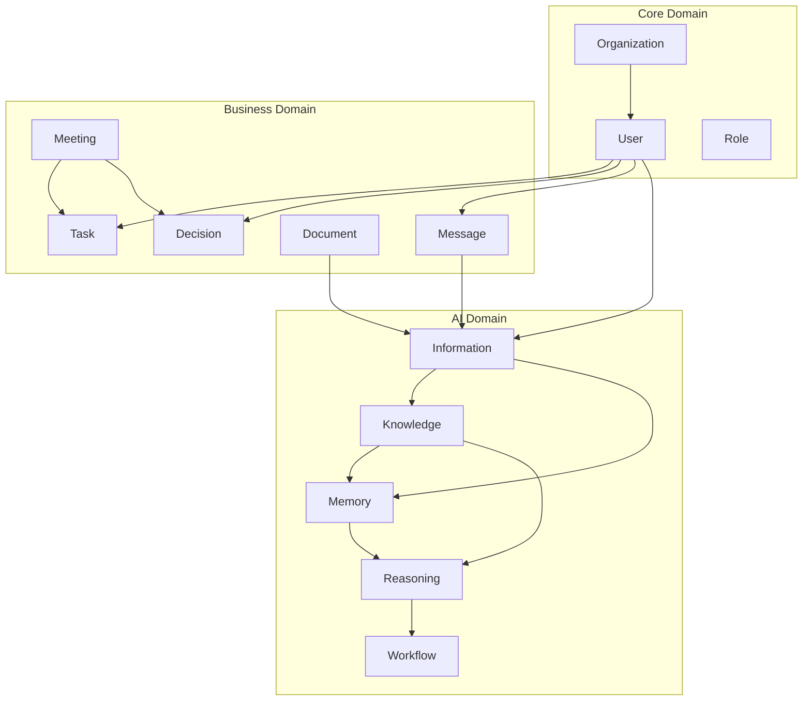

# Howard AIOS Domain Model Blueprint

> 本文档是 Howard AIOS 领域模型（Domain Model）的详细设计蓝图。
> 它基于 Domain Driven Design（DDD）方法论，定义了 AIOS 的所有领域实体、聚合根、值对象、仓储接口、领域服务和领域事件。
> 本文档与 [AIOS Constitution v1.0](../Constitution/AIOS-Constitution-v1.0.md)、[AIOS Vision](./00-Vision.md) 和 [AIOS Architecture Blueprint](./01-Architecture.md) 共同构成 AIOS 的完整设计体系。
> Constitution 定义原则，Vision 定义方向，Architecture 定义结构，本文档定义领域语义。

版本：v1.0
状态：Active
创建日期：2026-07-07
作者：Howard Zhang

---

## 1. Overview

### 1.1 为什么 AIOS 使用 Domain Driven Design

Howard AIOS 是一个复杂的多领域系统。它同时涉及信息管理、知识构建、记忆存储、AI 推理、工作流编排、外部集成和人机交互等多个业务领域。这些领域之间存在紧密的语义关联——一条会议记录可能同时产生知识实体、记忆条目、推理触发和工作流任务。

传统的数据驱动设计（先设计表结构，再写业务逻辑）在 AIOS 中会导致以下问题：

**语义丢失**：数据库表只描述数据的存储结构，不描述数据的业务含义。一个 `Information` 记录在数据库中只是一行数据，但在业务语义中它可能是一个会议录音、一封客户邮件或一份合同扫描件。

**业务逻辑分散**：当业务规则散落在 Controller、Service、Util 各处时，同一个领域概念的处理逻辑可能被拆分到多个文件中，难以理解和维护。

**领域边界模糊**：没有明确的领域边界定义，Information 层的代码可能意外依赖 Knowledge 层的实现，导致耦合过紧。

Domain Driven Design 解决这些问题：

- **统一语言**（Ubiquitous Language）：开发团队和产品团队使用相同的术语——Information、Knowledge、Memory、Reasoning、Workflow 在代码、文档和对话中含义一致。
- **限界上下文**（Bounded Context）：每个领域有明确的边界，Information Domain 和 Knowledge Domain 不共享内部实现。
- **聚合根**（Aggregate Root）：通过聚合定义数据一致性边界，确保业务规则在聚合内部得到保证。
- **领域事件**（Domain Event）：领域之间的交互通过事件驱动，而非直接依赖，实现松耦合。

### 1.2 AIOS 领域划分

AIOS 的领域划分为三大类：

- **Core Domain（核心领域）**：Organization、User、Role、Permission——系统的多租户和权限基础设施。
- **Business Domain（业务领域）**：Meeting、Task、Decision、Document、Message——组织的日常运营实体。
- **AI Domain（智能领域）**：Information、Knowledge、Memory、Reasoning、Workflow、Prompt、Agent、Connector——AIOS 的 AI 核心能力。

---

## 2. Core Domain

核心领域定义了 AIOS 的多租户基础设施和访问控制体系。所有业务实体和 AI 实体都必须归属于一个 Organization。

### 2.1 Organization

Organization 是 AIOS 的最顶层聚合根，是多租户隔离的基础单元。

**职责**：Organization 代表一个企业或业务实体。它拥有人类用户、会议、任务、决策、文档、消息、记忆和信息。所有数据必须归属于一个 Organization，不允许存在全局数据。

**核心属性**：
- `id`：全局唯一标识（UUID）
- `name`：组织名称
- `shortName`：简称（可选）
- `industry`：所属行业（可选）
- `description`：描述（可选）
- `createdAt` / `updatedAt`：时间戳

**生命周期**：
- **CREATED**：组织被创建
- **ACTIVE**：组织处于活跃状态，用户可以正常操作
- **SUSPENDED**：组织被暂停，只读访问
- **ARCHIVED**：组织被归档，数据保留但不可访问

**拥有者**：系统管理员（System Admin）。Organization 的创建和归档由系统级别操作完成。

**边界**：Organization 是所有其他实体的边界。User、Meeting、Task、Decision、Document、Message、Memory、Information 都通过 `organizationId` 关联到 Organization。一个 Organization 的数据绝对不能被另一个 Organization 访问。

**状态变化**：CREATED → ACTIVE → SUSPENDED → ARCHIVED

### 2.2 User

User 代表系统中的一个人类用户。每个 User 必须归属于一个 Organization。

**职责**：User 是系统的操作者。User 可以创建 Information、被分配 Task、做出 Decision、发送 Message。User 的行为受其 Role 约束。

**核心属性**：
- `id`：全局唯一标识（UUID）
- `email`：邮箱地址（全局唯一）
- `name`：用户姓名
- `role`：用户角色（UserRole 枚举）
- `organizationId`：所属组织
- `createdAt` / `updatedAt`：时间戳

**生命周期**：
- **CREATED**：用户账号被创建
- **ACTIVE**：用户可以正常登录和操作
- **DISABLED**：用户被禁用，无法登录
- **DELETED**：用户被删除（软删除，数据保留）

**拥有者**：Organization Admin。用户的创建、角色分配和禁用由组织管理员操作。

**边界**：User 归属于 Organization。User 不能跨组织操作。User 的 Task、Decision、Message、Information 通过关联关系管理。

**状态变化**：CREATED → ACTIVE → DISABLED → DELETED

### 2.3 Role

Role 定义了用户在组织中的权限级别。AIOS 使用基于角色的访问控制（RBAC）。

**当前角色定义**（UserRole 枚举）：

- **FOUNDER**：创始人。拥有组织的最高权限，可以查看所有数据、做出决策、管理成员、配置系统。FOUNDER 是组织的唯一拥有者。
- **ADMIN**：管理员。可以管理成员、创建和编辑所有实体、配置工作流，但不能修改组织设置或删除组织。
- **MEMBER**：成员。可以创建和编辑自己负责的实体（Task、Information），查看组织公开数据，参与会议。
- **VIEWER**：查看者。只读权限，只能查看组织数据，不能创建或修改任何实体。

**角色权限矩阵**：

| 操作 | FOUNDER | ADMIN | MEMBER | VIEWER |
|------|---------|-------|--------|--------|
| 管理组织设置 | ✅ | ❌ | ❌ | ❌ |
| 管理成员 | ✅ | ✅ | ❌ | ❌ |
| 创建/编辑所有实体 | ✅ | ✅ | ❌ | ❌ |
| 创建/编辑自己的实体 | ✅ | ✅ | ✅ | ❌ |
| 查看所有数据 | ✅ | ✅ | ✅ | ✅ |
| 做出决策 | ✅ | ✅ | ❌ | ❌ |
| 配置工作流 | ✅ | ✅ | ❌ | ❌ |
| 访问 AI 建议 | ✅ | ✅ | ✅ | ❌ |

### 2.4 Permission

Permission 是对 Role 的细粒度扩展。当 Role 的四级权限不足以满足业务需求时，Permission 提供更精细的控制。

**当前状态**：Permission 尚未在 Prisma Schema 中实现。当前阶段使用 UserRole 枚举的四级角色控制。

**未来设计**：Permission 将定义为 Resource + Action 的组合。例如：
- `information:create` — 创建信息
- `information:read` — 查看信息
- `information:update` — 编辑信息
- `information:delete` — 删除信息
- `knowledge:read` — 查看知识图谱
- `workflow:manage` — 管理工作流

每个 Role 将关联一组 Permission，管理员可以自定义角色和权限组合。

---

## 3. Business Domain

业务领域定义了组织日常运营中产生的核心实体。这些实体记录了组织的活动和决策。

### 3.1 Meeting

Meeting 代表一次会议。它是组织协作的核心场景，也是 AIOS 的重要信息源。

**职责**：记录会议的基本信息、参与者和时间范围。Meeting 是 PLAUD 录音的目标实体——一次 PLAUD 录音对应一次 Meeting。

**核心属性**：
- `id`：全局唯一标识（UUID）
- `title`：会议标题
- `description`：会议描述（可选）
- `startedAt`：开始时间
- `endedAt`：结束时间（可选，会议进行中时为空）
- `participants`：参与者列表（字符串数组）
- `organizationId`：所属组织

**生命周期**：
- **SCHEDULED**：会议已安排（未来实现）
- **IN_PROGRESS**：会议正在进行
- **COMPLETED**：会议已结束
- **ARCHIVED**：会议已归档

**拥有者**：Organization。Meeting 归属于组织，参与者通过 `participants` 字段记录。

**边界**：Meeting 是独立的聚合根。它不拥有 Task 或 Decision，但会议结束后可以触发创建 Task 和 Decision（通过领域事件）。

**状态变化**：SCHEDULED → IN_PROGRESS → COMPLETED → ARCHIVED

### 3.2 Task

Task 代表一个待完成的工作项。它是组织执行力的核心载体。

**职责**：记录任务的标题、描述、状态、优先级和责任人。Task 可以手动创建，也可以由 AIOS 自动从会议记录或 AI 建议中生成。

**核心属性**：
- `id`：全局唯一标识（UUID）
- `title`：任务标题
- `description`：任务描述（可选）
- `status`：任务状态（TaskStatus 枚举）
- `priority`：优先级（TaskPriority 枚举）
- `assigneeId`：责任人 ID（可选）
- `organizationId`：所属组织
- `dueAt`：截止日期（可选）

**生命周期**（TaskStatus 枚举）：
- **TODO**：待处理。任务已创建但尚未开始。
- **IN_PROGRESS**：进行中。责任人已开始处理。
- **DONE**：已完成。任务已完成并确认。
- **CANCELLED**：已取消。任务被取消，不再执行。

**优先级**（TaskPriority 枚举）：
- **LOW**：低优先级。不影响业务进展。
- **MEDIUM**：中等优先级。默认值。
- **HIGH**：高优先级。需要尽快处理。
- **CRITICAL**：紧急。阻碍业务进展，必须立即处理。

**拥有者**：User（通过 assigneeId）。Task 的责任人负责执行和更新状态。

**边界**：Task 是独立的聚合根。它归属于 Organization，关联到 User。Task 的状态变化是原子操作——不允许同时处于 TODO 和 DONE。

**状态变化**：TODO → IN_PROGRESS → DONE（或 CANCELLED）

### 3.3 Decision

Decision 代表一个业务决策。它是组织决策过程的记录。

**职责**：记录决策的标题、描述、状态和决策者。Decision 帮助组织追踪"为什么做了这个决定"，支持未来的复盘和学习。

**核心属性**：
- `id`：全局唯一标识（UUID）
- `title`：决策标题
- `description`：决策描述和背景（可选）
- `status`：决策状态（DecisionStatus 枚举）
- `madeById`：决策者 ID
- `organizationId`：所属组织
- `decidedAt`：决策确认时间（可选）

**生命周期**（DecisionStatus 枚举）：
- **PROPOSED**：提议中。决策被提出，等待讨论。
- **DISCUSSED**：讨论中。决策已经过讨论，收集了反馈。
- **DECIDED**：已决策。决策已确认，进入执行。
- **ARCHIVED**：已归档。决策已完成或废弃。

**拥有者**：User（通过 madeById）。决策者是做出最终决定的人，通常是 FOUNDER 或 ADMIN。

**边界**：Decision 是独立的聚合根。它归属于 Organization，关联到决策者 User。

**状态变化**：PROPOSED → DISCUSSED → DECIDED → ARCHIVED

### 3.4 Document

Document 代表一个文档实体。它是组织知识的载体。

**职责**：存储文档的标题、内容和来源信息。Document 可以来自外部（上传的文件、OCR 结果）或内部（系统生成的报告）。

**核心属性**：
- `id`：全局唯一标识（UUID）
- `title`：文档标题
- `content`：文档内容（可选）
- `source`：来源标识
- `type`：文档类型
- `organizationId`：所属组织

**生命周期**：
- **UPLOADED**：文档已上传
- **PROCESSED**：文档已完成解析
- **INDEXED**：文档已完成索引
- **ARCHIVED**：文档已归档

**拥有者**：Organization。Document 归属于组织，不归属于特定用户。

**边界**：Document 是独立的聚合根。Document 的内容可以被 Parser 提取为 Knowledge 实体，但 Document 本身不存储解析结果。

**状态变化**：UPLOADED → PROCESSED → INDEXED → ARCHIVED

### 3.5 Message

Message 代表一条消息。它是组织沟通的记录。

**职责**：存储来自各种渠道的消息内容。Message 可以来自微信、企业微信、邮件、飞书等通信渠道。

**核心属性**：
- `id`：全局唯一标识（UUID）
- `source`：消息来源
- `content`：消息内容
- `authorId`：作者 ID（可选，外部消息可能无关联用户）
- `organizationId`：所属组织

**生命周期**：
- **RECEIVED**：消息已接收
- **PROCESSED**：消息已处理（提取了实体或触发了动作）
- **ARCHIVED**：消息已归档

**拥有者**：Organization。Message 归属于组织。authorId 关联到组织内的用户（如果是组织成员发送的）。

**边界**：Message 是独立的聚合根。它是信息流中的一个节点——消息内容可以被 Parser 层提取为 Information 或 Knowledge。

**状态变化**：RECEIVED → PROCESSED → ARCHIVED

---

## 4. AI Domain

AI 领域是 AIOS 的核心竞争力所在。它定义了从信息接收到智能执行的全链路实体。

### 4.1 Information

Information 是 AIOS 信息管道的第一站。它是所有来源的原始信息的统一载体。

**职责**：接收、归一化和存储所有来源的原始信息。Information 是 L1 Information Layer 的核心实体。它只负责存储，不做解析和推理。

**核心属性**：
- `id`：全局唯一标识（UUID）
- `title`：信息标题（可选）
- `content`：信息内容
- `sourceType`：来源类型（SourceType 枚举）
- `sourceDetail`：来源详情（可选，如微信联系人名称）
- `rawPayload`：原始数据（JSON 格式，保留完整的原始信息）
- `status`：信息状态（InformationStatus 枚举）
- `submittedById`：提交者 ID（可选）
- `organizationId`：所属组织

**来源类型**（SourceType 枚举）：
- MANUAL：手动录入
- WECHAT：微信
- DINGTALK：钉钉
- FEISHU：飞书
- EMAIL：邮件
- PLAUD：PLAUD 录音设备
- FILE：文件上传
- OCR：OCR 识别
- API：API 调用
- WEBHOOK：Webhook 事件

**生命周期**（InformationStatus 枚举）：
- **RECEIVED**：信息刚刚被接收，尚未处理
- **NORMALIZED**：信息已完成格式归一化
- **STORED**：信息已持久化并建立索引
- **ARCHIVED**：信息已归档，不再活跃但仍可检索

**拥有者**：Organization。Information 归属于组织。submittedBy 记录提交者（如果是人工提交）。

**边界**：Information 是独立的聚合根。它是 Information Engine 的核心实体。Information 不依赖 Knowledge 或 Memory，它是数据流的起点。

**状态变化**：RECEIVED → NORMALIZED → STORED → ARCHIVED

### 4.2 Knowledge

Knowledge 代表从 Information 中提取的结构化知识实体。

**职责**：构建和维护知识图谱。Knowledge 不是单一模型，而是一组实体和关系的集合——人物、公司、项目、客户、供应商及其之间的关系。

**当前状态**：Knowledge 的实体模型尚未在 Prisma Schema 中独立定义。当前阶段，知识通过 Business Domain 的实体（User、Meeting、Task、Decision）隐式表达。

**未来设计**：
- `KnowledgeEntity`：通用知识实体，包含 type（PERSON、COMPANY、PROJECT、CUSTOMER）、name、metadata
- `KnowledgeRelation`：实体间关系，包含 sourceEntityId、targetEntityId、relationType、confidence
- `KnowledgeSource`：知识来源追踪，关联到 Information 记录

### 4.3 Memory

Memory 是 AIOS 的长期记忆单元。它将信息和知识转化为可语义检索的记忆。

**职责**：存储记忆内容、标签和向量嵌入。Memory 为 Reasoning Layer 提供历史上下文。

**核心属性**：
- `id`：全局唯一标识（UUID）
- `content`：记忆内容
- `source`：记忆来源标识
- `tags`：标签数组（用于分类和过滤）
- `embedding`：向量嵌入（用于语义搜索）
- `organizationId`：所属组织

**生命周期**：
- **CREATED**：记忆已创建
- **INDEXED**：记忆已完成向量嵌入
- **ACTIVE**：记忆处于活跃检索状态
- **DECAYED**：记忆因长期未访问而降低优先级
- **ARCHIVED**：记忆已归档

**拥有者**：Organization。Memory 归属于组织，确保多租户记忆隔离。

**边界**：Memory 是独立的聚合根。它可以从 Information 或 Knowledge 生成，但一旦创建就是独立的记忆条目。Memory 的 embedding 字段支持对接 Qdrant 向量数据库。

**状态变化**：CREATED → INDEXED → ACTIVE → DECAYED → ARCHIVED

### 4.4 Reasoning

Reasoning 代表一次 AI 推理过程。

**职责**：记录推理的触发条件、输入上下文、推理过程和输出结果。Reasoning 满足 AIOS Constitution 中"AI 必须可解释"的要求。

**未来设计**：
- `id`：推理记录 ID
- `trigger`：触发原因（用户查询、事件驱动、定时任务）
- `contextSources`：上下文来源（Knowledge IDs、Memory IDs）
- `reasoningChain`：推理链（中间步骤记录）
- `result`：推理结果（分析、建议、预警）
- `confidence`：置信度（0.0 - 1.0）
- `feedback`：用户反馈（采纳、拒绝、忽略）
- `organizationId`：所属组织

### 4.5 Workflow

Workflow 代表一个自动化工作流定义或实例。

**职责**：定义工作流的触发条件、执行步骤和通知规则。管理工作流的执行生命周期。

**未来设计**：
- `WorkflowDefinition`：工作流模板，包含 trigger（触发条件）、steps（步骤列表）、notifications（通知规则）
- `WorkflowInstance`：工作流执行实例，包含 definitionId、status、startedAt、completedAt、executionLog
- `WorkflowStep`：工作流步骤，包含 type（ACTION、CONDITION、WAIT、APPROVAL）、config、status

### 4.6 Prompt

Prompt 代表 LLM 提示词模板。

**职责**：存储和管理 LLM 调用的提示词。Prompt 是 Reasoning Layer 调用 AI 时的核心配置。

**未来设计**：
- `id`：Prompt ID
- `name`：Prompt 名称
- `version`：版本号
- `template`：模板内容（支持变量插值）
- `parameters`：参数定义
- `model`：目标 LLM 模型
- `useCase`：使用场景（SUMMARY、ANALYSIS、RISK_DETECTION、RECOMMENDATION）

### 4.7 Agent

Agent 代表一个 AI Agent。

**职责**：定义 AI Agent 的能力、权限和行为模式。Agent 是 Reasoning 和 Workflow 的执行单元。

**未来设计**：
- `id`：Agent ID
- `name`：Agent 名称
- `type`：Agent 类型（ANALYST、EXECUTOR、COORDINATOR）
- `capabilities`：能力列表
- `permissions`：权限范围
- `configuration`：配置参数
- `organizationId`：所属组织

### 4.8 Connector

Connector 代表一个外部系统集成。

**职责**：管理与外部平台的连接配置、认证状态和数据同步规则。Connector 是 Application Layer 的核心配置实体。

**未来设计**：
- `id`：Connector ID
- `name`：连接器名称
- `type`：连接器类型（PLAUD、WECHAT_ENTERPRISE、EMAIL、NOTION、GITHUB）
- `configuration`：连接配置（加密存储）
- `authStatus`：认证状态（CONNECTED、EXPIRED、ERROR）
- `syncRules`：数据同步规则
- `organizationId`：所属组织

---

## 5. Entity Summary

以下是 AIOS 所有实体的完整清单。

### 已实现实体（Prisma Schema 已定义）

| 实体 | 领域 | 聚合根 | 说明 |
|------|------|--------|------|
| Organization | Core | 是 | 多租户基础单元 |
| User | Core | 否 | 归属于 Organization |
| Meeting | Business | 是 | 会议实体 |
| Task | Business | 是 | 任务实体 |
| Decision | Business | 是 | 决策实体 |
| Document | Business | 是 | 文档实体 |
| Message | Business | 是 | 消息实体 |
| Memory | AI | 是 | 长期记忆 |
| Information | AI | 是 | 原始信息 |

### 未来实体（待实现）

| 实体 | 领域 | 聚合根 | 说明 |
|------|------|--------|------|
| KnowledgeEntity | AI | 是 | 知识图谱实体 |
| KnowledgeRelation | AI | 否 | 知识关系 |
| ReasoningRecord | AI | 是 | 推理记录 |
| WorkflowDefinition | AI | 是 | 工作流定义 |
| WorkflowInstance | AI | 否 | 工作流实例 |
| WorkflowStep | AI | 否 | 工作流步骤 |
| Prompt | AI | 是 | LLM 提示词 |
| Agent | AI | 是 | AI Agent |
| Connector | AI | 是 | 外部连接器 |
| Permission | Core | 否 | 细粒度权限 |
| RolePermission | Core | 否 | 角色-权限关联 |

---

## 6. Aggregate

聚合（Aggregate）是一组相关实体的集合，作为数据修改的单元。聚合根（Aggregate Root）是外部访问聚合的唯一入口。

### 6.1 Organization Aggregate

**聚合根**：Organization

**包含实体**：User（通过 organizationId）、Meeting、Task、Decision、Document、Message、Memory、Information

**为什么是一个聚合**：Organization 是 AIOS 多租户架构的基础。所有其他实体都必须归属于一个 Organization。Organization 的创建和删除会影响其下所有实体的可用性。但在实际实现中，由于 Organization 下的实体数量可能非常大，我们不会在内存中加载整个聚合——而是通过 Repository 按实体类型分别查询，同时通过 `organizationId` 字段保证数据隔离。

**一致性规则**：
- 所有子实体的 `organizationId` 必须与聚合根一致
- Organization 被归档时，所有子实体变为只读
- User 的 email 在 Organization 范围内唯一

### 6.2 Task Aggregate

**聚合根**：Task

**包含实体**：Task（独立实体，无子实体）

**为什么是独立聚合**：Task 是独立的业务单元。它的状态变化（TODO → IN_PROGRESS → DONE）不需要与 Meeting 或 Decision 保持事务一致性。Task 通过事件与其他聚合交互。

### 6.3 Decision Aggregate

**聚合根**：Decision

**包含实体**：Decision（独立实体，无子实体）

**为什么是独立聚合**：Decision 记录决策过程，它的状态变化（PROPOSED → DISCUSSED → DECIDED）是独立的事务。

### 6.4 Information Aggregate

**聚合根**：Information

**包含实体**：Information（独立实体，rawPayload 作为值对象内嵌）

**为什么是独立聚合**：Information 是数据流的起点，它不依赖 Knowledge 或 Memory 的存在。Information 的创建和状态变化是原子操作。

### 6.5 Memory Aggregate

**聚合根**：Memory

**包含实体**：Memory（独立实体，embedding 和 tags 作为值对象内嵌）

**为什么是独立聚合**：Memory 是独立的记忆条目，它可以关联到 Information 或 Knowledge，但这种关联是通过引用而非包含实现的。

---

## 7. Value Object

值对象（Value Object）是没有唯一标识的不可变对象。它们通过属性值相等来判断等价性。

### 当前已实现的值对象（通过 Prisma 枚举和内嵌类型）

| 值对象 | 类型 | 说明 |
|--------|------|------|
| UserRole | Enum | 用户角色：FOUNDER、ADMIN、MEMBER、VIEWER |
| TaskStatus | Enum | 任务状态：TODO、IN_PROGRESS、DONE、CANCELLED |
| TaskPriority | Enum | 任务优先级：LOW、MEDIUM、HIGH、CRITICAL |
| DecisionStatus | Enum | 决策状态：PROPOSED、DISCUSSED、DECIDED、ARCHIVED |
| SourceType | Enum | 信息来源：MANUAL、WECHAT、DINGTALK、FEISHU、EMAIL、PLAUD、FILE、OCR、API、WEBHOOK |
| InformationStatus | Enum | 信息状态：RECEIVED、NORMALIZED、STORED、ARCHIVED |

### 未来设计的值对象

| 值对象 | 类型 | 说明 |
|--------|------|------|
| TimeRange | Object | 时间范围（start, end），用于 Meeting |
| Embedding | Float[] | 向量嵌入，用于 Memory 的语义搜索 |
| RawPayload | JSON | 原始数据载体，用于 Information |
| Confidence | Float | 置信度（0.0 - 1.0），用于 Reasoning 和 Knowledge |
| Coordinates | Object | 地理坐标（latitude, longitude），未来用于位置信息 |
| Money | Object | 金额（amount, currency），未来用于财务领域 |
| EmailAddress | String | 邮箱地址，带格式验证 |
| PhoneNumber | String | 电话号码，带格式验证 |
| DateRange | Object | 日期范围，用于报告和统计 |
| SortCriteria | Object | 排序条件（field, direction），用于查询 |
| PaginationParams | Object | 分页参数（page, pageSize），用于查询 |

---

## 8. Repository

每个聚合根对应一个 Repository。Repository 封装数据访问逻辑，对外提供统一的接口。

### 8.1 Repository 列表

| Repository | 聚合根 | 说明 | 状态 |
|------------|--------|------|------|
| OrganizationRepository | Organization | 组织数据访问 | 待实现 |
| UserRepository | User | 用户数据访问 | 待实现 |
| MeetingRepository | Meeting | 会议数据访问 | 待实现 |
| TaskRepository | Task | 任务数据访问 | 待实现 |
| DecisionRepository | Decision | 决策数据访问 | 待实现 |
| DocumentRepository | Document | 文档数据访问 | 待实现 |
| MessageRepository | Message | 消息数据访问 | 待实现 |
| InformationRepository | Information | 信息数据访问 | 已实现（PrismaInformationRepository） |
| MemoryRepository | Memory | 记忆数据访问 | 待实现 |
| KnowledgeRepository | KnowledgeEntity | 知识数据访问 | 待实现 |
| WorkflowRepository | WorkflowDefinition | 工作流数据访问 | 待实现 |
| PromptRepository | Prompt | 提示词数据访问 | 待实现 |
| AgentRepository | Agent | AI Agent 数据访问 | 待实现 |
| ConnectorRepository | Connector | 连接器数据访问 | 待实现 |

### 8.2 Repository 接口规范

所有 Repository 遵循统一的接口规范：

- `findById(id)`：按 ID 查询
- `findAll(criteria)`：按条件查询（支持分页和排序）
- `create(data)`：创建新记录
- `update(id, data)`：更新记录
- `delete(id)`：删除记录（软删除优先）
- `count(criteria)`：计数查询

Repository 实现 Prisma 数据访问，但对上层暴露纯接口。Service 层不直接调用 Prisma Client。

### 8.3 已实现示例

`InformationRepository`（在 `services/information/` 中）已实现完整的 Repository 模式：

- 定义接口：`InformationRepository`
- Prisma 实现：`PrismaInformationRepository`
- 支持分页查询、按来源过滤、按状态过滤
- Service 层通过接口调用，便于测试和替换

---

## 9. Domain Service

领域服务（Domain Service）封装不属于任何单一实体的业务逻辑。它们协调多个实体和 Repository 完成复杂的业务操作。

### 9.1 Information Service

**职责**：管理 Information 的完整生命周期——创建、归一化、存储、检索、归档。

**核心操作**：
- `create(data)`：创建新的 Information 记录，验证 SourceType 有效性
- `normalize(id)`：将 Information 从 RECEIVED 归一化为 NORMALIZED
- `findAll(query)`：分页检索 Information，支持按来源、状态、时间范围过滤
- `archive(id)`：归档 Information

**位置**：`services/information/`（已实现）

### 9.2 Knowledge Service

**职责**：构建和管理知识图谱——实体提取、关系构建、图谱查询。

**核心操作**：
- `extractEntities(informationId)`：从 Information 中提取实体
- `buildRelations(sourceId, targetId, type)`：建立实体间关系
- `queryGraph(criteria)`：查询知识图谱
- `getEntityContext(entityId)`：获取实体的完整上下文

**位置**：`services/knowledge/`（骨架，待实现）

### 9.3 Memory Service

**职责**：管理长期记忆——创建记忆、生成向量嵌入、语义搜索、上下文组装。

**核心操作**：
- `memorize(content, source, tags)`：创建新的记忆条目
- `search(query, organizationId)`：语义搜索记忆
- `getContext(entityId, topic)`：为特定实体和主题组装上下文
- `decay()`：执行记忆衰减——降低长期未访问记忆的优先级

**位置**：`memory/`（占位，待实现）

### 9.4 Reasoning Service

**职责**：执行 AI 推理——调用 LLM、管理推理链、生成分析和建议。

**核心操作**：
- `analyze(query, context)`：基于上下文执行分析
- `predict(entityId, metric)`：基于历史数据预测趋势
- `recommend(scenario)`：生成行动建议
- `explain(reasoningId)`：获取推理过程的解释

**位置**：`services/ai/`（骨架，待实现）

### 9.5 Workflow Service

**职责**：编排自动化工作流——定义工作流、触发执行、管理生命周期。

**核心操作**：
- `define(definition)`：创建新的工作流定义
- `trigger(event)`：根据事件触发匹配的工作流
- `execute(instanceId)`：执行工作流实例的下一步
- `getStatus(instanceId)`：查询工作流执行状态

**位置**：`services/workflow/`（骨架，待实现）

### 9.6 AI Service（编排层）

**职责**：作为 AI Domain 的顶层编排服务，协调 Knowledge、Memory、Reasoning 服务完成复杂的 AI 任务。

**核心操作**：
- `processInformation(informationId)`：完整处理一条信息——提取知识、生成记忆、触发推理
- `answerQuestion(query, organizationId)`：回答用户问题——检索知识和记忆，调用推理，返回答案
- `generateReport(type, organizationId)`：生成报告——汇总数据，调用推理，输出结构化报告

**位置**：未来实现，作为 AI Domain 的编排层。

---

## 10. Domain Event

领域事件（Domain Event）表示领域中发生的重要事件。它们是聚合之间和领域之间通信的标准方式。

### 10.1 Core Domain Events

| 编号 | 事件名称 | 触发时机 | 携带数据 |
|------|----------|----------|----------|
| 1 | `OrganizationCreated` | 组织被创建 | organizationId, name |
| 2 | `OrganizationArchived` | 组织被归档 | organizationId |
| 3 | `UserCreated` | 用户被创建 | userId, organizationId, role |
| 4 | `UserRoleChanged` | 用户角色变更 | userId, oldRole, newRole |
| 5 | `UserDisabled` | 用户被禁用 | userId, organizationId |

### 10.2 Business Domain Events

| 编号 | 事件名称 | 触发时机 | 携带数据 |
|------|----------|----------|----------|
| 6 | `MeetingStarted` | 会议开始 | meetingId, organizationId |
| 7 | `MeetingCompleted` | 会议结束 | meetingId, duration, participants |
| 8 | `TaskCreated` | 任务被创建 | taskId, title, assigneeId, priority |
| 9 | `TaskStatusChanged` | 任务状态变更 | taskId, oldStatus, newStatus |
| 10 | `TaskOverdue` | 任务逾期 | taskId, dueAt, assigneeId |
| 11 | `DecisionProposed` | 决策被提议 | decisionId, title, madeById |
| 12 | `DecisionMade` | 决策被确认 | decisionId, decidedAt |
| 13 | `DocumentUploaded` | 文档上传 | documentId, type, source |
| 14 | `MessageReceived` | 消息接收 | messageId, source, authorId |

### 10.3 AI Domain Events

| 编号 | 事件名称 | 触发时机 | 携带数据 |
|------|----------|----------|----------|
| 15 | `InformationReceived` | 信息被接收 | informationId, sourceType |
| 16 | `InformationNormalized` | 信息完成归一化 | informationId |
| 17 | `InformationStored` | 信息完成存储 | informationId |
| 18 | `InformationArchived` | 信息被归档 | informationId |
| 19 | `KnowledgeEntityCreated` | 知识实体创建 | entityId, type, name |
| 20 | `KnowledgeRelationCreated` | 知识关系建立 | sourceEntityId, targetEntityId, relationType |
| 21 | `MemoryCreated` | 记忆创建 | memoryId, source, tags |
| 22 | `MemoryIndexed` | 记忆完成嵌入 | memoryId |
| 23 | `ReasoningCompleted` | 推理完成 | reasoningId, result, confidence |
| 24 | `RiskDetected` | 风险被识别 | entityType, entityId, severity, description |
| 25 | `WorkflowTriggered` | 工作流被触发 | workflowId, triggerEvent |
| 26 | `WorkflowCompleted` | 工作流完成 | instanceId, duration |
| 27 | `WorkflowFailed` | 工作流失败 | instanceId, error, failedStep |
| 28 | `ConnectorStatusChanged` | 连接器状态变更 | connectorId, oldStatus, newStatus |

### 10.4 事件流向

---

## 11. Entity Relationship Diagram

以下是 AIOS 完整的实体关系图，基于当前 Prisma Schema：

---

## 12. Aggregate Diagram

> 注：Organization 是全局聚合根，所有其他聚合根通过 `organizationId` 归属于它。但在实际实现中，各聚合根是独立管理的，Organization 通过外键约束保证数据隔离。

---

## 13. Domain Dependency Diagram

依赖方向：Core Domain 被所有领域依赖。Business Domain 产生数据，AI Domain 消费和增强数据。AI Domain 内部：Information → Knowledge → Memory → Reasoning → Workflow。

---

## 14. Future Evolution

### 14.1 短期扩展（6-12 个月）

**知识图谱实体**：新增 `KnowledgeEntity` 和 `KnowledgeRelation` 模型，将隐式知识显式化。KnowledgeEntity 支持多种类型（PERSON、COMPANY、PROJECT、CUSTOMER、SUPPLIER），KnowledgeRelation 记录实体间的关系类型和置信度。

**连接器实体**：新增 `Connector` 模型，管理外部集成的配置和状态。每个 Organization 可以配置多个 Connector，支持独立的认证和同步规则。

**工作流实体**：新增 `WorkflowDefinition`、`WorkflowInstance` 和 `WorkflowStep` 模型，支持声明式工作流定义和执行追踪。

### 14.2 中期扩展（1-2 年）

**推理记录**：新增 `ReasoningRecord` 模型，完整记录每次 AI 推理的输入、过程和输出。满足 AIOS Constitution 中"AI 必须可解释"的要求。

**Prompt 管理**：新增 `Prompt` 模型，版本化管理 LLM 提示词模板。支持 A/B 测试和渐进式发布。

**Agent 定义**：新增 `Agent` 模型，定义 AI Agent 的能力和权限。支持多 Agent 协同。

### 14.3 长期扩展（2-5 年）

**细粒度权限**：新增 `Permission` 和 `RolePermission` 模型，支持 Resource + Action 级别的权限控制。

**审计日志**：新增 `AuditLog` 模型，记录所有数据变更的完整历史。支持合规审计和问题排查。

**跨组织共享**：新增 `SharedKnowledge` 实体，支持多个 Organization 之间的知识共享。通过显式配置控制共享范围，确保数据隔离不被破坏。

**联邦学习**：新增 `FederatedModel` 实体，支持跨组织的 AI 模型联合训练。在不共享原始数据的前提下，多个组织共同改进 AI 模型质量。

### 14.4 领域扩展原则

- **向后兼容**：新增实体不能破坏已有实体的接口和行为。
- **Prisma 驱动**：所有新实体首先在 Prisma Schema 中定义，通过 Migration 管理数据库变更。
- **Repository 先行**：每个新实体必须有对应的 Repository，Service 层通过 Repository 访问数据。
- **事件驱动**：新实体与已有实体的交互通过 Domain Event，不通过直接引用。

---

> 本 Domain Model Blueprint 与 [AIOS Constitution v1.0](../Constitution/AIOS-Constitution-v1.0.md)、[AIOS Vision](./00-Vision.md) 和 [AIOS Architecture Blueprint](./01-Architecture.md) 保持一致。
> Prisma Schema 是数据模型的唯一真相来源。本文档描述的是领域语义和业务规则，不替代 Prisma Schema。
> 如需更新本文档，请确保变更与 Constitution 的核心原则和 Architecture Blueprint 的分层设计不冲突。
> 修改本文档需在 CHANGELOG.md 中记录。
