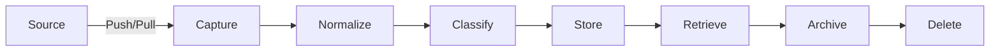
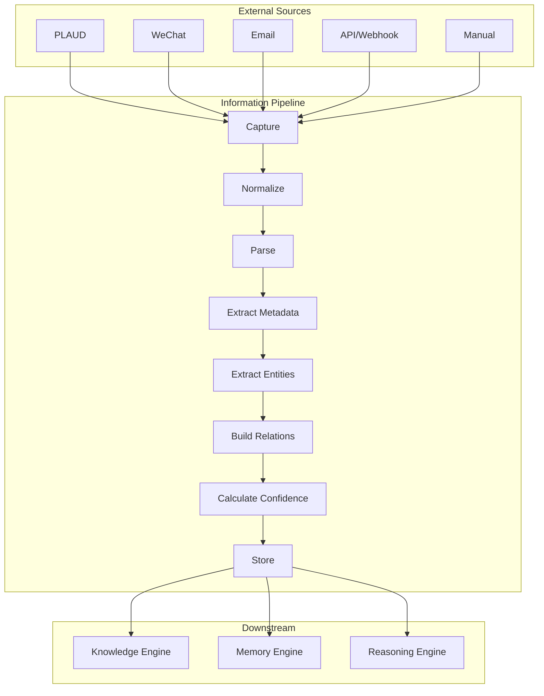
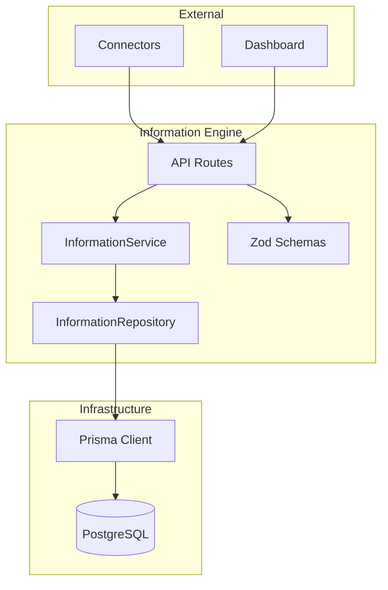

# Howard AIOS Information Engine Blueprint

> 本文档是 Howard AIOS Information Engine 的详细设计蓝图。
> Information Engine 是 AIOS 八层架构中 L1 Information Layer 的核心实现，负责接收、归一化和存储所有来源的原始信息。

版本：v1.0
状态：Active
创建日期：2026-07-07
作者：Howard Zhang

依赖文档：
- [AIOS Constitution v1.0](../Constitution/AIOS-Constitution-v1.0.md)
- [AIOS Vision](./00-Vision.md)
- [AIOS Architecture Blueprint](./01-Architecture.md)
- [AIOS Domain Model](./02-Domain-Model.md)

---

## 1. Overview

Information Engine 是 Howard AIOS 的信息引擎，也是整个 AIOS 数据管道的入口。它实现了 AIOS Constitution 中"Everything is Information"和"Information Never Disappears"两条核心原则。

Information Engine 的唯一职责是：接收来自所有渠道的原始信息，将其归一化为统一格式，持久化存储，并为下游的 Knowledge Engine、Memory Engine 和 Reasoning Engine 提供标准化的数据访问接口。

Information Engine 不做解析、不做推理、不做过滤。所有信息原样保存，由下游层处理。这个设计决策确保了信息管道的简单性和可靠性——入口层越简单，系统越稳定。

### 1.1 Information Engine 在 AIOS 中的位置

在 AIOS 八层架构中，Information Engine 位于 L1 Information Layer。它是所有外部信息进入 AIOS 的唯一入口。所有连接器（PLAUD、企业微信、邮件、飞书等）都将数据写入 Information Engine，而非直接写入 Knowledge 或 Memory。

在 DDD 领域模型中，Information Engine 管理 `Information` 聚合，对应 `InformationRepository` 仓储和 `InformationService` 领域服务。

### 1.2 当前实现状态

Information Engine 是当前 AIOS 中唯一已实现的业务服务，位于 `services/information/`：

- **Repository 层**：`InformationRepository` 接口 + `PrismaInformationRepository` 实现
- **Service 层**：`InformationService` 类，封装业务逻辑和验证
- **验证层**：Zod Schema 验证（`CreateInformationSchema`、`UpdateInformationSchema`、`InformationQuerySchema`）
- **API 层**：Fastify 路由（GET / POST / PATCH / DELETE）
- **测试层**：16 个单元测试

---

## 2. Design Goal

### 2.1 核心设计目标

**统一入口**：所有信息必须通过 Information Engine 进入 AIOS。不允许任何连接器或 API 直接写入 Knowledge、Memory 或其他层。

**格式归一化**：不同来源的信息格式各异——微信消息是 JSON、邮件是 MIME、PLAUD 是音频文件、PDF 是二进制。Information Engine 将所有格式归一化为统一的 `Information` 记录。

**持久化保证**：信息一旦进入 Information Engine，永不丢失。即使下游处理失败，原始信息依然保留。这实现了 Constitution 中"Information Never Disappears"的原则。

**多租户隔离**：每条 Information 必须关联一个 Organization。不允许存在不属于任何组织的全局信息。

**可扩展信息源**：通过 `SourceType` 枚举支持信息源的可扩展性。添加新信息源只需在枚举中添加值并创建对应连接器。

### 2.2 非目标

Information Engine 明确不做以下事情：

- 不做自然语言处理（NLP）——由 Knowledge Engine 的 Parser 负责
- 不做实体提取和关系构建——由 Knowledge Engine 负责
- 不做向量嵌入和语义搜索——由 Memory Engine 负责
- 不做 AI 推理和建议生成——由 Reasoning Engine 负责
- 不做工作流触发和执行——由 Workflow Engine 负责

---

## 3. Information Lifecycle

Information 经历完整的生命周期，从接收到归档或删除。

### 3.1 Information Source

Information Engine 支持 15 种信息来源，覆盖创始人日常接触的所有信息渠道。

| 来源类型 | SourceType 值 | 说明 | 连接器状态 |
|----------|--------------|------|-----------|
| 会议录音 | PLAUD | PLAUD 录音设备的会议录音和转写文本 | 待实现 |
| 语音消息 | VOICE | 语音备忘录和语音消息 | 待实现 |
| 聊天记录 | CHAT | 通用聊天记录（IM 消息） | 待实现 |
| 微信 | WECHAT | 微信个人消息和群聊 | 待实现 |
| 邮件 | EMAIL | IMAP/SMTP 邮件，包括附件 | 待实现 |
| 图片 | IMAGE | 图片文件，通过 OCR 提取文字 | 待实现 |
| PDF 文档 | PDF | PDF 文件，提取文本和表格 | 待实现 |
| 网页 | WEBSITE | 网页内容抓取和快照 | 待实现 |
| 剪贴板 | CLIPBOARD | 系统剪贴板内容 | 待实现 |
| API 调用 | API | 通过 REST API 提交的结构化数据 | 已实现 |
| Webhook | WEBHOOK | 外部系统通过 Webhook 推送的事件数据 | 已实现 |
| 手动录入 | MANUAL | 用户通过 Dashboard 手动输入 | 已实现 |
| 文件上传 | FILE | 通用文件上传（Word、Excel、PPT 等） | 待实现 |
| 日历 | CALENDAR | 日历事件和日程安排 | 待实现 |
| 待办事项 | TODO | 外部待办事项系统的任务导入 | 待实现 |
| 钉钉 | DINGTALK | 钉钉消息和审批 | 待实现 |
| 飞书 | FEISHU | 飞书消息和文档 | 待实现 |
| OCR 识别 | OCR | 独立 OCR 服务识别结果 | 待实现 |

### 3.2 Information Capture

Information Capture 是信息进入 AIOS 的第一步。捕获策略根据来源类型不同：

**推送模式（Push）**：外部系统主动将数据推送到 AIOS。

- API 调用：客户端通过 `POST /api/information` 提交信息
- Webhook：外部系统通过预配置的 Webhook URL 推送事件
- PLAUD 设备：PLAUD 录音完成后自动推送到 AIOS
- 手动录入：用户通过 Dashboard 表单提交

**拉取模式（Pull）**：AIOS 主动从外部系统获取数据。

- 邮件轮询：定时通过 IMAP 拉取新邮件
- 微信同步：通过企业微信 API 定时拉取消息
- 日历同步：定时拉取日历事件
- 网页抓取：定时抓取指定网页内容

所有捕获的信息立即创建为 `Information` 记录，状态为 `RECEIVED`。此时信息尚未经过任何处理，原始数据完整保留在 `rawPayload` 字段中。

### 3.3 Information Parsing

Information Parsing 将原始信息转化为可理解的内容。不同来源的信息需要不同的解析策略：

**文本解析**：微信消息、邮件正文、聊天记录——直接提取文本内容。

**文档解析**：PDF 使用 PDF 解析库提取文本和表格；Word/PPT 使用 Office 文档解析库；Excel 提取单元格数据和公式。

**音频解析**：PLAUD 录音先通过语音转文字（STT）服务转为文本，再提取说话人、时间段等元数据。

**图像解析**：图片通过 OCR 服务提取文字，支持中英文混合识别。结果包括文字内容和位置坐标。

**结构化解析**：API 和 Webhook 接收的数据通常已经是结构化的 JSON，直接映射到 Information 字段。

当前阶段，Parsing 能力有限——Information Engine 只存储原始内容和文本内容。深度解析（实体提取、关系识别）将在后续 Sprint 中由 Knowledge Engine 实现。

### 3.4 Information Classification

Information Classification 为每条信息添加分类标签，便于下游处理和用户检索。

**自动分类**：基于 `sourceType` 和简单规则自动分类。

- PLAUD → 会议类
- EMAIL → 邮件类
- WECHAT → 通讯类
- FILE → 文档类
- API/WEBHOOK → 集成类

**手动分类**：用户可以通过 Dashboard 手动添加标签和分类。

**AI 分类**（未来）：由 Knowledge Engine 的 Parser 基于内容分析自动分类——合同、发票、报告、备忘录等。

### 3.5 Information Storage

Information 存储在 PostgreSQL 数据库中，通过 Prisma ORM 访问。

**Prisma 模型**：`Information`

| 字段 | 类型 | 说明 |
|------|------|------|
| id | String (UUID) | 主键 |
| title | String? | 信息标题（可选） |
| content | String | 信息内容（文本化后的主体内容） |
| sourceType | SourceType | 来源类型枚举 |
| sourceDetail | String? | 来源详情（如微信联系人名称） |
| rawPayload | Json? | 原始数据（完整的原始 Payload） |
| status | InformationStatus | 信息状态 |
| submittedById | String? | 提交者 ID |
| organizationId | String | 所属组织 ID |
| createdAt | DateTime | 创建时间 |
| updatedAt | DateTime | 更新时间 |

**存储策略**：

- `content` 字段存储文本化后的主体内容，用于全文检索
- `rawPayload` 字段以 JSON 格式保留完整的原始数据，确保不丢失任何细节
- `organizationId` 确保多租户隔离，每条信息必须属于一个组织
- 索引：建议对 `organizationId + sourceType`、`organizationId + status`、`createdAt` 建立复合索引

### 3.6 Information Retrieval

Information Retrieval 提供多种检索方式：

**基础检索**：
- 按 ID 查询：`findById(id)`
- 按组织查询：`findAll({ organizationId })`，支持分页
- 按来源过滤：`findAll({ sourceType: 'PLAUD' })`
- 按状态过滤：`findAll({ status: 'STORED' })`
- 按时间范围：`findAll({ from: date1, to: date2 })`

**组合查询**：支持多个条件的组合，通过 `InformationQuerySchema` 验证。

**全文搜索**（未来）：基于 PostgreSQL 的 `tsvector` 全文索引，支持中英文混合搜索。

**语义搜索**（未来）：由 Memory Engine 提供，基于向量嵌入的语义相似度搜索。

### 3.7 Information Archive

Information Archive 将不再活跃的信息移入归档状态，降低查询噪声但保留数据。

**归档条件**：
- 信息状态为 `STORED` 且创建时间超过配置的天数
- 用户手动归档
- 系统自动归档策略（可配置）

**归档操作**：将 `status` 从 `STORED` 变更为 `ARCHIVED`。归档后的信息不出现在默认查询结果中，但可以通过显式指定状态查询。

**归档恢复**：支持将 `ARCHIVED` 状态的信息恢复为 `STORED`。

### 3.8 Information Delete Strategy

AIOS Constitution 规定"Information Never Disappears"。因此，Information Engine 的删除策略非常严格：

**软删除优先**：Information 不提供物理删除操作。"删除"操作实际上是将状态变更为 `ARCHIVED`。

**合规删除**（未来）：当法律要求删除特定数据时（如 GDPR），提供合规删除接口。合规删除会在 `rawPayload` 中清除敏感字段，但保留元数据和 `content` 的脱敏版本。

**组织删除**：当 Organization 被删除时，其下所有 Information 随之一并归档（非物理删除）。

---

## 4. Information Pipeline

Information Pipeline 是信息从外部来源到存储的完整处理管道。

### 4.1 Capture

Capture 阶段从外部来源获取原始数据，创建 `Information` 记录（status: RECEIVED）。

- 验证来源合法性（API Key、Webhook Secret）
- 记录来源元数据（sourceType、sourceDetail）
- 保存原始 Payload（rawPayload）
- 创建时间戳

### 4.2 Normalize

Normalize 阶段将不同格式的信息归一化为统一结构。

- 音频 → 文字转写（调用 STT 服务）
- 图片 → OCR 文字提取
- 文档 → 文本提取
- 邮件 → 正文 + 附件分别处理
- 所有格式 → 统一的 `content` 字段

Normalize 完成后，状态变更为 `NORMALIZED`。

### 4.3 Parse

Parse 阶段对归一化后的内容进行结构化解析。

- 提取标题（如果原始信息没有标题）
- 识别内容类型（会议记录、邮件、合同、报告等）
- 提取关键段落和结构

当前阶段 Parse 能力有限，主要由 Knowledge Engine 的 Parser 在后续阶段完成深度解析。

### 4.4 Metadata Extraction

Metadata 阶段提取和丰富信息的元数据。

| 元数据字段 | 来源 | 说明 |
|-----------|------|------|
| source | sourceType + sourceDetail | 信息来源 |
| timestamp | createdAt | 接收时间 |
| owner | submittedBy | 提交者 |
| organization | organizationId | 所属组织 |
| permission | 基于 UserRole 推断 | 访问权限 |
| language | 自动检测 | 内容语言（中文、英文、混合） |
| importance | 规则/AI 评估 | 重要程度（LOW/MEDIUM/HIGH/CRITICAL） |
| tags | 自动提取 + 手动标注 | 标签列表 |

### 4.5 Entity Extraction

Entity Extraction 从信息内容中提取命名实体。

- 人物：张三、李四
- 公司：Howard AIOS、某客户
- 项目：V2 产品升级
- 日期：2026年7月7日
- 金额：100万元
- 地点：北京、上海

当前阶段：Entity Extraction 由 Knowledge Engine 负责，Information Engine 只做原始存储。未来可以在 Information Pipeline 中集成轻量级的 NER（命名实体识别）。

### 4.6 Relation Extraction

Relation Extraction 识别实体之间的关系。

- 张三 **属于** A 公司
- 李四 **负责** B 项目
- C 会议 **产生了** D 决策
- E 合同 **关联** F 客户

当前阶段：Relation Extraction 完全由 Knowledge Engine 负责。

### 4.7 Confidence Scoring

Confidence 为提取的实体和关系计算置信度分数（0.0 - 1.0）。

- 结构化来源（API、Webhook）的置信度高（0.9 - 1.0）
- OCR 识别结果的置信度取决于识别质量（0.5 - 0.9）
- NLP 提取的实体置信度取决于模型准确度（0.6 - 0.95）

当前阶段：Confidence Scoring 尚未实现，将在 Knowledge Engine 中实现。

### 4.8 Storage

Storage 阶段将处理后的信息持久化到数据库。

- 写入 PostgreSQL `Information` 表
- 状态变更为 `STORED`
- 发出 `InformationStored` 领域事件
- 下游 Knowledge Engine 和 Memory Engine 监听事件并开始处理

---

## 5. Information Metadata

每条 Information 携带丰富的元数据，用于分类、检索和权限控制。

### 5.1 Source Metadata

| 字段 | 说明 |
|------|------|
| sourceType | 信息来源枚举（MANUAL、WECHAT、PLAUD 等） |
| sourceDetail | 来源详情（如"张三的微信消息"、"客户邮件"） |
| rawPayload | 原始数据完整保留 |

### 5.2 Temporal Metadata

| 字段 | 说明 |
|------|------|
| createdAt | 系统接收时间 |
| updatedAt | 最后修改时间 |
| originalTimestamp | 原始信息的时间戳（如邮件发送时间，待实现） |

### 5.3 Ownership Metadata

| 字段 | 说明 |
|------|------|
| organizationId | 所属组织（必填） |
| submittedById | 提交者（可选，API 推送可能无提交者） |

### 5.4 Access Control Metadata

| 字段 | 说明 |
|------|------|
| permission | 访问权限级别（待实现） |
| visibility | 可见性（PUBLIC、ORGANIZATION、PRIVATE，待实现） |

### 5.5 Content Metadata

| 字段 | 说明 |
|------|------|
| language | 内容语言（待实现：自动检测 zh/en/mixed） |
| importance | 重要程度（待实现：LOW/MEDIUM/HIGH/CRITICAL） |
| tags | 标签列表（待实现：自动提取 + 手动标注） |
| contentType | 内容类型（待实现：MEETING_NOTE、EMAIL、CONTRACT 等） |

---

## 6. Component Diagram

### 6.1 组件职责

- **API Routes**（`apps/api/src/routes/information.ts`）：HTTP 端点定义，请求路由，响应格式化
- **Zod Schemas**（`services/information/src/types.ts`）：输入输出验证，类型定义
- **InformationService**（`services/information/src/service.ts`）：业务逻辑编排，验证调用，错误处理
- **InformationRepository**（`services/information/src/repository.ts`）：数据访问抽象，Prisma 操作封装
- **Prisma Client**（`packages/database`）：数据库 ORM，类型安全查询
- **PostgreSQL**：数据持久化存储

---

## 7. Future Evolution

### 7.1 短期演进（6-12 个月）

**连接器生态**：实现 PLAUD、企业微信、邮件三大核心连接器，覆盖创始人最常用的信息源。

**全文搜索**：基于 PostgreSQL `tsvector` 实现中英文全文搜索，支持模糊匹配和高亮。

**批量导入**：支持批量信息导入，用于历史数据迁移和大批量处理。

**流式接收**：支持流式信息接收，处理大型文件（视频、长音频）时不阻塞系统。

### 7.2 中期演进（1-2 年）

**智能分类**：集成 Knowledge Engine 的 Parser，实现基于内容分析的自动分类。

**去重检测**：实现信息去重——识别来自不同渠道的重复信息并自动合并。

**冲突检测**：识别不同来源信息之间的矛盾，标记并通知用户确认。

**优先级排序**：基于重要性和紧急性自动排序，确保关键信息优先处理。

### 7.3 长期演进（2-5 年）

**实时流处理**：引入事件流平台（如 Kafka），支持高吞吐量的实时信息处理。

**联邦信息源**：支持跨组织的信息共享——在保持数据隔离的前提下，允许多个组织共享公开信息。

**信息版本控制**：支持同一信息的多个版本——当信息被更新时，保留历史版本。

**智能归档**：基于 AI 分析的自动归档策略——预测信息的未来价值，自动调整存储策略。

---

> 本 Information Engine Blueprint 与 [AIOS Constitution v1.0](../Constitution/AIOS-Constitution-v1.0.md)、[AIOS Vision](./00-Vision.md)、[AIOS Architecture Blueprint](./01-Architecture.md) 和 [AIOS Domain Model](./02-Domain-Model.md) 保持一致。
> Prisma Schema 是 Information 数据模型的唯一真相来源。
> 修改本文档需在 CHANGELOG.md 中记录。
