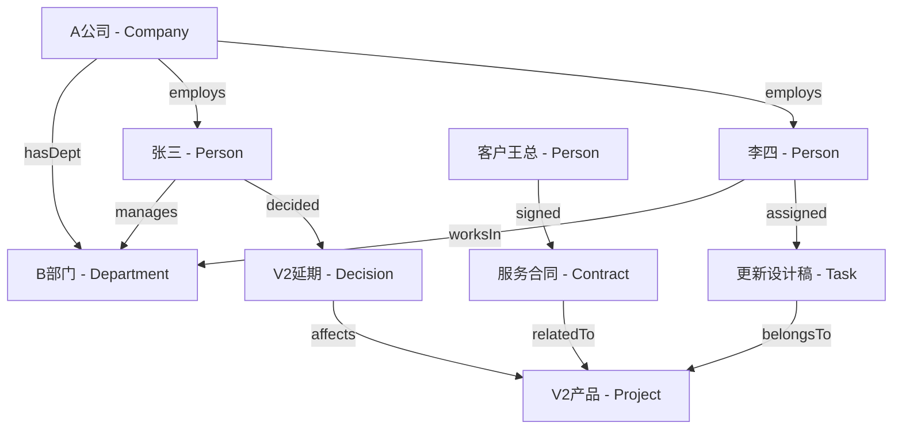
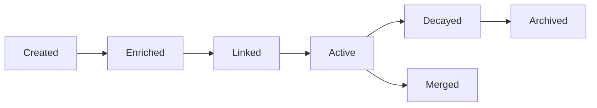
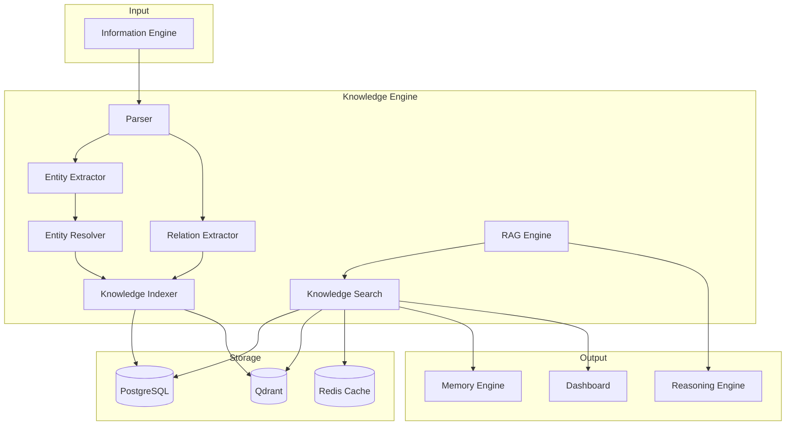

# Howard AIOS Knowledge Engine Blueprint

> 本文档是 Howard AIOS Knowledge Engine 的详细设计蓝图。
> Knowledge Engine 是 AIOS 八层架构中 L2 Knowledge Layer 的核心实现，负责从信息中提取结构化知识、构建知识图谱、建立实体关系网络。

版本：v1.0
状态：Active
创建日期：2026-07-07
作者：Howard Zhang

依赖文档：
- [AIOS Constitution v1.0](../Constitution/AIOS-Constitution-v1.0.md)
- [AIOS Vision](./00-Vision.md)
- [AIOS Architecture Blueprint](./01-Architecture.md)
- [AIOS Domain Model](./02-Domain-Model.md)

---

## 1. Overview

Knowledge Engine 是 Howard AIOS 的知识中枢。它实现了 Constitution 中"Everything becomes Knowledge"和"Everything is Connected"两条核心原则。

Knowledge Engine 从 Information Engine 存储的原始信息中提取结构化实体（人物、公司、项目、会议、任务、决策），建立它们之间的关系网络，形成 Knowledge Graph。Knowledge Graph 是 AIOS 的核心资产——它让系统不仅拥有信息，更拥有理解信息含义的能力。

### 1.1 Knowledge Engine 在 AIOS 中的位置

在八层架构中，Knowledge Engine 位于 L2 Knowledge Layer，是 Information Layer 的直接下游。它监听 Information Engine 发出的 `InformationStored` 事件，对新存储的信息执行解析和知识提取。

Knowledge Engine 的输出为 Memory Engine 提供知识上下文，为 Reasoning Engine 提供决策依据。

### 1.2 当前实现状态

Knowledge Engine 当前为骨架服务（`services/knowledge/`），核心功能待后续 Sprint 实现。Prisma Schema 中已定义基础业务实体（User、Organization、Meeting、Task、Decision、Document、Message），这些实体是 Knowledge Graph 的组成部分。

---

## 2. Knowledge Definition

### 2.1 什么是知识

在 AIOS 中，知识不是文件，不是文档，不是笔记。知识是实体和关系的结构化网络。

一条会议记录不是知识。从会议记录中提取出"张三决定将 V2 产品延期两周"——"张三"是实体，"V2 产品"是实体，"决定"是关系，"延期两周"是属性——这才是知识。

知识具有三个特征：

- **结构化**：知识有明确的实体、关系和属性
- **可查询**：知识可以通过图查询获取答案
- **可推理**：知识可以作为 AI 推理的输入

### 2.2 知识类型

| 知识类型 | 实体示例 | 关系示例 |
|----------|----------|----------|
| 组织知识 | 公司、部门、团队 | A 公司 **下设** B 部门 |
| 人员知识 | 创始人、员工、客户 | 张三 **管理** B 部门 |
| 项目知识 | 项目、里程碑、交付物 | V2 项目 **包含** C 里程碑 |
| 会议知识 | 会议、议题、决策 | D 会议 **产生** E 决策 |
| 任务知识 | 任务、负责人、截止日期 | 张三 **负责** F 任务 |
| 客户关系 | 客户、合同、互动 | G 客户 **签署** H 合同 |
| 财务知识 | 收入、支出、预算 | I 项目 **消耗** J 预算 |

---

## 3. Knowledge Graph

### 3.1 图谱结构

Knowledge Graph 采用属性图（Property Graph）模型：

- **节点（Node）**：代表实体，带有类型和属性
- **边（Edge）**：代表关系，带有类型、方向和属性
- **属性（Property）**：节点和边的键值对属性



### 3.2 节点类型

| 节点类型 | 说明 | Prisma 模型 |
|----------|------|-------------|
| Person | 人物 | User（内部）/ KnowledgeEntity（外部） |
| Company | 公司/组织 | Organization（内部）/ KnowledgeEntity（外部） |
| Department | 部门 | 未来：KnowledgeEntity |
| Project | 项目 | 未来：KnowledgeEntity |
| Meeting | 会议 | Meeting |
| Task | 任务 | Task |
| Decision | 决策 | Decision |
| Document | 文档 | Document |
| Customer | 客户 | 未来：KnowledgeEntity |
| Contract | 合同 | 未来：KnowledgeEntity |
| Risk | 风险 | 未来：KnowledgeEntity |

### 3.3 边类型

| 边类型 | 方向 | 说明 |
|--------|------|------|
| belongsTo | 子 → 父 | 归属于（任务属于项目） |
| manages | 人 → 部门/项目 | 管理关系 |
| worksIn | 人 → 部门 | 工作关系 |
| employs | 公司 → 人 | 雇佣关系 |
| decided | 人 → 决策 | 决策关系 |
| assigned | 任务 → 人 | 任务分配 |
| attends | 人 → 会议 | 参会关系 |
| affects | 决策/事件 → 实体 | 影响关系 |
| relatesTo | 任意 → 任意 | 通用关联 |
| signed | 客户 → 合同 | 签署关系 |
| reports | 人 → 人 | 汇报关系 |

---

## 4. Semantic Layer

Semantic Layer 是 Knowledge Engine 的语义理解层。它负责理解信息的含义，而非仅仅存储文本。

### 4.1 语义解析

Semantic Layer 接收来自 Information Engine 的文本内容，通过 NLP 模型进行语义解析：

- **命名实体识别（NER）**：从文本中识别人物、公司、项目、日期、金额等实体
- **意图识别**：判断文本的意图——是会议记录、邮件回复、合同条款还是任务指派
- **情感分析**：识别文本中的情感倾向——正面、负面、中性
- **主题分类**：将文本归类到业务主题——管理、销售、技术、财务、法务

### 4.2 语义嵌入

将文本和实体转化为向量嵌入（Embedding），支持语义搜索和相似度计算。

- 文本嵌入：将段落转化为 768 维或 1536 维向量
- 实体嵌入：将知识图谱中的实体转化为向量表示
- 关系嵌入：将关系路径转化为向量表示

语义嵌入的结果存储在 Memory Engine 的向量数据库中，Knowledge Engine 通过接口访问。

---

## 5. Vector Layer

Vector Layer 是 Knowledge Engine 与向量数据库的交互层。

### 5.1 向量存储

Knowledge Engine 生成的实体嵌入和关系嵌入存储在 Qdrant 向量数据库中。每个向量关联到对应的 Knowledge Entity ID 和 Organization ID。

### 5.2 向量搜索

支持基于向量相似度的知识搜索：

- **语义搜索**："上次和客户李总讨论的方案" → 找到语义最相关的知识实体
- **实体搜索**："与张三相关的所有项目" → 通过图谱关系 + 向量相似度综合排序
- **相似实体发现**：找到与指定实体语义相似的其他实体

### 5.3 向量更新

当 Knowledge Graph 更新时（新增实体、修改属性、建立关系），对应的向量嵌入自动重新计算和更新。

---

## 6. Tag System

### 6.1 自动标签

Knowledge Engine 基于内容分析自动为实体和信息生成标签：

- **来源标签**：PLAUD、EMAIL、WECHAT
- **主题标签**：管理、销售、技术、财务
- **优先级标签**：URGENT、IMPORTANT、NORMAL
- **时间标签**：Q1-2026、MONTHLY、WEEKLY

### 6.2 手动标签

用户可以通过 Dashboard 手动添加自定义标签。手动标签的优先级高于自动标签。

### 6.3 标签层级

支持标签的层级结构：

```
项目/
├── V2产品/
│   ├── 设计
│   ├── 开发
│   └── 测试
└── 新客户获取/
    ├── 市场调研
    └── 商务谈判
```

---

## 7. Entity Extraction

Entity Extraction 是 Knowledge Engine 的核心能力之一。它从 Information 的文本内容中识别和提取命名实体。

### 7.1 提取策略

**规则提取**：基于预定义规则和模式匹配提取实体。

- 日期格式识别：2026-07-07、7月7日、下周一
- 金额识别：100万元、$50,000
- 邮箱识别：name@company.com
- 电话识别：+86-xxx-xxxx-xxxx

**模型提取**：基于 NER 模型提取实体。

- 人物名称（PER）
- 公司名称（ORG）
- 项目名称（MISC）
- 日期时间（TIME）
- 金额数量（QUANTITY）

**上下文提取**：基于上下文推断实体含义。

- "张三说..." → 张三是人物
- "与A公司合作..." → A公司是公司
- "项目V2进度..." → V2是项目

### 7.2 实体去重

同一个实体可能在不同信息中以不同形式出现：

- "张三" 和 "Zhang San" 是同一个人
- "A公司" 和 "A Co., Ltd" 是同一家公司
- "V2" 和 "产品V2" 和 "Version 2" 是同一个项目

Knowledge Engine 通过实体消歧（Entity Resolution）算法识别和合并重复实体。消歧依据：

- 名称相似度（编辑距离、Jaccard 相似度）
- 上下文相似度（共同出现的其他实体）
- 属性匹配（邮箱、电话等唯一标识）

### 7.3 实体属性丰富

实体创建后，随着更多信息的到达，其实体属性会不断丰富：

- 第一次提到"张三"：只有名字
- 第二次：识别出邮箱和职位
- 第三次：关联到项目和部门
- 持续积累：形成完整的人物画像

---

## 8. Relation Extraction

Relation Extraction 识别实体之间的关系，建立 Knowledge Graph 的边。

### 8.1 关系类型

**显式关系**：文本中明确表达的关系。

- "张三是B部门的经理" → 张三 **manages** B部门
- "项目V2由李四负责" → 李四 **leads** 项目V2
- "客户王总签署了合同" → 王总 **signed** 合同

**隐式关系**：需要推理才能发现的关系。

- 张三和李四参加了同一场会议 → 张三 **attended_with** 李四
- A项目和B项目使用了相同的技术栈 → A项目 **similar_to** B项目
- 两个客户来自同一行业 → 客户A **same_industry** 客户B

### 8.2 关系置信度

每条关系附带置信度分数（0.0 - 1.0）：

- 显式关系的置信度高（0.8 - 1.0）
- 隐式关系的置信度较低（0.4 - 0.8）
- 模型推断关系的置信度取决于模型准确度

低于阈值（默认 0.5）的关系不自动创建，而是标记为"待确认"供用户审核。

---

## 9. Ontology

### 9.1 本体定义

Knowledge Engine 使用本体（Ontology）定义知识的结构和约束。本体定义了：

- 允许的节点类型和它们的属性
- 允许的边类型和它们的方向约束
- 实体之间的合法关系组合

### 9.2 AIOS 本体结构

```
AIOS Ontology
├── Entity Types
│   ├── Person（属性：name, email, phone, role）
│   ├── Company（属性：name, industry, size）
│   ├── Project（属性：name, status, startDate, endDate）
│   ├── Meeting（属性：title, date, participants）
│   ├── Task（属性：title, status, priority, dueDate）
│   ├── Decision（属性：title, status, madeBy, decidedAt）
│   ├── Document（属性：title, type, source）
│   ├── Customer（属性：name, industry, value）
│   └── Contract（属性：title, amount, startDate, endDate）
├── Relation Types
│   ├── employs（Company → Person）
│   ├── manages（Person → Department/Project）
│   ├── belongsTo（Entity → Parent Entity）
│   ├── attends（Person → Meeting）
│   ├── decides（Person → Decision）
│   ├── assignedTo（Task → Person）
│   └── relatesTo（Any → Any）
└── Constraints
    ├── 一个 Task 只能有一个 assignee
    ├── 一个 Decision 必须有一个 madeBy
    ├── Person 不能直接关联到 Contract（必须通过 Company）
    └── 所有实体必须属于一个 Organization
```

---

## 10. Knowledge Index

Knowledge Index 是知识图谱的检索优化层。

### 10.1 全文索引

对所有实体的 `name`、`description` 等文本字段建立全文索引，支持关键词搜索。

### 10.2 向量索引

对所有实体的向量嵌入建立 ANN（近似最近邻）索引，支持语义搜索。

### 10.3 图索引

对高频查询路径建立图索引：

- 按 Organization 查询所有实体
- 按 Person 查询关联的所有实体和关系
- 按 Project 查询所有 Task 和 Decision

---

## 11. Knowledge Search

### 11.1 关键词搜索

基于全文索引的精确匹配和模糊匹配：

- `"张三 项目"` → 匹配包含"张三"和"项目"的实体
- `"合同 * 客户"` → 通配符匹配

### 11.2 语义搜索

基于向量相似度的语义匹配：

- `"上次和客户讨论的方案"` → 语义最相关的会议和决策
- `"关于产品延期的信息"` → 语义相关的任务和决策

### 11.3 Hybrid Search

Hybrid Search 结合关键词搜索和语义搜索的优势：

1. 关键词搜索召回精确匹配的候选集
2. 语义搜索召回语义相关的候选集
3. 合并两个候选集，按综合分数排序
4. 去重并返回最终结果

Hybrid Search 的权重可配置：

```
finalScore = keywordWeight * keywordScore + semanticWeight * semanticScore
```

默认权重：keywordWeight = 0.3, semanticWeight = 0.7。

### 11.4 RAG（Retrieval Augmented Generation）

RAG 是 Knowledge Engine 与 Reasoning Engine 协作的核心机制：

1. 用户提出问题
2. Knowledge Engine 通过 Hybrid Search 检索相关知识
3. 检索到的知识作为上下文注入 LLM Prompt
4. LLM 基于知识上下文生成回答

RAG 确保 AI 的回答基于 AIOS 中积累的真实知识，而非 LLM 的通用训练数据。这大幅提升了回答的准确性和相关性。

---

## 12. Knowledge Update

Knowledge Graph 不是静态的，它随着新信息的到达持续更新。

### 12.1 增量更新

当新的 Information 到达时：

1. Entity Extraction 提取新实体
2. 与已有实体进行去重匹配
3. 匹配成功 → 丰富已有实体属性
4. 匹配失败 → 创建新实体
5. Relation Extraction 提取新关系
6. 更新 Knowledge Graph

### 12.2 批量更新

支持批量导入知识：

- 从 CRM 系统导入客户数据
- 从 ERP 系统导入项目数据
- 从历史文档批量提取知识

### 12.3 人工修正

用户可以通过 Dashboard 修正 Knowledge Graph：

- 合并错误的重复实体
- 拆分被错误合并的不同实体
- 修改关系类型或方向
- 删除错误的实体或关系

---

## 13. Knowledge Version

### 13.1 版本控制

每个知识实体的属性变更都记录历史版本：

| 时间 | 实体 | 属性 | 旧值 | 新值 | 来源 |
|------|------|------|------|------|------|
| 2026-07-01 | 张三 | role | 工程师 | 技术经理 | 会议记录 |
| 2026-07-05 | V2项目 | status | 进行中 | 延期 | 邮件 |

### 13.2 版本回溯

支持查询实体在任意时间点的状态：

- "一个月前，V2项目的状态是什么？"
- "张三是从什么时候开始管理B部门的？"

---

## 14. Knowledge Merge

### 14.1 实体合并

当两个实体被识别为同一实体时，执行合并：

1. 选择主实体（保留的实体）
2. 将副实体的属性合并到主实体
3. 将副实体的关系转移到主实体
4. 标记副实体为 MERGED，指向主实体
5. 记录合并日志

### 14.2 合并策略

- **属性冲突**：保留最新值，保留历史版本
- **关系冲突**：保留所有关系，去重
- **置信度**：合并后的置信度取最大值

---

## 15. Knowledge Conflict

### 15.1 冲突检测

Knowledge Engine 主动检测知识冲突：

- **属性冲突**：不同来源对同一属性给出不同值。例如：A 邮件说项目预算是 100 万，B 会议记录说是 150 万。
- **关系冲突**：不同来源对同一关系给出矛盾描述。例如：来源 A 说张三管理 B 部门，来源 B 说张三已经离职。
- **时间冲突**：同一事件在不同来源中有不同的时间记录。

### 15.2 冲突解决

- **时间优先**：新信息的值覆盖旧信息
- **来源权重**：高可信来源（API、手动录入）优先于低可信来源（OCR、NLP 推断）
- **人工确认**：无法自动解决的冲突标记为"待确认"，通知用户处理

---

## 16. Knowledge Quality

### 16.1 质量指标

| 指标 | 说明 |
|------|------|
| 完整度 | 实体属性的填充率 |
| 准确度 | 实体和关系的正确率 |
| 覆盖度 | Knowledge Graph 覆盖的业务范围 |
| 时效性 | 知识更新的及时性 |
| 关联度 | 实体之间的平均关系密度 |

### 16.2 质量保障

- 定期扫描孤立实体（没有关系连接的实体）
- 定期检查过期实体（长期未更新的实体）
- 定期验证关系一致性
- 定期计算质量指标并生成报告

---

## 17. Knowledge Lifecycle



| 阶段 | 说明 |
|------|------|
| Created | 实体首次被创建 |
| Enriched | 实体属性被后续数据丰富 |
| Linked | 实体与其他实体建立了关系 |
| Active | 实体处于活跃状态 |
| Decayed | 实体因长期未更新而降低优先级 |
| Archived | 实体已归档，仅在显式查询时返回 |
| Merged | 实体已合并到另一个实体 |

---

## 18. Knowledge Security

### 18.1 多租户隔离

Knowledge Graph 严格遵循多租户隔离：

- 每个 Organization 拥有独立的 Knowledge Graph
- A 公司的知识不能被 B 公司访问
- 跨组织查询需要显式授权

### 18.2 访问控制

基于 UserRole 的知识访问控制：

- FOUNDER：访问组织的全部知识
- ADMIN：访问组织的全部知识
- MEMBER：访问自己参与的知识 + 组织公开知识
- VIEWER：只读访问组织公开知识

### 18.3 敏感知识

某些知识被标记为敏感：

- 财务数据
- 人事信息
- 法律文件
- 战略规划

敏感知识的访问需要额外的权限验证。

---

## 19. Knowledge Sharing

### 19.1 组织内共享

Knowledge Graph 在组织内默认可见（受角色权限控制）。

### 19.2 跨组织共享（未来）

当创始人管理多个公司时，支持有限的跨组织知识共享：

- 共享人员知识（一个人在多个公司的角色）
- 共享客户知识（同一个客户与多个公司的业务）
- 共享行业知识（行业趋势、竞争分析）

跨组织共享需要创始人显式配置，默认关闭。

---

## 20. Knowledge Cache

### 20.1 查询缓存

高频查询结果缓存，降低数据库和向量搜索的压力：

- 实体详情缓存（TTL: 5 分钟）
- 关系查询缓存（TTL: 10 分钟）
- 搜索结果缓存（TTL: 1 分钟）

### 20.2 上下文缓存

为 Reasoning Engine 组装的上下文包缓存：

- 实体上下文（实体 + 关联实体 + 关系）
- 主题上下文（某主题下的所有相关知识）
- 时间上下文（某时间段内的所有事件）

### 20.3 缓存失效

- 实体或关系变更时，相关缓存自动失效
- TTL 过期自动失效
- 支持手动刷新缓存

---

## 21. Knowledge Architecture



---

## 22. Future Evolution

### 22.1 短期演进（6-12 个月）

- 实现基础 Entity Extraction（规则 + 简单 NER）
- 实现基础 Knowledge Graph（PostgreSQL 存储，无图数据库）
- 实现关键词搜索
- 实现 KnowledgeService 基础 CRUD

### 22.2 中期演进（1-2 年）

- 引入 Qdrant 向量数据库
- 实现 Hybrid Search（关键词 + 语义）
- 实现 RAG 集成
- 实现实体消歧和合并
- 实现知识版本控制

### 22.3 长期演进（2-5 年）

- 引入专用图数据库（Neo4j 或 TigerGraph）
- 实现图推理（基于路径的关系发现）
- 实现联邦知识图谱（跨组织知识共享）
- 实现实时知识流处理
- 实现自适应本体（系统自动学习新的实体类型和关系类型）

---

> 本 Knowledge Engine Blueprint 与 [AIOS Constitution v1.0](../Constitution/AIOS-Constitution-v1.0.md)、[AIOS Vision](./00-Vision.md)、[AIOS Architecture Blueprint](./01-Architecture.md) 和 [AIOS Domain Model](./02-Domain-Model.md) 保持一致。
> Prisma Schema 是 Knowledge 实体数据模型的唯一真相来源。
> 修改本文档需在 CHANGELOG.md 中记录。
