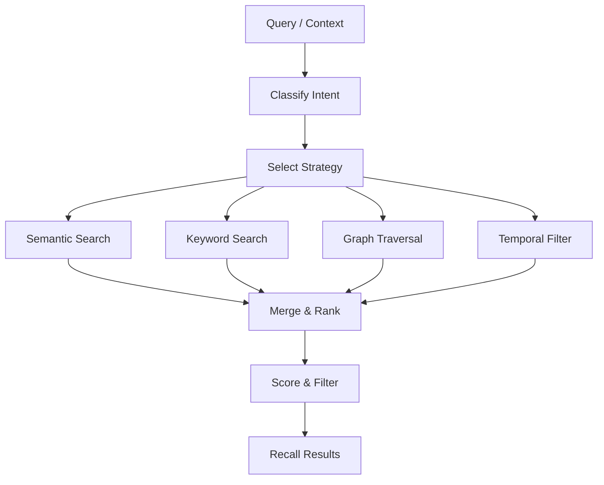
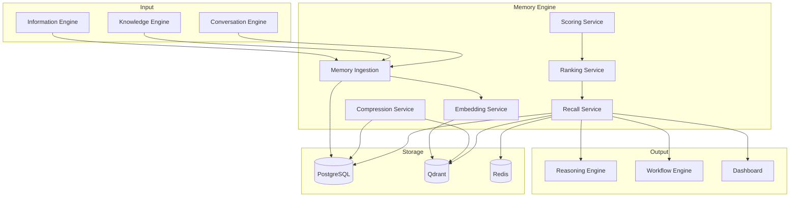
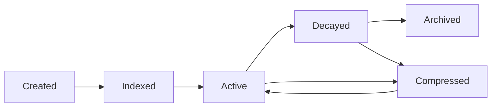
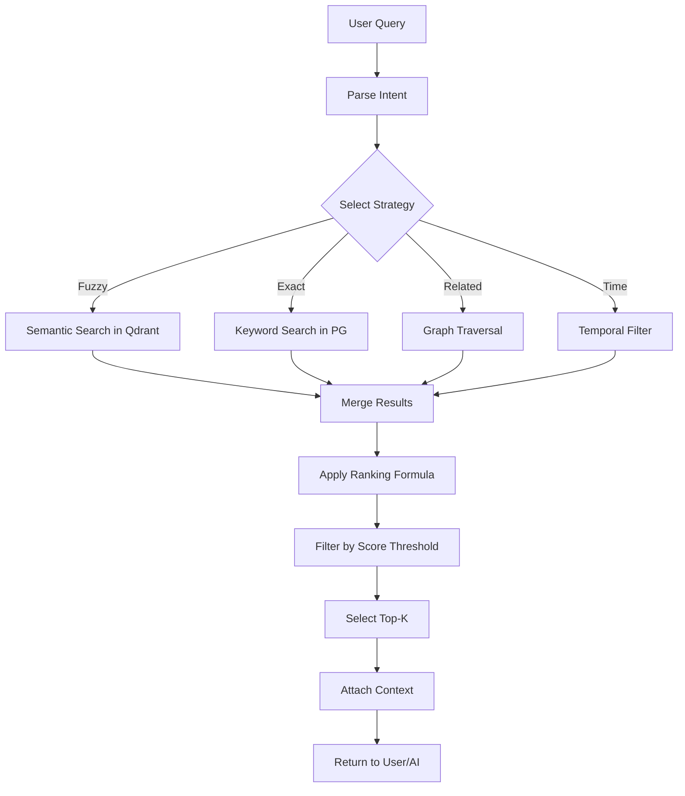

# Howard AIOS Memory Engine Blueprint

> 本文档是 Howard AIOS Memory Engine 的详细设计蓝图。
> Memory Engine 是 AIOS 八层架构中 L4 Memory Layer 的核心实现，负责组织和维护系统的长期记忆，为 AI 推理提供历史上下文。

版本：v1.0
状态：Active
创建日期：2026-07-07
作者：Howard Zhang

依赖文档：
- [AIOS Constitution v1.0](../Constitution/AIOS-Constitution-v1.0.md)
- [AIOS Vision](./00-Vision.md)
- [AIOS Architecture Blueprint](./01-Architecture.md)
- [AIOS Domain Model](./02-Domain-Model.md)

---

## 1. Overview

Memory Engine 是 Howard AIOS 的长期记忆系统。它实现了 Constitution 中"Information Never Disappears"原则的记忆维度——不仅信息不消失，系统还能"回忆"过去的经验。

人类的大脑有两种核心记忆能力：记住发生过什么（情景记忆），以及记住事物之间的联系（语义记忆）。Memory Engine 为 AIOS 提供类似的能力——让系统能够回答"上个月发生了什么"、"上次和客户李总讨论了什么"、"张三过去半年参与了哪些项目"。

### 1.1 Memory Engine 在 AIOS 中的位置

在八层架构中，Memory Engine 位于 L4 Memory Layer。它同时接收 Information Engine（原始信息）和 Knowledge Engine（结构化知识）的输出，将它们转化为可语义检索的记忆条目。Memory Engine 的输出直接服务于 Reasoning Engine——为 AI 推理提供历史上下文。

### 1.2 当前实现状态

Prisma Schema 已定义 `Memory` 模型（content、source、tags、embedding、organizationId）。`memory/` 目录为占位目录，完整实现待后续 Sprint。

---

## 2. Working Memory

Working Memory（工作记忆）是最短期的记忆类型，保存当前正在进行的对话和任务的上下文。

### 2.1 特征

- **时效性**：存活时间从几秒到几小时
- **容量有限**：同一时间保持 7±2 个信息项
- **高优先级**：Working Memory 的内容优先参与 AI 推理

### 2.2 使用场景

- 用户正在与 AIOS 对话——保持当前对话的上下文
- 用户正在处理一个任务——保持任务相关的背景信息
- AI 正在执行推理——保持在推理过程中收集的中间结果

### 2.3 实现策略

- 存储在 Redis 或内存缓存中（未来实现）
- 超时自动清除（默认 TTL: 4 小时）
- 对话结束后，关键信息转入 Conversation Memory

---

## 3. Conversation Memory

Conversation Memory（对话记忆）保存用户与 AIOS 之间的对话历史。

### 3.1 特征

- **时效性**：保留 30 天，过期后压缩摘要
- **结构化**：每轮对话包含角色、内容、时间戳
- **上下文窗口**：AI 推理时加载最近 N 轮对话作为上下文

### 3.2 使用场景

- "我昨天问了什么关于 V2 项目的问题？"
- "上次 AI 给我的建议是什么？"
- 保持对话连贯性——AI 理解前文语境

### 3.3 实现策略

- 对话消息存储在 PostgreSQL
- 对话摘要存储在 Memory 表
- 对话向量嵌入存储在 Qdrant
- 超过 30 天的对话自动生成摘要后归档

---

## 4. Long-term Memory

Long-term Memory（长期记忆）是 Memory Engine 的核心。它保存系统积累的所有历史知识。

### 4.1 特征

- **持久性**：永不删除，只归档
- **容量无限**：通过压缩和分层管理存储增长
- **语义检索**：支持向量相似度和全文搜索

### 4.2 记忆来源

Long-term Memory 从以下来源积累：

- **Information Engine**：每条 Information 转化为记忆条目
- **Knowledge Engine**：知识实体的变更历史转化为记忆
- **Conversation Memory**：过期对话的摘要转入长期记忆
- **Reasoning Engine**：AI 推理的结果和反馈存入长期记忆
- **用户标注**：用户手动创建的记忆条目

### 4.3 Prisma 模型

当前已定义的 `Memory` 模型：

| 字段 | 类型 | 说明 |
|------|------|------|
| id | String (UUID) | 主键 |
| content | String | 记忆内容 |
| source | String | 记忆来源标识 |
| tags | String[] | 标签列表 |
| embedding | Float[] | 向量嵌入 |
| organizationId | String | 所属组织 |
| createdAt | DateTime | 创建时间 |
| updatedAt | DateTime | 更新时间 |

---

## 5. Semantic Memory

Semantic Memory（语义记忆）存储关于世界的知识和事实。

### 5.1 特征

- **事实性**：存储客观事实，而非主观体验
- **结构化**：以实体和属性的形式组织
- **可推理**：支持基于已知事实的逻辑推断

### 5.2 示例

| 语义记忆 | 类型 |
|----------|------|
| 张三是 A 公司的技术总监 | 人物事实 |
| V2 项目的预算是 150 万 | 项目事实 |
| 上次董事会在 2026 年 6 月 15 日召开 | 事件事实 |
| 客户王总的邮箱是 wang@company.com | 联系信息 |

### 5.3 与 Knowledge Engine 的关系

Semantic Memory 和 Knowledge Graph 有重叠但不同：

- **Knowledge Graph** 存储结构化关系（图结构）
- **Semantic Memory** 存储自然语言描述的事实（文本 + 向量）

Knowledge Engine 输出结构化知识，Memory Engine 将知识转化为语义记忆——两者互补。

---

## 6. Procedural Memory

Procedural Memory（程序记忆）存储"如何做某件事"的知识。

### 6.1 特征

- **操作性**：存储操作流程和步骤
- **习得性**：通过重复实践而巩固
- **自动化**：熟练后无需刻意思考

### 6.2 在 AIOS 中的应用

| 程序记忆 | 说明 |
|----------|------|
| 会议处理流程 | PLAUD → 转写 → 提取 → 分配待办 → 通知 |
| 邮件处理流程 | 接收 → 分类 → 提取实体 → 生成摘要 → 存档 |
| 报告生成流程 | 收集数据 → 分析 → 生成图表 → 撰写文本 → 审核 |
| 客户跟进流程 | 识别客户 → 查找历史 → 生成建议 → 发送提醒 |

### 6.3 实现策略

Procedural Memory 通过 Workflow Engine 的工作流定义实现。每个工作流模板就是一种程序记忆。系统通过分析工作流的执行历史和成功率，自动优化程序记忆。

---

## 7. Organization Memory

Organization Memory（组织记忆）是属于一个 Organization 的集体记忆。

### 7.1 特征

- **多租户隔离**：A 公司的记忆与 B 公司完全隔离
- **集体知识**：组织中所有用户的贡献汇聚成组织记忆
- **传承性**：员工离职后，其贡献的记忆保留在组织中

### 7.2 组成

- 组织的会议历史
- 组织的项目知识
- 组织的客户关系
- 组织的决策记录
- 组织的工作流经验

### 7.3 跨用户记忆

在同一个 Organization 内：

- 用户 A 创建的记忆，用户 B 可以检索（受权限控制）
- 用户 A 与客户的互动，会丰富组织对该客户的记忆
- 用户 A 的离职不会导致组织记忆的丢失

---

## 8. Founder Memory

Founder Memory（创始人记忆）是 Memory Engine 的特殊层，专注于理解和记住创始人的偏好和习惯。

### 8.1 特征

- **个性化**：记录创始人的决策风格、管理偏好、关注重点
- **长期积累**：随着使用时间增长，越来越理解创始人
- **高优先级**：在 AI 推理时，Founder Memory 的权重最高

### 8.2 记忆类型

| 记忆类型 | 示例 |
|----------|------|
| 决策风格 | 倾向于数据驱动，不喜欢直觉决策 |
| 管理偏好 | 喜欢简短汇报，不需要冗长分析 |
| 关注领域 | 特别关注客户满意度和产品进度 |
| 沟通偏好 | 喜欢早晨处理重要事务，下午开会 |
| 风险偏好 | 对高风险投资谨慎，对技术创新积极 |

### 8.3 未来目标

Founder Memory 是实现 Founder Digital Twin 的关键基础。当系统积累了足够的 Founder Memory，AIOS 能够预测创始人在特定场景下的选择，在创始人不在时做出与创始人风格一致的决策。

---

## 9. AI Memory

AI Memory（AI 记忆）存储 AI 系统自身的学习经验。

### 9.1 特征

- **反思性**：记录 AI 推理的成功和失败经验
- **自适应性**：基于反馈调整推理策略
- **全局性**：跨 Organization 的通用学习（隐私安全）

### 9.2 记忆类型

| 记忆类型 | 示例 |
|----------|------|
| 推理模板 | "当项目进度落后 20% 时，建议..." |
| 错误模式 | "当信息源为 OCR 时，数字识别需要二次验证" |
| 成功模式 | "用户在采纳战略建议后给予了正面反馈" |
| 模型偏好 | "对于中文内容，模型 A 的效果优于模型 B" |

### 9.3 隐私边界

AI Memory 分为两个层级：

- **组织级 AI Memory**：存储在 Organization 内部，不跨组织共享
- **系统级 AI Memory**：经过脱敏后的通用学习结果，用于改进基础模型

---

## 10. Memory Compression

Memory Compression 管理长期记忆的增长，确保系统不会因为记忆无限膨胀而性能下降。

### 10.1 压缩策略

**摘要压缩**：将多条相关记忆合并为一条摘要记忆。

```
原始记忆 1：周一讨论了 V2 项目的技术方案
原始记忆 2：周二张三提交了 V2 的设计稿
原始记忆 3：周三评审通过了 V2 的设计
→ 压缩为：本周 V2 项目完成了技术讨论和设计评审
```

**层级压缩**：按时间粒度分层压缩。

| 时间范围 | 粒度 | 压缩率 |
|----------|------|--------|
| 0-7 天 | 原始记忆 | 1:1 |
| 7-30 天 | 日摘要 | 10:1 |
| 30-90 天 | 周摘要 | 30:1 |
| 90-365 天 | 月摘要 | 100:1 |
| 1 年以上 | 年摘要 | 1000:1 |

**选择性保留**：高重要性的记忆不压缩，低重要性的记忆优先压缩。

### 10.2 压缩触发

- 定时任务：每天凌晨执行一次压缩
- 容量阈值：当记忆数量超过阈值时触发
- 手动触发：用户手动要求压缩旧记忆

---

## 11. Memory Recall

Memory Recall（记忆召回）是 Memory Engine 最核心的能力——在需要时找到正确的记忆。



### 11.1 召回策略

**语义召回**：基于向量相似度搜索语义相关的记忆。适合模糊查询："上次和客户讨论的方案"。

**关键词召回**：基于全文索引匹配关键词。适合精确查询："张三的邮箱"。

**图遍历召回**：基于 Knowledge Graph 的关系遍历。适合关联查询："张三参与的所有项目"。

**时间召回**：基于时间范围过滤。适合时间查询："上周的会议记录"。

**混合召回**：同时使用多种策略，合并结果并综合排序。

### 11.2 上下文感知召回

Memory Engine 的召回不是简单的搜索，而是上下文感知的智能召回：

1. 分析当前对话/任务的上下文
2. 推断用户可能需要的记忆类型
3. 选择最优的召回策略组合
4. 按相关性和时效性排序结果
5. 返回 Top-K 条记忆

---

## 12. Memory Ranking

Memory Ranking 决定召回结果的排序。

### 12.1 排序因子

| 因子 | 权重 | 说明 |
|------|------|------|
| 语义相关度 | 0.35 | 与查询的向量相似度 |
| 关键词匹配度 | 0.20 | 关键词匹配分数 |
| 时效性 | 0.20 | 越新的记忆权重越高 |
| 访问频率 | 0.10 | 被频繁访问的记忆权重更高 |
| 重要性 | 0.15 | 被标记为重要的记忆权重更高 |

### 12.2 排序公式

```
finalScore = 0.35 * semanticScore
           + 0.20 * keywordScore
           + 0.20 * recencyScore
           + 0.10 * frequencyScore
           + 0.15 * importanceScore
```

权重可配置，不同场景可以使用不同的权重组合。

---

## 13. Memory Score

Memory Score 量化每条记忆的"价值"，用于压缩决策和排序。

### 13.1 评分因子

| 因子 | 范围 | 说明 |
|------|------|------|
| 访问次数 | 0-∞ | 被检索和使用的次数 |
| 最后访问时间 | 天数 | 距上次被访问的天数 |
| 关联实体数 | 0-∞ | 与多少知识实体关联 |
| 用户反馈 | 0-1 | 用户对记忆的正面/负面反馈 |
| 来源权重 | 0-1 | 记忆来源的可信度 |

### 13.2 评分公式

```
memoryScore = accessCount * 0.2
            + (1 / (daysSinceLastAccess + 1)) * 0.3
            + relatedEntityCount * 0.1
            + userFeedback * 0.2
            + sourceWeight * 0.2
```

### 13.3 评分应用

- **压缩决策**：评分低于阈值的记忆优先进入压缩队列
- **排序加权**：评分作为排序的辅助因子
- **缓存优先级**：高评分记忆优先进入缓存

---

## 14. Memory Expiration

Memory Expiration 管理记忆的过期和归档。

### 14.1 过期策略

AIOS Constitution 规定"Information Never Disappears"。因此 Memory Engine 不使用"删除"，而是"降级"。

| 阶段 | 触发条件 | 操作 |
|------|----------|------|
| Active | 默认状态 | 参与所有检索和推理 |
| Decayed | 90 天未访问 且 评分低于阈值 | 降低检索权重，不参与默认查询 |
| Archived | 365 天未访问 且 评分低于阈值 | 仅在显式查询时返回 |
| Compressed | 手动或定时触发 | 合并为摘要记忆 |

### 14.2 永不过期的记忆

以下类型的记忆永不过期：

- 创始人手动标记为"重要"的记忆
- 与活跃决策相关的记忆
- 涉及法律合规的记忆
- Founder Memory（创始人偏好记忆）

---

## 15. Memory Merge

Memory Merge 将多条相关记忆合并为一条更丰富的记忆。

### 15.1 合并条件

- 多条记忆描述同一事件或同一实体
- 多条记忆来自不同来源但内容相关
- 压缩过程中需要合并旧记忆

### 15.2 合并策略

**内容合并**：将多条记忆的内容整合为一条完整的叙述。

**属性合并**：

- 标签：取并集，去重
- 来源：保留所有来源
- 时间：取最早创建时间
- 嵌入：重新计算合并后的向量

**冲突处理**：如果多条记忆的内容矛盾，保留所有版本并标记冲突。

---

## 16. Memory Retrieval

Memory Retrieval 是面向用户的记忆检索接口。

### 16.1 检索模式

**自然语言查询**：

- "上周和客户的沟通记录"
- "关于 V2 项目的所有决策"
- "张三个月份的工作总结"

**结构化查询**：

- 按标签过滤：`{ tags: ["项目", "V2"] }`
- 按时间过滤：`{ from: "2026-06-01", to: "2026-06-30" }`
- 按来源过滤：`{ source: "PLAUD" }`
- 按实体过滤：`{ relatedEntity: "张三" }`

**组合查询**：自然语言 + 结构化条件的组合。

### 16.2 检索结果

每条检索结果包含：

- 记忆内容
- 相关度分数
- 来源标识
- 时间戳
- 关联标签
- 关联实体

---

## 17. Embedding

### 17.1 嵌入模型

Memory Engine 使用嵌入模型将记忆文本转化为向量：

- 中文嵌入：使用多语言嵌入模型（如 multilingual-e5-large）
- 英文嵌入：使用英文嵌入模型（如 text-embedding-3-small）
- 混合嵌入：自动检测语言，选择对应模型

### 17.2 嵌入维度

- 默认维度：1536 维（兼容 OpenAI text-embedding-3-small）
- 可配置：支持 768 维（轻量模型）或 3072 维（高精度模型）

### 17.3 嵌入更新

- 记忆创建时自动生成嵌入
- 记忆内容更新时重新生成嵌入
- 记忆合并时重新生成嵌入
- 嵌入模型升级时批量重新生成（异步后台任务）

---

## 18. Vector Store

### 18.1 Qdrant 集成

Memory Engine 使用 Qdrant 作为向量数据库：

| 特性 | 说明 |
|------|------|
| 向量搜索 | ANN 近似最近邻搜索，毫秒级响应 |
| 元数据过滤 | 支持按 organizationId、tags、source 过滤 |
| 批量操作 | 支持批量写入和更新向量 |
| 持久化 | 向量持久化存储，服务重启不丢失 |

### 18.2 Collection 设计

```
Collection: memories
├── 向量维度：1536
├── 距离度量：Cosine Similarity
├── Payload Schema:
│   ├── organizationId: String（必须，用于多租户过滤）
│   ├── memoryId: String（关联 PostgreSQL Memory 记录）
│   ├── source: String
│   ├── tags: String[]
│   ├── createdAt: Timestamp
│   └── score: Float
```

### 18.3 多租户隔离

Qdrant 的 Payload Filter 确保多租户隔离：

```
每次搜索必须包含 organizationId 过滤条件：
{
  "filter": {
    "must": [
      { "key": "organizationId", "match": { "value": "<org_id>" } }
    ]
  }
}
```

---

## 19. Memory Security

### 19.1 数据加密

- 静态加密：PostgreSQL 数据使用数据库级加密
- 传输加密：API 通信使用 HTTPS
- 向量加密：Qdrant 支持加密存储（未来实现）

### 19.2 访问审计

所有记忆访问操作记录审计日志：

- 谁在什么时间访问了什么记忆
- 访问类型（读取、搜索、导出）
- 访问结果（返回了多少条记忆）

### 19.3 敏感记忆标记

支持将特定记忆标记为敏感：

- 财务数据相关记忆
- 人事变动相关记忆
- 法律文件相关记忆
- 战略规划相关记忆

敏感记忆的访问需要额外的权限验证和审计记录。

---

## 20. Memory Isolation

### 20.1 Organization 级隔离

Memory Engine 的最基本隔离单元是 Organization：

- 每个 Organization 的记忆物理存储在同一个数据库中，通过 `organizationId` 字段逻辑隔离
- 所有查询必须携带 `organizationId` 参数
- 不允许无 `organizationId` 的全局查询

### 20.2 User 级隔离（未来）

在 Organization 内部，支持 User 级别的记忆隔离：

- 用户的个人记忆仅自己可见
- 共享记忆在权限范围内可见
- 组织公开记忆对所有成员可见

### 20.3 跨组织记忆共享（未来）

当创始人管理多个公司时，支持有限的跨组织记忆共享：

- 共享通用知识（行业趋势、管理方法论）
- 不共享业务数据（客户信息、财务数据、人事信息）
- 共享需要创始人显式配置

---

## 21. Memory Architecture



---

## 22. Memory Lifecycle



| 阶段 | 状态 | 说明 |
|------|------|------|
| Created | 新创建 | 记忆刚刚被创建，尚未嵌入 |
| Indexed | 已索引 | 向量嵌入已生成，可参与语义搜索 |
| Active | 活跃 | 记忆处于活跃状态，参与所有检索 |
| Decayed | 衰减 | 长期未访问，降低检索权重 |
| Archived | 归档 | 仅在显式查询时返回 |
| Compressed | 已压缩 | 与其他记忆合并为摘要 |

---

## 23. Memory Recall Flow



---

## 24. Future Evolution

### 24.1 短期演进（6-12 个月）

- 实现基础 Memory Service（CRUD + 简单搜索）
- 集成 Qdrant 向量数据库
- 实现基础语义搜索（单策略召回）
- 实现 Working Memory（Redis 缓存）

### 24.2 中期演进（1-2 年）

- 实现 Hybrid Recall（多策略合并召回）
- 实现 Memory Compression（自动摘要和压缩）
- 实现 Memory Scoring 和 Ranking
- 实现 Conversation Memory（对话历史管理）
- 实现 Memory Expiration（自动衰减和归档）

### 24.3 长期演进（2-5 年）

- 实现 Founder Memory（创始人偏好学习）
- 实现 AI Memory（AI 自适应学习）
- 实现 Procedural Memory（流程自动优化）
- 实现跨组织记忆共享
- 实现记忆可视化——时间线视图、关系图视图
- 实现记忆导出和迁移

---

> 本 Memory Engine Blueprint 与 [AIOS Constitution v1.0](../Constitution/AIOS-Constitution-v1.0.md)、[AIOS Vision](./00-Vision.md)、[AIOS Architecture Blueprint](./01-Architecture.md) 和 [AIOS Domain Model](./02-Domain-Model.md) 保持一致。
> Prisma Schema 是 Memory 数据模型的唯一真相来源。
> 修改本文档需在 CHANGELOG.md 中记录。
