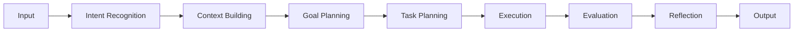
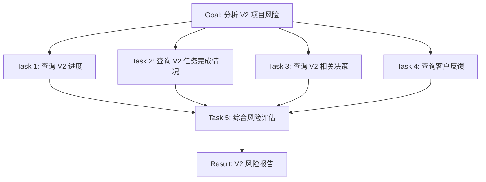
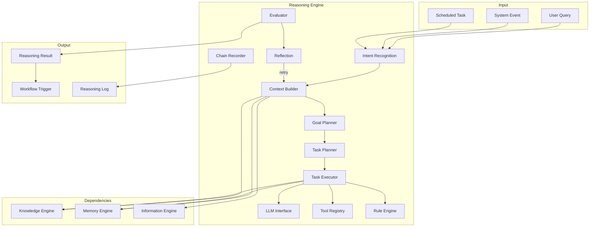
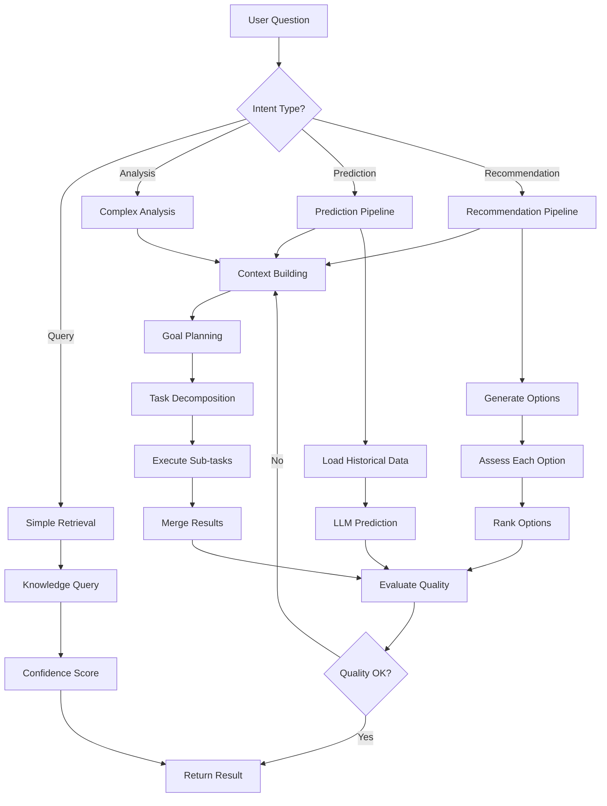
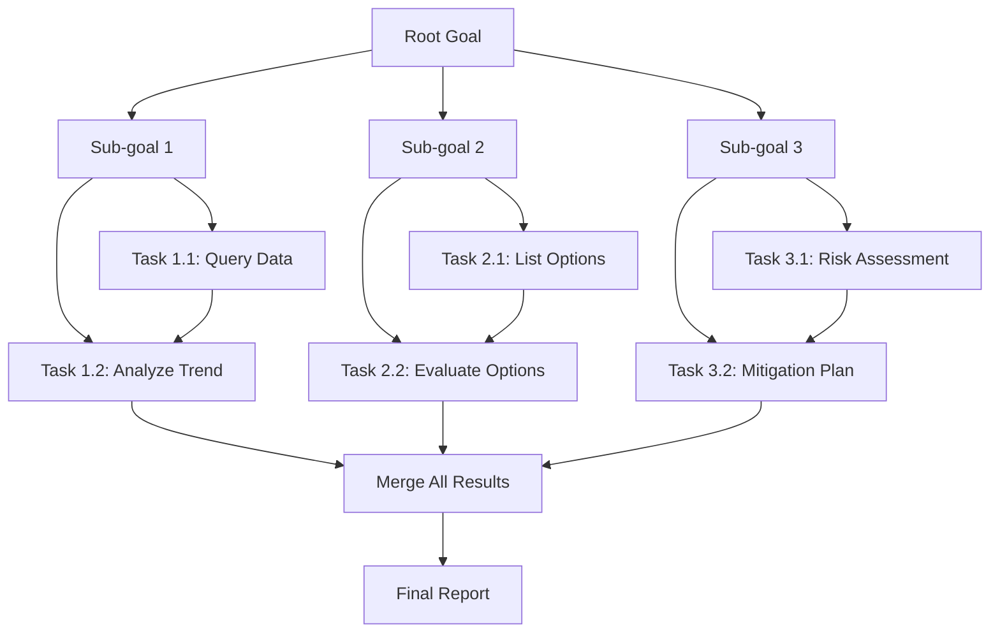

# Howard AIOS Reasoning Engine Blueprint

版本：v1.0
目的：定义 AIOS 智能推理引擎的完整设计——从意图识别到多步规划到自我反思。
状态：Active
创建日期：2026-07-07

依赖文档：
- [AIOS Constitution v1.0](../Constitution/AIOS-Constitution-v1.0.md)
- [00-Vision](./00-Vision.md)
- [01-Architecture](./01-Architecture.md)
- [02-Domain-Model](./02-Domain-Model.md)
- [05-Information-Engine](./05-Information-Engine.md)
- [06-Knowledge-Engine](./06-Knowledge-Engine.md)
- [07-Memory-Engine](./07-Memory-Engine.md)

---

## 1. Overview

Reasoning Engine 是 Howard AIOS 的智能核心，位于八层架构的 L4 Reasoning Layer。它基于 Knowledge Engine 提供的知识图谱和 Memory Engine 提供的长期记忆，执行逻辑推理、趋势分析、风险识别和决策建议。

Reasoning Engine 实现了 AIOS Constitution 中"AI Must Be Explainable"和"Human Always Wins"两条核心原则。它的每一个输出都必须附带可追溯的推理链，每一个建议都必须标注置信度，每一个不可逆操作都必须等待人类确认。

Reasoning Engine 不是简单的 LLM 封装。它是一个完整的推理管道，包含意图识别、上下文构建、目标规划、任务分解、工具调用、结果评估和自我反思七个阶段。

---

## 2. Design Goals

**可解释性**：每次推理必须生成完整的 Reasoning Chain，记录从输入到输出的每一步推导过程。用户可以查看"为什么 AI 给出了这个建议"。

**置信度量化**：每个推理结果附带 0.0-1.0 的置信度分数。低于阈值的结果标记为"低置信度"，建议用户进一步验证。

**人机协作**：Reasoning Engine 提供建议，人类做决策。对于高风险建议（涉及财务、人事、法律），必须经过人类确认后才进入执行阶段。

**多步推理**：支持复杂问题的多步分解——将一个大问题拆分为多个子问题，逐步推理后合成最终答案。

**自我反思**：推理完成后执行 Reflection——评估推理质量，识别潜在错误，必要时重新推理。

**可插拔 LLM**：LLM 调用通过抽象接口实现，支持 OpenAI、Claude、Gemini 等多供应商切换，不绑定单一 LLM。

---

## 3. Reasoning Definition

Reasoning（推理）是从已知信息推导出新知识或结论的过程。在 AIOS 中，推理分为三类：

**演绎推理（Deductive）**：从一般规则推导具体结论。"所有项目超过截止日期未完成的都标记为风险" + "V2 项目超过截止日期" → "V2 项目是风险"。

**归纳推理（Inductive）**：从具体案例总结一般规律。"过去三次项目延期的原因都是需求变更" → "需求变更是项目延期的常见原因"。

**类比推理（Analogical）**：从相似场景推断当前情况。"A 公司采用敏捷方法后效率提升 30%" + "B 公司情况类似" → "B 公司可以尝试敏捷方法"。

Reasoning Engine 综合使用这三种推理方式，根据场景自动选择最优策略。

---

## 4. Reasoning Pipeline

Reasoning Engine 的核心是一条八阶段推理管道：



### 4.1 Intent Recognition（意图识别）

Intent Recognition 分析用户输入或系统事件，识别推理任务的意图。

| 意图类型 | 触发方式 | 示例 |
|----------|----------|------|
| Query | 用户提问 | "上个月销售额是多少？" |
| Analysis | 用户请求分析 | "分析 V2 项目的风险" |
| Prediction | 用户请求预测 | "预测下季度客户增长" |
| Recommendation | 用户请求建议 | "我应该优先进入哪个市场？" |
| Alert | 系统事件触发 | 项目进度落后阈值 |
| Summary | 用户请求汇总 | "总结本周的会议" |
| Comparison | 用户请求对比 | "对比 A 方案和 B 方案" |

意图识别的结果决定了后续管道使用哪些推理策略和调用哪些工具。

### 4.2 Context Building（上下文构建）

Context Building 从 Knowledge Engine 和 Memory Engine 收集与当前任务相关的上下文。

**知识上下文**：从 Knowledge Graph 中查询相关实体和关系。例如用户询问"V2 项目"，系统检索 V2 的负责人、进度、关联任务、历史决策。

**记忆上下文**：从 Memory Engine 中召回相关记忆。例如"上次讨论 V2 项目时说了什么"。

**对话上下文**：加载最近 N 轮对话历史，保持推理的连贯性。

**用户上下文**：加载 Founder Memory 中的用户偏好和决策风格。

上下文组装为 Context Package，传递给后续阶段。Context Package 的大小受 LLM Token 限制约束，通过优先级排序选择最重要的上下文。

### 4.3 Goal Planning（目标规划）

Goal Planning 将用户意图转化为明确的推理目标。

**简单目标**：单次推理即可完成。"查询张三的邮箱" → 直接知识检索。

**复合目标**：需要多步推理。"分析公司上半年的经营状况" → 拆分为：财务分析 + 项目进度 + 客户关系 + 团队效率 → 合成报告。

Goal Planning 输出 Goal Specification，包含：目标描述、成功标准、约束条件、时间限制。

### 4.4 Task Planning（任务规划）

Task Planning 将 Goal 分解为可执行的子任务序列。



任务规划输出 Task Graph——一个有向无环图（DAG），定义子任务的依赖关系和执行顺序。

### 4.5 Execution（执行）

Execution 阶段按照 Task Graph 执行每个子任务。执行方式包括：

**知识查询**：调用 Knowledge Engine 查询实体和关系。
**记忆召回**：调用 Memory Engine 检索相关记忆。
**LLM 调用**：调用大语言模型进行文本分析、摘要、推理。
**工具调用**：调用外部工具（计算器、日历查询、API 调用）。
**规则匹配**：调用 Rule Engine 匹配预定义的业务规则。

子任务可以并行执行（无依赖关系的任务），也可以串行执行（有依赖关系的任务）。

### 4.6 Evaluation（评估）

Evaluation 阶段评估推理结果的质量：

**完整性检查**：所有子任务是否都成功完成？
**一致性检查**：多个子任务的结果是否矛盾？
**置信度计算**：综合各子任务的置信度，计算最终结果的置信度。
**阈值检查**：置信度是否达到最低阈值？不达标则标记为"低置信度"或触发重新推理。

### 4.7 Reflection（反思）

Reflection 是 Reasoning Engine 的自我改进机制：

**结果审查**：推理结果是否回答了用户的原始问题？
**推理链审查**：推理过程中是否有逻辑跳跃或错误假设？
**替代方案**：是否存在其他合理的推理路径？
**信心校准**：置信度评估是否合理？

如果 Reflection 发现问题，可以触发重新推理——从 Context Building 阶段重新开始，使用不同的策略或更多的上下文。

---

## 5. Decision Engine

Decision Engine 是 Reasoning Engine 中负责决策支持的子模块。

### 5.1 决策框架

Decision Engine 使用结构化的决策框架：

1. **问题定义**：明确需要做出的决策是什么
2. **选项生成**：列出所有可能的选项
3. **信息收集**：为每个选项收集支持/反对的证据
4. **风险评估**：评估每个选项的风险
5. **收益分析**：评估每个选项的预期收益
6. **建议生成**：综合评估，推荐最优选项
7. **解释生成**：说明推荐理由

### 5.2 决策类型

| 决策类型 | 风险等级 | 是否需要人类确认 |
|----------|----------|-----------------|
| 信息查询 | 低 | 否 |
| 日常建议 | 低 | 否 |
| 战略建议 | 高 | 是 |
| 资源分配 | 高 | 是 |
| 财务建议 | 高 | 是 |
| 人事建议 | 高 | 是 |

---

## 6. Rule Engine

Rule Engine 是 Reasoning Engine 的确定性推理子模块。它基于预定义的业务规则进行推理，不需要 LLM 调用。

### 6.1 规则类型

**阈值规则**：当指标超过阈值时触发预警。"项目进度落后 > 20% → 发出风险预警"。

**时间规则**：基于时间条件触发。"任务截止日期前 3 天未完成 → 发送提醒"。

**状态规则**：基于状态变化触发。"任务状态变为 DONE → 检查后续任务是否就绪"。

**组合规则**：多个条件的组合。"客户 30 天未互动 AND 合同 60 天内到期 → 发出跟进提醒"。

### 6.2 规则管理

规则以声明式方式定义，存储在数据库或配置文件中。管理员可以通过 Dashboard 创建、修改、启用、禁用规则，无需修改代码。

---

## 7. LLM Planning

LLM Planning 管理大语言模型的调用策略。

### 7.1 Prompt 工程

每次 LLM 调用使用结构化的 Prompt：

```
[System] 你是 AIOS Reasoning Engine。基于提供的上下文回答用户问题。
[Context] {从 Context Building 收集的上下文}
[History] {最近的对话历史}
[Question] {用户的原始问题}
[Instructions] 请基于上下文回答，不要编造信息。如果不确定，标注低置信度。
```

### 7.2 模型选择

根据任务复杂度选择不同模型：

| 任务类型 | 模型选择 | 理由 |
|----------|----------|------|
| 简单查询 | 轻量模型 | 速度快，成本低 |
| 文本摘要 | 中等模型 | 平衡质量和速度 |
| 深度推理 | 高级模型 | 需要强推理能力 |
| 代码生成 | 代码专用模型 | 代码质量更高 |

### 7.3 Token 管理

LLM 调用受 Token 限制。Reasoning Engine 通过以下策略管理 Token：

- 上下文截断：按优先级保留最重要的上下文
- 历史压缩：长对话历史压缩为摘要
- 分步调用：复杂问题拆分为多次 LLM 调用
- 缓存复用：相似查询复用已有的 LLM 结果

---

## 8. Tool Calling

Tool Calling 允许 Reasoning Engine 在推理过程中调用外部工具。

### 8.1 工具类型

| 工具 | 说明 | 调用场景 |
|------|------|----------|
| Knowledge Search | 知识图谱查询 | 需要查询实体或关系 |
| Memory Recall | 记忆检索 | 需要历史上下文 |
| Calculator | 数值计算 | 需要精确的数学计算 |
| Calendar | 日历查询 | 需要了解日程安排 |
| Web Search | 网页搜索 | 需要外部信息 |
| Code Executor | 代码执行 | 需要运行脚本验证假设 |
| MCP Agent | MCP 工具调用 | 需要操作外部系统 |

### 8.2 工具选择

Reasoning Engine 根据推理需求自动选择工具：

1. 分析推理任务需要的信息类型
2. 匹配可提供该信息的工具
3. 构造工具调用参数
4. 执行工具调用
5. 将结果注入推理链

---

## 9. Confidence Score

Confidence Score 量化推理结果的可信程度。

### 9.1 评分维度

| 维度 | 权重 | 说明 |
|------|------|------|
| 数据质量 | 0.25 | 输入数据的完整性和准确性 |
| 推理一致性 | 0.25 | 推理过程中是否出现矛盾 |
| LLM 确定性 | 0.20 | LLM 输出的确定性程度 |
| 规则匹配度 | 0.15 | 是否有明确的规则支持 |
| 历史验证 | 0.15 | 类似推理的历史准确率 |

### 9.2 阈值策略

| 置信度范围 | 处理策略 |
|-----------|----------|
| 0.8 - 1.0 | 高置信度，直接呈现结果 |
| 0.5 - 0.8 | 中置信度，呈现结果但标注"仅供参考" |
| 0.3 - 0.5 | 低置信度，呈现结果并建议用户验证 |
| 0.0 - 0.3 | 极低置信度，不呈现结果，建议用户补充信息 |

---

## 10. Reasoning Chain

Reasoning Chain 是推理过程的完整记录，满足 Constitution 中"AI Must Be Explainable"的要求。

### 10.1 链结构

```
ReasoningChain {
  id: UUID
  trigger: { type, input }           // 触发原因和输入
  steps: [
    { id, type, input, output, confidence, duration },
    ...
  ]
  result: { content, confidence }     // 最终结果
  reflection: { quality, issues }     // 反思结果
  metadata: { model, tokens, cost }   // 元数据
}
```

### 10.2 链类型

**线性链**：A → B → C → Result。简单问题使用线性推理链。

**树形链**：A → (B1, B2, B3) → Merge → Result。复杂问题拆分为多个分支，分别推理后合并。

**循环链**：A → B → Evaluate → (pass → Result, fail → A)。推理结果不满意时循环重试。

---

## 11. Error Recovery

Reasoning Engine 的错误恢复机制：

**LLM 调用失败**：自动重试（最多 3 次），切换备用模型。

**工具调用失败**：降级处理——跳过失败的工具，使用已有信息继续推理，标注结果不完整。

**上下文不足**：向用户请求补充信息，或扩大检索范围。

**推理超时**：返回已有的部分结果，标注推理未完成。

**矛盾结果**：标记矛盾，呈现不同路径的结果，让用户判断。

---

## 12. Multi-step Planning

Multi-step Planning 处理需要多次推理才能完成的复杂任务。

### 12.1 规划策略

**前向规划**：从当前状态出发，逐步推进到目标状态。适合"分析并给出建议"类任务。

**后向规划**：从目标状态倒推需要哪些条件。适合"如何达成目标"类任务。

**混合规划**：结合前向和后向，从两端向中间推进。适合最复杂的问题。

### 12.2 规划限制

- 最大步骤数：20 步（可配置）
- 最大深度：5 层（可配置）
- 最大 Token 消耗：100K tokens（可配置）
- 超时时间：60 秒（可配置）

---

## 13. Self Evaluation

Self Evaluation 是 Reasoning Engine 的持续改进机制。

### 13.1 评估指标

| 指标 | 说明 |
|------|------|
| 准确率 | 推理结果的正确率（基于用户反馈） |
| 采纳率 | 用户对建议的采纳比例 |
| 响应时间 | 推理的平均耗时 |
| 成本 | LLM 调用的平均 Token 消耗 |
| 用户满意度 | 用户对推理结果的评分 |

### 13.2 反馈学习

用户对推理结果的反馈（采纳、拒绝、修改）被记录到 AI Memory。Reasoning Engine 定期分析反馈数据，调整推理策略：

- 频繁被拒绝的建议类型 → 调整推理规则
- 频繁被采纳的建议类型 → 提高置信度
- 特定领域的低准确率 → 优化该领域的 Prompt

---

## 14. Reasoning Architecture



---

## 15. Reasoning Flow



---

## 16. Planning Graph



---

## 17. Security

### 17.1 LLM 安全

- 所有 LLM 调用的 Prompt 不包含敏感数据（密码、密钥、个人信息）
- LLM 输出经过安全过滤——检测注入攻击、有害内容
- LLM 调用日志不记录完整的 Prompt 和 Response（脱敏存储）

### 17.2 推理安全

- 推理结果不包含跨组织数据（多租户隔离）
- 高敏感推理（财务、人事）需要额外权限验证
- 推理链日志加密存储，访问需要审计

### 17.3 工具安全

- Tool Calling 遵循最小权限原则
- 外部工具调用需要认证和授权
- 工具调用日志完整记录，支持审计

---

## 18. Summary

Reasoning Engine 是 AIOS 的智能核心，将知识、记忆和 AI 能力融合为统一的推理平台。它通过八阶段推理管道（意图识别 → 上下文构建 → 目标规划 → 任务规划 → 执行 → 评估 → 反思 → 输出）实现从问题到答案的完整推理过程。每个推理结果附带置信度分数和可追溯的推理链，确保 AI 的透明性和可解释性。

---

## 19. Future Evolution

### 短期（6-12 个月）

- 实现基础 Reasoning Service（简单查询 + 文本摘要）
- 实现 Rule Engine 基础版（阈值规则 + 时间规则）
- 集成首个 LLM 供应商（OpenAI）

### 中期（1-2 年）

- 实现 Multi-step Planning 和 Task Decomposition
- 实现 Tool Calling 框架
- 实现 Reasoning Chain 记录和可视化
- 实现 Reflection 和自我评估
- 集成多 LLM 供应商

### 长期（2-5 年）

- 实现自适应推理——根据用户反馈自动优化推理策略
- 实现多 Agent 协同推理——多个专用 Agent 协作完成复杂推理
- 实现联邦推理——跨组织推理，不共享原始数据
- 实现实时推理——事件驱动的持续推理，而非请求响应式

---

> 本文档与 Constitution、Vision、Architecture、Domain Model 及三大引擎蓝图保持一致。
> 修改需在 CHANGELOG.md 中记录。
