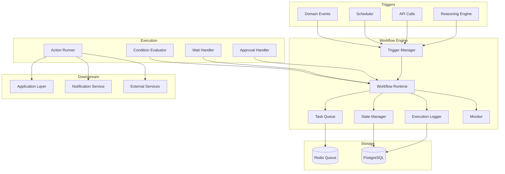
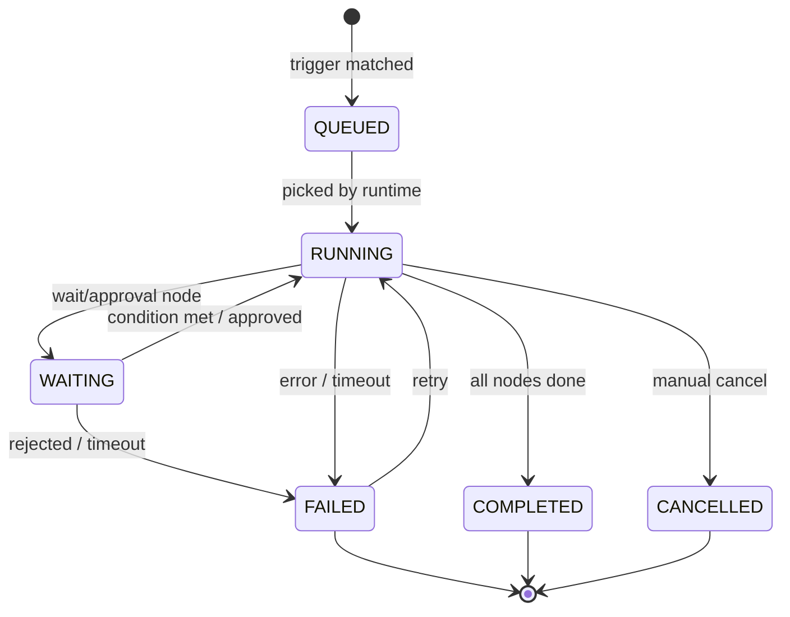
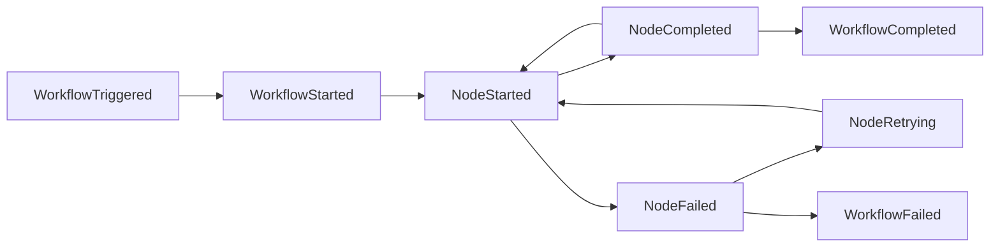
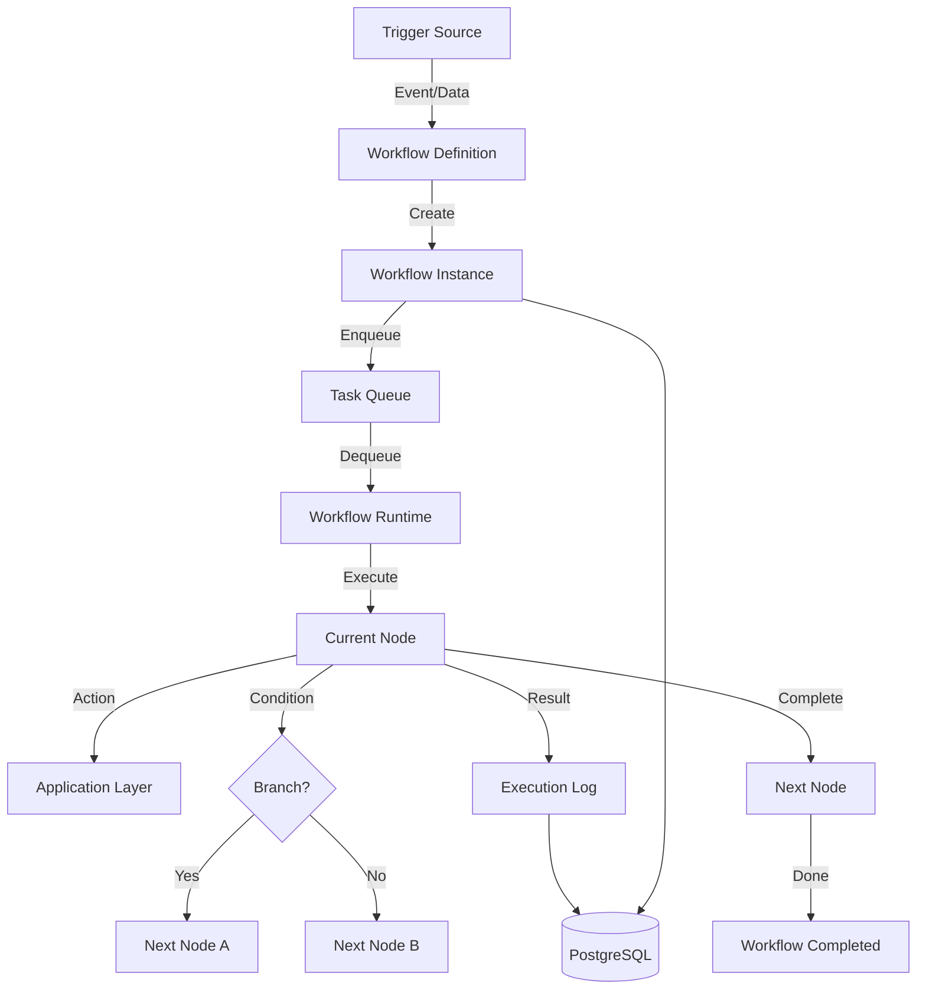

# Howard AIOS Workflow Engine Blueprint

版本：v1.0
目的：定义 AIOS 工作流引擎的完整设计——从流程定义到运行时到监控体系。
状态：Active
创建日期：2026-07-07

依赖文档：
- [AIOS Constitution v1.0](../Constitution/AIOS-Constitution-v1.0.md)
- [00-Vision](./00-Vision.md)
- [01-Architecture](./01-Architecture.md)
- [02-Domain-Model](./02-Domain-Model.md)
- [05-Information-Engine](./05-Information-Engine.md)
- [06-Knowledge-Engine](./06-Knowledge-Engine.md)
- [07-Memory-Engine](./07-Memory-Engine.md)

---

## 1. Overview

Workflow Engine 是 Howard AIOS 的执行编排器，位于八层架构的 L6 Workflow Layer。它实现了 AIOS Constitution 中"Everything creates Action"的核心原则——将信息和推理转化为可执行的自动化流程。

Workflow Engine 负责将 Reasoning Engine 的分析结果和系统事件转化为具体的执行计划。它管理工作流的定义、触发、执行、监控和生命周期。一个典型的工作流：会议结束 → 提取待办 → 分配给责任人 → 发送通知 → 设置跟进提醒。

在 DDD 领域模型中，Workflow Engine 管理 `WorkflowDefinition`（工作流模板）和 `WorkflowInstance`（工作流实例）两个核心聚合。

---

## 2. Design Goals

**声明式定义**：工作流通过声明式配置定义（JSON/YAML），而非硬编码。管理员可以通过 Dashboard 创建和修改工作流，无需编写代码。

**事件驱动**：工作流由事件触发——信息创建、知识更新、推理结果、定时任务、用户操作。每个工作流定义明确的触发条件。

**容错执行**：每个步骤支持重试、超时、降级。失败的步骤不会导致整个工作流崩溃。

**可视化编排**：工作流以有向无环图（DAG）结构定义，支持可视化编辑和展示。

**版本管理**：工作流模板支持版本控制。修改模板不影响正在运行的实例。

**多租户隔离**：每个 Organization 拥有独立的工作流空间。

---

## 3. Core Components

### 3.1 WorkflowDefinition（工作流定义）

工作流定义是工作流的模板，描述工作流的结构和行为。

| 属性 | 类型 | 说明 |
|------|------|------|
| id | UUID | 定义 ID |
| name | String | 工作流名称 |
| description | String | 描述 |
| version | Integer | 版本号 |
| trigger | TriggerConfig | 触发条件配置 |
| nodes | Node[] | 节点列表 |
| edges | Edge[] | 节点之间的连接 |
| variables | Variable[] | 工作流变量定义 |
| timeout | Duration | 全局超时时间 |
| retryPolicy | RetryPolicy | 默认重试策略 |
| organizationId | UUID | 所属组织 |

### 3.2 WorkflowInstance（工作流实例）

工作流实例是工作流定义的一次执行。

| 属性 | 类型 | 说明 |
|------|------|------|
| id | UUID | 实例 ID |
| definitionId | UUID | 关联的定义 ID |
| definitionVersion | Integer | 使用的定义版本 |
| status | WorkflowStatus | 当前状态 |
| context | JSON | 执行上下文（变量值） |
| startedAt | DateTime | 开始时间 |
| completedAt | DateTime? | 完成时间 |
| currentNodeId | UUID? | 当前执行节点 |
| executionLog | LogEntry[] | 执行日志 |

### 3.3 WorkflowNode（工作流节点）

节点是工作流中的执行单元。

| 节点类型 | 说明 |
|----------|------|
| ACTION | 执行具体操作（发送通知、创建任务、调用 API） |
| CONDITION | 条件判断，决定执行路径 |
| WAIT | 等待条件满足或超时 |
| APPROVAL | 等待人类审批 |
| PARALLEL | 并行执行多个子节点 |
| SUB_WORKFLOW | 调用另一个工作流 |
| START | 工作流起点 |
| END | 工作流终点 |

### 3.4 WorkflowEdge（工作流边）

边连接节点，定义执行流向。

| 属性 | 说明 |
|------|------|
| sourceId | 源节点 ID |
| targetId | 目标节点 ID |
| condition | 条件表达式（用于条件分支） |
| label | 边标签（如"是"/"否"） |

---

## 4. Architecture



---

## 5. Workflow Lifecycle

工作流定义的生命周期：

```
DRAFT → PUBLISHED → ACTIVE → DEPRECATED → ARCHIVED
```

工作流实例的生命周期：



### 5.1 Definition Lifecycle

| 阶段 | 说明 |
|------|------|
| DRAFT | 定义正在编辑，不会被触发 |
| PUBLISHED | 定义已发布，可以创建实例 |
| ACTIVE | 定义正在使用，新事件会触发实例 |
| DEPRECATED | 定义已废弃，不再创建新实例，但运行中的实例继续执行 |
| ARCHIVED | 定义已归档，完全停用 |

### 5.2 Instance Lifecycle

| 阶段 | 说明 |
|------|------|
| QUEUED | 实例已创建，等待运行时拾取 |
| RUNNING | 运行时正在执行节点 |
| WAITING | 等待外部条件（审批、超时、事件） |
| COMPLETED | 所有节点执行成功 |
| FAILED | 执行失败（超过重试次数） |
| CANCELLED | 被手动取消 |

---

## 6. Workflow Template

Workflow Template 是预定义的工作流模板，覆盖常见的业务场景。

### 6.1 内置模板

| 模板名称 | 触发条件 | 执行步骤 |
|----------|----------|----------|
| 会议待办分配 | MeetingCompleted 事件 | 提取待办 → 分配责任人 → 发送通知 → 设置跟进 |
| 客户跟进提醒 | 定时（每日） | 检查客户最后互动时间 → 超过阈值 → 发送提醒 |
| 项目风险预警 | TaskOverdue 事件 | 收集逾期任务 → 评估影响 → 通知管理层 |
| 日报生成 | 定时（每日 18:00） | 汇总当日数据 → 生成报告 → 发送给管理层 |
| 新客户欢迎 | CustomerCreated 事件 | 发送欢迎消息 → 创建初始任务 → 分配客户经理 |
| 合同到期预警 | 定时（每日） | 检查合同到期日期 → 30天内到期 → 发送预警 |
| 审批流程 | ApprovalRequested 事件 | 发送审批请求 → 等待审批 → 执行/拒绝 |

### 6.2 自定义模板

用户可以通过 Dashboard 的工作流编辑器创建自定义模板：

1. 选择触发条件（事件类型 / 定时规则 / API 调用）
2. 添加节点（拖拽方式）
3. 连接节点（定义执行流和条件分支）
4. 配置每个节点的参数
5. 测试运行（Dry Run）
6. 发布模板

---

## 7. Workflow Runtime

Workflow Runtime 是工作流的执行引擎。

### 7.1 执行模型

Runtime 使用 Pull 模型从 Task Queue 中拾取待执行的实例：

1. Trigger Manager 检测到触发条件，创建 WorkflowInstance（状态：QUEUED）
2. 实例写入 Redis Task Queue
3. Runtime Worker 从 Queue 中拉取实例
4. 加载 WorkflowDefinition，开始按 DAG 顺序执行节点
5. 每个节点执行结果写入 Execution Log
6. 全部节点完成 → 状态变更为 COMPLETED

### 7.2 并行执行

当 DAG 中存在并行分支时，Runtime 同时执行无依赖关系的节点：

```
START → Node A → Node C → END
     → Node B ↗
```

Node A 和 Node B 并行执行，两者都完成后执行 Node C。

### 7.3 上下文传递

节点之间通过 Workflow Context 传递数据：

```json
{
  "trigger": { "eventId": "...", "eventType": "MeetingCompleted" },
  "variables": {
    "meetingId": "uuid",
    "participants": ["张三", "李四"],
    "tasks": [...]
  },
  "nodeResults": {
    "node_extract": { "tasks": [...] },
    "node_assign": { "assignments": [...] }
  }
}
```

---

## 8. Workflow State

### 8.1 状态存储

工作流状态存储在 PostgreSQL 中，热数据（运行中实例的队列位置）缓存在 Redis 中。

### 8.2 状态一致性

Runtime 使用乐观锁确保状态一致性：

- 每个实例有 `version` 字段
- 状态更新时检查 version 是否匹配
- 不匹配则重试
- 防止并发 Worker 同时修改同一实例

---

## 9. Workflow Trigger

### 9.1 触发类型

| 触发类型 | 说明 | 示例 |
|----------|------|------|
| Domain Event | 领域事件触发 | InformationReceived、MeetingCompleted |
| Schedule | 定时触发 | 每天 09:00、每周一、每月 1 日 |
| API | 外部 API 调用触发 | POST /api/workflow/trigger |
| Webhook | 外部系统 Webhook 触发 | GitHub push 事件 |
| Reasoning | AI 推理结果触发 | 风险预警、建议行动 |
| Manual | 用户手动触发 | Dashboard 点击"执行" |

### 9.2 触发条件表达式

支持条件表达式过滤触发：

```
eventType == "TaskStatusChanged" AND newStatus == "DONE" AND priority == "HIGH"
```

```
schedule == "0 9 * * 1" AND organizationId == "uuid"
```

---

## 10. Workflow Schedule

### 10.1 Cron 表达式

定时触发使用标准 Cron 表达式：

| 表达式 | 说明 |
|--------|------|
| `0 9 * * *` | 每天 09:00 |
| `0 18 * * 1-5` | 工作日 18:00 |
| `0 0 1 * *` | 每月 1 日 00:00 |
| `*/15 * * * *` | 每 15 分钟 |

### 10.2 调度器实现

Scheduler 作为后台进程运行：

1. 每分钟扫描所有 ACTIVE 状态的定时工作流
2. 检查 Cron 表达式是否匹配当前时间
3. 匹配则创建 WorkflowInstance

---

## 11. Workflow Retry

### 11.1 重试策略

| 策略 | 说明 |
|------|------|
| maxRetries | 最大重试次数（默认 3） |
| backoffType | 退避类型（FIXED / EXPONENTIAL） |
| initialDelay | 初始延迟（默认 1 秒） |
| maxDelay | 最大延迟（默认 60 秒） |
| retryableErrors | 可重试的错误类型列表 |

### 11.2 退避算法

**固定退避**：每次重试等待相同时间。1s → 1s → 1s

**指数退避**：等待时间指数增长。1s → 2s → 4s → 8s（上限 maxDelay）

### 11.3 不可重试错误

以下错误不触发重试：

- 权限不足
- 参数验证失败
- 资源不存在
- 业务逻辑错误

---

## 12. Workflow Rollback

### 12.1 补偿机制

当工作流执行失败时，已成功的节点可能需要回滚。Workflow Engine 使用 Saga 模式实现补偿：

- 每个 ACTION 节点可以定义 `compensate` 操作
- 失败时，按逆序执行已成功节点的 compensate 操作

### 12.2 补偿示例

```
Node 1: 创建任务 → compensate: 删除任务
Node 2: 发送通知 → compensate: 无法补偿（标记为需手动处理）
Node 3: 更新日历 → compensate: 取消日历事件
```

如果 Node 3 失败：
1. Node 2 的 compensate 标记为"需手动处理"
2. Node 1 的 compensate 执行：删除创建的任务

---

## 13. Workflow Version

### 13.1 版本策略

- 每次修改工作流定义，版本号自动递增
- 已运行的实例保持使用创建时的定义版本
- 新触发使用最新版本的定义
- 支持回滚到旧版本

### 13.2 版本对比

Dashboard 提供版本对比功能，显示两个版本之间的差异：新增/删除/修改的节点和边。

---

## 14. Workflow Permission

### 14.1 定义权限

| 操作 | FOUNDER | ADMIN | MEMBER | VIEWER |
|------|---------|-------|--------|--------|
| 创建/编辑定义 | ✅ | ✅ | ❌ | ❌ |
| 发布定义 | ✅ | ✅ | ❌ | ❌ |
| 查看所有定义 | ✅ | ✅ | ✅ | ✅ |
| 手动触发 | ✅ | ✅ | ✅ | ❌ |
| 查看执行日志 | ✅ | ✅ | ✅ | ❌ |
| 审批节点 | ✅ | ✅ | ✅（如果是指定审批人） | ❌ |

### 14.2 执行权限

工作流执行时使用系统级权限，但受 Organization 边界限制。工作流不能访问其他 Organization 的数据。

---

## 15. Workflow Monitoring

### 15.1 Dashboard 指标

| 指标 | 说明 |
|------|------|
| 活跃实例数 | 当前正在运行的工作流实例 |
| 成功率 | 过去 24 小时内成功完成的比例 |
| 平均执行时间 | 实例从开始到完成的平均耗时 |
| 失败率 | 过去 24 小时内失败的比例 |
| 队列深度 | 等待执行的实例数量 |
| 最慢实例 | 执行时间最长的实例 |

### 15.2 告警规则

| 告警 | 条件 |
|------|------|
| 失败率过高 | 失败率 > 10% |
| 队列堆积 | 队列深度 > 100 |
| 执行超时 | 实例执行时间 > 定义超时的 80% |
| 重试耗尽 | 实例重试次数达到上限 |

---

## 16. Workflow Logging

### 16.1 日志级别

| 级别 | 说明 |
|------|------|
| INFO | 正常执行信息（节点开始/完成） |
| WARN | 需要注意的情况（重试、降级） |
| ERROR | 执行错误（节点失败、超时） |
| DEBUG | 详细调试信息（上下文变量、API 调用） |

### 16.2 日志格式

每条日志记录包含：

```json
{
  "timestamp": "2026-07-07T09:00:00Z",
  "instanceId": "uuid",
  "nodeId": "uuid",
  "level": "INFO",
  "message": "Node completed successfully",
  "data": { "output": { ... } },
  "duration": 1234
}
```

---

## 17. Workflow Metrics

### 17.1 性能指标

| 指标 | 采集方式 | 说明 |
|------|----------|------|
| 触发延迟 | 事件发生到实例创建的时间 | 衡量触发器响应速度 |
| 队列等待时间 | 实例创建到开始执行的时间 | 衡量队列处理能力 |
| 节点执行时间 | 每个节点的执行耗时 | 识别瓶颈节点 |
| 端到端时间 | 实例创建到完成的时间 | 整体执行效率 |

### 17.2 业务指标

| 指标 | 说明 |
|------|------|
| 工作流创建数量 | 按定义类型统计 |
| 审批通过率 | APPROVAL 节点的通过率 |
| 人工干预率 | 需要人工处理的工作流比例 |
| 自动化覆盖率 | 自动化处理 vs 手动处理的比例 |

---

## 18. Workflow Event

### 18.1 事件流



### 18.2 事件类型

| 事件 | 触发时机 | 携带数据 |
|------|----------|----------|
| WorkflowTriggered | 触发条件匹配 | definitionId, triggerType, triggerData |
| WorkflowStarted | 实例开始执行 | instanceId, definitionId, version |
| NodeStarted | 节点开始执行 | instanceId, nodeId, nodeType |
| NodeCompleted | 节点执行成功 | instanceId, nodeId, output |
| NodeFailed | 节点执行失败 | instanceId, nodeId, error |
| NodeRetrying | 节点进入重试 | instanceId, nodeId, retryCount |
| ApprovalRequested | 等待审批 | instanceId, nodeId, approverId |
| ApprovalCompleted | 审批完成 | instanceId, nodeId, decision |
| WorkflowCompleted | 工作流完成 | instanceId, duration, nodeCount |
| WorkflowFailed | 工作流失败 | instanceId, failedNodeId, error |
| WorkflowCancelled | 工作流被取消 | instanceId, cancelledBy |

---

## 19. Workflow Queue

### 19.1 队列架构

Workflow Engine 使用 Redis 作为任务队列：

| 队列 | 说明 |
|------|------|
| workflow:pending | 待执行的实例队列 |
| workflow:running | 正在执行的实例集合 |
| workflow:delayed | 延迟执行的实例（重试等待） |
| workflow:dead | 失败的实例（死信队列） |

### 19.2 消费者模型

- 多个 Runtime Worker 并行消费队列
- 每个 Worker 一次处理一个实例
- Worker 数量可配置，支持水平扩展
- 使用 Redis 的 BRPOPLPUSH 保证消息不丢失

---

## 20. Data Flow



---

## 21. Lifecycle

### 21.1 Definition Lifecycle 管理

```
创建(DRAFT) → 测试(Dry Run) → 发布(PUBLISHED) → 激活(ACTIVE) → 废弃(DEPRECATED) → 归档(ARCHIVED)
```

### 21.2 Instance Lifecycle 管理

实例创建后进入 QUEUED 状态。Runtime 拾取后变为 RUNNING。每个节点执行时，实例保持 RUNNING。遇到 WAIT 或 APPROVAL 节点时变为 WAITING。条件满足后恢复 RUNNING。全部节点完成后变为 COMPLETED。

---

## 22. Security

### 22.1 访问控制

- 工作流定义和实例受 Organization 隔离
- 敏感操作（删除定义、取消实例）需要 ADMIN 或 FOUNDER 权限
- 审批节点只允许指定的审批人操作

### 22.2 数据安全

- 工作流上下文中的敏感数据加密存储
- 执行日志中的敏感字段脱敏
- API 调用使用认证令牌

### 22.3 执行安全

- 工作流不能执行跨 Organization 的操作
- ACTION 节点的操作受权限检查
- 外部 API 调用通过 Application Layer 代理，不直接暴露

---

## 23. Summary

Workflow Engine 是 AIOS 的执行编排器，将事件和推理结果转化为自动化工作流。它通过声明式定义、DAG 执行图、事件驱动触发、容错重试和补偿机制，实现从"知道该做什么"到"实际去做"的自动化闭环。Workflow Engine 支持 7 种内置模板和自定义工作流，提供完整的监控、日志和指标体系，确保工作流的可靠运行和可观测性。

---

## 24. Future Evolution

### 短期（6-12 个月）

- 实现基础 Workflow Engine（DAG 执行 + 事件触发）
- 实现 3 个核心内置模板（会议待办、客户跟进、日报生成）
- 实现 Redis 任务队列
- 实现基础监控 Dashboard

### 中期（1-2 年）

- 实现可视化工作流编辑器（拖拽式）
- 实现 APPROVAL 节点（人工审批）
- 实现补偿机制（Saga 模式）
- 实现工作流版本对比和回滚
- 实现定时调度器

### 长期（2-5 年）

- 实现 AI 驱动的工作流优化——基于执行历史自动优化流程
- 实现跨组织工作流——多个公司之间的协同流程
- 实现工作流市场——预置工作流模板的分享和交易
- 实现自适应工作流——根据环境变化自动调整执行策略

---

> 本文档与 Constitution、Vision、Architecture、Domain Model 及三大引擎蓝图保持一致。
> 修改需在 CHANGELOG.md 中记录。
