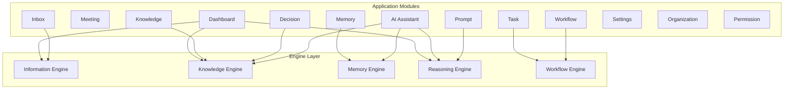
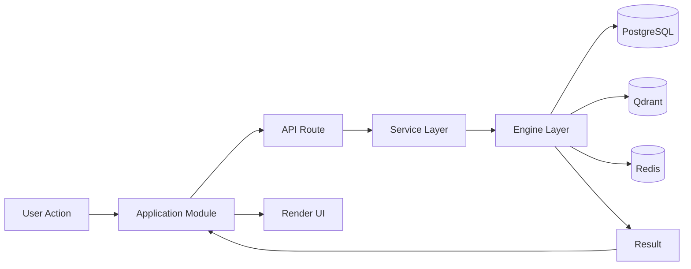
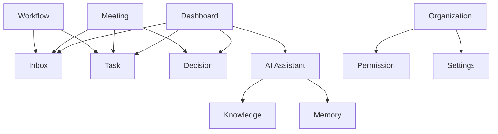

# Howard AIOS Application Layer Blueprint

版本：v1.0
目的：定义 AIOS 应用层的功能模块设计——从 Dashboard 到 AI Assistant 的完整功能体系。
状态：Active
创建日期：2026-07-07

依赖文档：
- [AIOS Constitution v1.0](../Constitution/AIOS-Constitution-v1.0.md)
- [00-Vision](./00-Vision.md)
- [01-Architecture](./01-Architecture.md)
- [02-Domain-Model](./02-Domain-Model.md)
- [05-Information-Engine](./05-Information-Engine.md)
- [06-Knowledge-Engine](./06-Knowledge-Engine.md)
- [07-Memory-Engine](./07-Memory-Engine.md)

---

## 1. Overview

Application Layer 是 Howard AIOS 的功能模块层，定义了 AIOS 向用户提供的所有功能模块。它位于八层架构的 L7 Execution Layer 之上，是底层引擎能力面向用户的呈现方式。

Application Layer 不关心引擎如何工作，只关心用户能做什么。它将 Information Engine、Knowledge Engine、Memory Engine、Reasoning Engine 和 Workflow Engine 的能力封装为用户可理解的功能模块。

当前 AIOS 定义了 14 个功能模块，覆盖从信息管理到 AI 助手的完整功能体系。

---

## 2. Design Goals

**模块独立**：每个功能模块有明确的职责边界，模块之间通过 API 通信，不共享内部状态。

**渐进式复杂度**：基础功能（信息录入、任务管理）简单直觉，高级功能（知识图谱、AI 推理）可以渐进式学习。

**多租户感知**：每个功能模块都感知当前 Organization，所有操作限定在组织范围内。

**权限驱动**：功能可见性和操作权限由 RBAC 系统控制，不同角色看到不同的功能子集。

---

## 3. Core Components

### 3.1 Dashboard（仪表盘）

Dashboard 是 AIOS 的核心入口，提供全局视角的运营概览。

**功能清单**：
- 全局数据概览——今日新增信息、活跃任务、待处理决策、风险预警
- 跨公司切换——在多 Organization 之间快速切换
- AI 洞察面板——Reasoning Engine 生成的最新分析和建议
- 快捷操作——快速创建信息、任务、会议
- 时间线视图——按时间顺序展示最近的活动
- 自定义布局——用户可调整面板位置和大小

**数据来源**：Information Engine（信息统计）、Knowledge Engine（实体概览）、Reasoning Engine（AI 建议）、Workflow Engine（工作流状态）。

**权限**：FOUNDER 和 ADMIN 可看到完整 Dashboard，MEMBER 看到自己相关的部分，VIEWER 只读。

### 3.2 Meeting（会议管理）

Meeting 模块管理组织的会议全生命周期。

**功能清单**：
- 会议列表——按时间排序的会议历史
- 会议详情——参会人、议题、录音转写、决策事项、待办任务
- PLAUD 集成——自动同步 PLAUD 录音和转写文本
- 会议总结——AI 自动生成会议摘要和行动项
- 会议搜索——按关键词、参与者、日期范围搜索

**数据来源**：Prisma Meeting 模型、PLAUD 连接器、Knowledge Engine（参会人关系）。

**权限**：FOUNDER 和 ADMIN 查看所有会议，MEMBER 查看参与的会议。

### 3.3 Knowledge（知识管理）

Knowledge 模块提供知识图谱的可视化和管理能力。

**功能清单**：
- 知识图谱可视化——交互式关系图展示实体和关系
- 实体浏览——按类型浏览人物、公司、项目、客户等
- 关系探索——从一个实体出发，发现关联实体和路径
- 实体详情——查看实体的完整信息和历史记录
- 知识搜索——全文搜索和语义搜索
- 手动添加——手动创建实体和关系（补充 AI 未提取的知识）

**数据来源**：Knowledge Engine、Memory Engine（语义搜索）。

**权限**：FOUNDER 和 ADMIN 可编辑知识，MEMBER 可查看和添加，VIEWER 只读。

### 3.4 Task（任务管理）

Task 模块管理组织的任务和待办事项。

**功能清单**：
- 任务看板——按状态分列展示（待办 / 进行中 / 已完成）
- 任务列表——支持按优先级、责任人、截止日期排序和过滤
- 任务详情——描述、子任务、关联信息、评论、活动历史
- 任务创建——手动创建或从会议/AI 建议自动创建
- 任务分配——将任务分配给组织成员
- 任务统计——完成率、逾期率、工作量分布

**数据来源**：Prisma Task 模型、Workflow Engine（自动任务创建）。

**权限**：FOUNDER 和 ADMIN 管理所有任务，MEMBER 管理自己的任务。

### 3.5 Decision（决策管理）

Decision 模块记录和追踪组织的决策过程。

**功能清单**：
- 决策列表——按状态和时间排序的决策历史
- 决策详情——背景描述、讨论记录、最终决策、关联任务
- 决策流程——PROPOSED → DISCUSSED → DECIDED → ARCHIVED
- 决策回溯——查看决策依据和关联信息
- 决策统计——决策数量、决策者分布、决策效率

**数据来源**：Prisma Decision 模型、Knowledge Engine（决策关联实体）。

**权限**：FOUNDER 和 ADMIN 可创建和确认决策，MEMBER 可提议和参与讨论。

### 3.6 Inbox（信息收件箱）

Inbox 模块是 Information Engine 的用户界面，统一管理所有来源的信息。

**功能清单**：
- 信息流——按时间排序的所有来源信息
- 来源过滤——按 PLAUD、微信、邮件、API 等筛选
- 状态管理——RECEIVED / NORMALIZED / STORED / ARCHIVED
- 信息详情——原始内容、归一化内容、元数据、关联知识
- 手动录入——手动创建 Information 记录
- 批量操作——批量归档、批量标签、批量删除

**数据来源**：Information Engine。

**权限**：FOUNDER 和 ADMIN 查看所有信息，MEMBER 查看自己提交的信息。

### 3.7 Memory（记忆管理）

Memory 模块提供记忆系统的管理和检索界面。

**功能清单**：
- 记忆搜索——语义搜索和关键词搜索
- 记忆浏览——按标签、来源、时间浏览记忆
- 记忆详情——内容、嵌入向量、关联实体、来源信息
- 记忆统计——记忆数量、增长趋势、活跃度分布
- 记忆管理——手动添加标签、归档、恢复

**数据来源**：Memory Engine。

**权限**：FOUNDER 和 ADMIN 可管理所有记忆，MEMBER 可查看和搜索。

### 3.8 Workflow（工作流管理）

Workflow 模块提供工作流的定义、执行和监控能力。

**功能清单**：
- 工作流模板——浏览和管理内置和自定义模板
- 工作流实例——查看运行中和已完成的工作流实例
- 工作流可视化——DAG 图形展示工作流结构
- 手动触发——手动启动工作流
- 审批中心——查看和处理待审批的工作流节点
- 执行日志——查看每个实例的详细执行日志
- 监控面板——成功率、执行时间、队列深度

**数据来源**：Workflow Engine。

**权限**：FOUNDER 和 ADMIN 可定义和管理所有工作流，MEMBER 可查看和触发。

### 3.9 Prompt（提示词管理）

Prompt 模块管理 LLM 提示词模板，支持版本化和 A/B 测试。

**功能清单**：
- Prompt 列表——按使用场景分类的提示词模板
- Prompt 编辑——支持变量插值的模板编辑器
- 版本管理——Prompt 的版本历史和回滚
- 测试工具——输入测试数据，预览 LLM 输出
- 使用统计——每个 Prompt 的调用次数和效果评估

**数据来源**：Reasoning Engine。

**权限**：FOUNDER 和 ADMIN 可编辑 Prompt，MEMBER 只读。

### 3.10 AI Assistant（AI 助手）

AI Assistant 模块是用户与 Reasoning Engine 交互的主界面。

**功能清单**：
- 对话界面——自然语言交互，提问和获取回答
- 上下文感知——AI 理解当前页面和操作的上下文
- 主动建议——AI 基于数据分析主动推送洞察和建议
- 分析请求——请求 AI 执行深度分析（项目风险、趋势预测）
- 历史对话——查看过去的对话记录
- 反馈机制——对 AI 回答进行评价（有用/无用）

**数据来源**：Reasoning Engine、Knowledge Engine、Memory Engine。

**权限**：FOUNDER 和 ADMIN 可使用完整 AI 能力，MEMBER 可使用基础查询。

### 3.11 Settings（系统设置）

Settings 模块管理用户和组织级别的配置。

**功能清单**：
- 个人设置——姓名、邮箱、密码、通知偏好、语言
- 主题设置——界面主题、字体大小、布局偏好
- 连接器管理——配置和查看外部连接器状态
- API 密钥——管理 API 访问密钥
- Webhook 配置——管理入站和出站 Webhook

**数据来源**：Prisma User 模型、Connector 配置。

**权限**：每个用户可管理个人设置，ADMIN 可管理组织设置。

### 3.12 Organization（组织管理）

Organization 模块管理组织的基本信息和成员。

**功能清单**：
- 组织信息——名称、行业、描述、创建时间
- 成员管理——邀请、移除、角色变更
- 多组织切换——在多个组织之间快速切换（FOUNDER）
- 组织统计——成员数、信息量、任务数、决策数
- 组织设置——默认语言、时区、通知规则

**数据来源**：Prisma Organization 和 User 模型。

**权限**：FOUNDER 可完全管理组织，ADMIN 可管理成员，MEMBER 可查看。

### 3.13 Permission（权限管理）

Permission 模块管理角色和权限的精细控制。

**功能清单**：
- 角色列表——FOUNDER、ADMIN、MEMBER、VIEWER 的角色定义
- 权限矩阵——每个角色对每个模块的操作权限
- 自定义角色（未来）——管理员可创建自定义角色
- 权限审计——记录权限变更历史

**数据来源**：RBAC Service、Prisma UserRole 枚举。

**权限**：仅 FOUNDER 可管理权限。

---

## 4. Architecture

Application Layer 的架构遵循模块化设计：

每个 Application Module 通过 Service 接口与底层 Engine 通信，不直接访问数据库。

---

## 5. Data Flow

用户操作通过 Application Module 转化为 API 请求，经 Service Layer 调用 Engine Layer，返回结果后渲染到界面。

---

## 6. Lifecycle

Application Module 的生命周期管理：

| 阶段 | 说明 |
|------|------|
| PLANNED | 模块在蓝图中定义，尚未实现 |
| SKELETON | 模块骨架已创建，核心功能未实现 |
| ALPHA | 核心功能可用，供内部测试 |
| BETA | 功能基本完整，供早期用户测试 |
| STABLE | 功能稳定，正式发布 |
| MAINTENANCE | 功能维护阶段，只修复 Bug |

当前各模块状态：

| 模块 | 状态 |
|------|------|
| Dashboard | SKELETON |
| Meeting | PLANNED |
| Knowledge | PLANNED |
| Task | PLANNED |
| Decision | PLANNED |
| Inbox | SKELETON（Information API 已实现） |
| Memory | PLANNED |
| Workflow | SKELETON |
| Prompt | PLANNED |
| AI Assistant | PLANNED |
| Settings | PLANNED |
| Organization | SKELETON |
| Permission | SKELETON（RBAC 骨架） |

---

## 7. Security

### 7.1 模块级访问控制

每个模块的操作受 RBAC 权限控制。所有 API 请求经过认证中间件和权限中间件双重校验。

### 7.2 数据隔离

所有模块的查询和操作都携带 `organizationId`，确保多租户数据隔离。

### 7.3 敏感操作审计

以下操作记录审计日志：成员角色变更、权限修改、组织设置变更、工作流定义发布、数据批量删除。

---

## 8. Module Interaction Map

---

## 9. Roadmap

### Phase 1 — MVP 模块（6-12 个月）

- **Inbox**：完整的信息管理界面（CRUD、搜索、过滤）
- **Task**：任务看板（创建、分配、状态管理）
- **Dashboard**：基础数据概览面板
- **Organization**：组织管理和成员管理
- **Settings**：基础个人设置

### Phase 2 — 知识模块（1-2 年）

- **Meeting**：会议管理和 PLAUD 集成
- **Knowledge**：知识图谱可视化
- **Decision**：决策管理流程
- **Memory**：记忆搜索和管理

### Phase 3 — AI 模块（2-3 年）

- **AI Assistant**：对话界面和主动建议
- **Prompt**：提示词管理
- **Workflow**：可视化工作流编辑器
- **Permission**：细粒度权限管理

### Phase 4 — 高级功能（3-5 年）

- 跨组织视图
- AI Agent 市场
- 自定义模块和插件系统
- 移动端原生应用

---

## 10. Summary

Application Layer 定义了 AIOS 的 14 个功能模块，覆盖从信息管理到 AI 助手的完整功能体系。每个模块有明确的职责边界、数据来源和权限模型。模块之间通过 Engine Layer 间接协作，不直接耦合。功能按优先级分四个阶段实现，从 MVP 的 Inbox + Task + Dashboard 逐步演进到完整的 AI 辅助运营平台。

---

## 11. Future Evolution

### 短期

- 实现 Dashboard 基础版（数据概览 + 快捷操作）
- 完善 Inbox（信息搜索 + 过滤 + 批量操作）
- 实现 Task 看板（CRUD + 分配 + 统计）

### 中期

- 实现 Meeting 管理 + PLAUD 集成
- 实现 Knowledge 图谱可视化
- 实现 AI Assistant 对话界面

### 长期

- 自定义模块和插件系统
- 跨组织协同视图
- 模块市场（第三方开发者创建模块）
- 低代码模块构建器

---

> 本文档与 Constitution、Vision、Architecture、Domain Model 及三大引擎蓝图保持一致。
> 修改需在 CHANGELOG.md 中记录。
