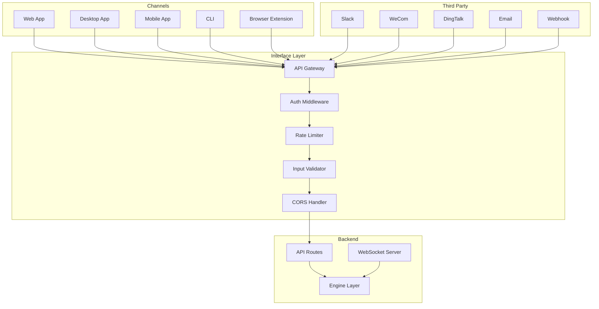
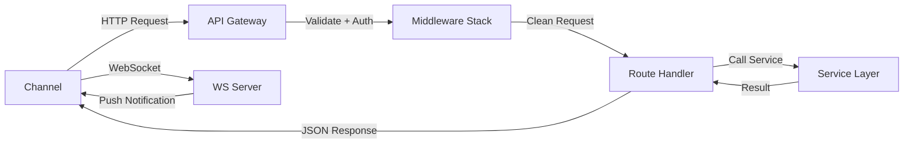
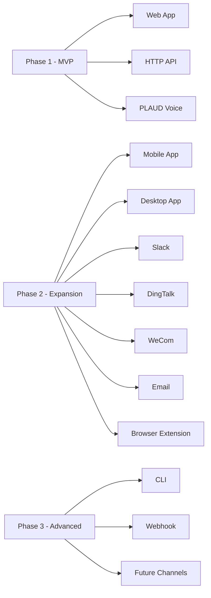

# Howard AIOS Interface Layer Blueprint

版本：v1.0
目的：定义 AIOS 的全渠道接入层——从 Web 到桌面到移动端到第三方集成。
状态：Active
创建日期：2026-07-07

依赖文档：
- [AIOS Constitution v1.0](../Constitution/AIOS-Constitution-v1.0.md)
- [00-Vision](./00-Vision.md)
- [01-Architecture](./01-Architecture.md)
- [02-Domain-Model](./02-Domain-Model.md)
- [05-Information-Engine](./05-Information-Engine.md)
- [06-Knowledge-Engine](./06-Knowledge-Engine.md)
- [07-Memory-Engine](./07-Memory-Engine.md)

---

## 1. Overview

Interface Layer 是 Howard AIOS 的接入层，位于八层架构的 L8 Interface Layer。它定义了用户和外部系统如何与 AIOS 交互。Interface Layer 不实现任何业务逻辑，只负责请求路由、认证、数据格式转换和响应封装。

AIOS 的 Interface Layer 支持多种接入渠道，从 Web 浏览器到桌面应用到第三方系统，覆盖 Founder 日常使用的所有触点。

---

## 2. Design Goals

**统一 API**：所有渠道通过同一套 RESTful API 与后端通信。API 是唯一的真相来源，Web 端和移动端共享 API。

**渠道无关**：业务逻辑不在 Interface Layer 中。无论用户通过哪个渠道操作，后端逻辑完全相同。

**渐进式渠道**：渠道按优先级分阶段实现。Web 优先，移动端和桌面端随后，第三方集成按用户需求逐步添加。

**安全边界**：Interface Layer 是安全边界的第一道防线——认证、限流、输入验证、CORS 策略全部在此层执行。

---

## 3. Core Components

### 3.1 Web（Web 应用）

Web 是 AIOS 的主渠道，也是最先实现的用户界面。

**技术栈**：Next.js 15（App Router）、React 19、TypeScript、TailwindCSS。

**功能范围**：
- 完整的 Application Layer 功能（14 个模块）
- 实时通知（WebSocket）
- 离线支持（Service Worker 缓存已加载数据）
- 响应式设计（适配桌面和平板）

**路由结构**：
| 路由 | 说明 |
|------|------|
| `/` | Dashboard 首页 |
| `/inbox` | 信息收件箱 |
| `/meeting` | 会议管理 |
| `/knowledge` | 知识图谱 |
| `/task` | 任务看板 |
| `/decision` | 决策管理 |
| `/memory` | 记忆管理 |
| `/workflow` | 工作流管理 |
| `/prompt` | 提示词管理 |
| `/ai` | AI 助手对话 |
| `/settings` | 系统设置 |
| `/organization` | 组织管理 |
| `/permission` | 权限管理 |

### 3.2 Desktop（桌面应用）

Desktop 应用为 Founder 提供系统级集成能力。

**技术栈**：Electron（长期目标）。

**功能范围**：
- Web 所有功能
- 系统托盘常驻——后台监听全局快捷键
- 全局快捷键——Ctrl+Shift+A 快速捕获信息
- 剪贴板监听——自动检测复制的文本/URL，一键存入 Inbox
- 原生通知——系统级推送通知
- 本地文件索引——扫描指定目录的文件变更，自动同步到 Information Engine

**优先级**：Phase 2（Web 稳定后启动）。

### 3.3 Mobile（移动端应用）

Mobile 应用提供随时随地的访问能力。

**技术栈**：React Native（共享 React 生态）。

**功能范围**：
- Dashboard 概览
- Inbox（查看和快速录入）
- Task（查看和更新状态）
- AI Assistant（对话交互）
- 推送通知
- 离线模式（缓存核心数据）

**优先级**：Phase 2。

### 3.4 API（HTTP API）

API 是 AIOS 的核心通信接口，所有渠道都通过 API 访问后端。

**技术栈**：Fastify、TypeScript、Zod（请求验证）。

**设计规范**：
- RESTful 风格
- JSON 请求/响应
- Bearer Token 认证（JWT）
- 分页参数：`?page=1&limit=20`
- 排序参数：`?sort=createdAt&order=desc`
- 过滤参数：`?status=ACTIVE&organizationId=uuid`

**API 路由**：
| 路由 | 方法 | 说明 |
|------|------|------|
| `/api/auth/login` | POST | 登录获取 Token |
| `/api/auth/refresh` | POST | 刷新 Token |
| `/api/auth/logout` | POST | 注销 |
| `/api/information` | GET/POST | 信息 CRUD |
| `/api/knowledge/entities` | GET/POST | 实体 CRUD |
| `/api/knowledge/relations` | GET/POST | 关系 CRUD |
| `/api/task` | GET/POST/PATCH | 任务 CRUD |
| `/api/meeting` | GET/POST | 会议 CRUD |
| `/api/decision` | GET/POST | 决策 CRUD |
| `/api/memory` | GET/POST | 记忆管理 |
| `/api/workflow/definitions` | GET/POST | 工作流定义 |
| `/api/workflow/instances` | GET | 工作流实例 |
| `/api/ai/chat` | POST | AI 对话 |
| `/api/organization` | GET/POST/PATCH | 组织管理 |
| `/api/user` | GET/POST/PATCH | 用户管理 |
| `/api/health` | GET | 健康检查 |

### 3.5 Webhook（Webhook 接入）

Webhook 允许外部系统在特定事件发生时接收通知。

**入站 Webhook**：外部系统向 AIOS 推送事件。

| 场景 | 说明 |
|------|------|
| GitHub Push | 代码推送触发相关工作流 |
| Stripe Payment | 支付事件更新客户记录 |
| 自定义 | 用户定义的任意入站 Webhook |

**出站 Webhook**：AIOS 在特定事件发生时通知外部系统。

| 事件 | 说明 |
|------|------|
| TaskCreated | 新任务创建时通知 |
| MeetingCompleted | 会议完成时通知 |
| WorkflowCompleted | 工作流完成时通知 |

### 3.6 Slack（Slack 集成）

Slack 集成允许在 Slack 中与 AIOS 交互。

**功能**：
- AIOS Bot 接收 Slack 消息，转发给 Reasoning Engine
- 从 Slack 频道快速捕获信息到 Inbox
- 接收 AIOS 通知推送到 Slack 频道
- 在 Slack 中查看任务和决策状态

**优先级**：Phase 2。

### 3.7 WeCom（企业微信集成）

企业微信是中国企业常用的沟通工具。

**功能**：
- AIOS Bot 在企业微信中提供对话入口
- 消息自动同步到 Information Engine
- 在企业微信中接收任务提醒和审批通知

**优先级**：Phase 2。

### 3.8 DingTalk（钉钉集成）

钉钉集成覆盖中国企业办公场景。

**功能**：
- 钉钉机器人接入
- 消息同步到 Information Engine
- 审批流程在钉钉中操作
- 日程同步

**优先级**：Phase 2。

### 3.9 Email（邮件集成）

邮件集成覆盖传统的商务沟通渠道。

**功能**：
- 邮件收件箱监控——特定邮箱收到的邮件自动同步到 Inbox
- 邮件发送——通过 AIOS 发送通知邮件
- 邮件模板——预定义的邮件模板（会议邀请、任务提醒）
- IMAP/SMTP 配置——用户配置自己的邮箱

**优先级**：Phase 2。

### 3.10 Voice（语音接入）

Voice 接入支持语音交互方式。

**功能**：
- PLAUD 硬件录音——PLAUD 录音自动同步和转写
- 语音命令——通过语音与 AI Assistant 交互
- 语音笔记——语音输入快速记录信息
- TTS 输出——AI 回答可以语音播报

**优先级**：PLAUD 为 Phase 1（核心渠道），其他语音功能为 Phase 2。

### 3.11 Browser Extension（浏览器扩展）

浏览器扩展提供在浏览任何网页时快速与 AIOS 交互的能力。

**功能**：
- 一键保存网页到 Information Engine
- 选中文本快速捕获到 Inbox
- 网页摘要——AI 自动总结当前网页内容
- 知识提取——从网页中提取实体和关系

**技术栈**：Chrome Extension Manifest V3。

**优先级**：Phase 2。

### 3.12 CLI（命令行工具）

CLI 为开发者和技术用户提供快速操作入口。

**功能**：
- 信息快速录入——`aios add "今天和客户A讨论了新项目"`
- 任务管理——`aios task list`、`aios task done <id>`
- 知识查询——`aios search "项目A的负责人"`
- AI 对话——`aios ask "分析本月的风险"`
- 工作流触发——`aios workflow trigger <name>`

**技术栈**：Node.js CLI，pnpm 安装。

**优先级**：Phase 2。

### 3.13 Future Interface（未来渠道）

| 渠道 | 说明 |
|------|------|
| Apple Watch | 快速通知和语音备忘 |
| Telegram Bot | 海外用户的消息渠道 |
| 微信小程序 | 中国用户的轻量入口 |
| API Marketplace | 第三方 API 集成市场 |
| IoT 设备 | 物联网设备数据采集 |
| AR/VR | 空间计算场景 |

---

## 4. Architecture



---

## 5. Data Flow



所有渠道的请求经过统一的中间件栈：认证 → 限流 → 验证 → CORS → 路由处理 → 服务调用 → 响应封装。

---

## 6. Lifecycle

### 6.1 渠道生命周期

| 阶段 | 说明 |
|------|------|
| PLANNED | 渠道在蓝图中定义 |
| PROTOTYPE | 原型验证可行性 |
| ALPHA | 内部测试版本 |
| BETA | 公开测试版本 |
| STABLE | 正式发布 |
| DEPRECATED | 停止维护 |

### 6.2 当前渠道状态

| 渠道 | 状态 |
|------|------|
| Web | ALPHA（骨架已搭建） |
| API | ALPHA（健康检查已实现） |
| Voice/PLAUD | PLANNED |
| Desktop | PLANNED |
| Mobile | PLANNED |
| Slack | PLANNED |
| WeCom | PLANNED |
| DingTalk | PLANNED |
| Email | PLANNED |
| Browser Extension | PLANNED |
| CLI | PLANNED |
| Webhook | PLANNED |

---

## 7. Security

### 7.1 API 安全

- **认证**：所有 API（除 health 和 login）需要 JWT Bearer Token
- **限流**：每 IP 每分钟 60 次请求（可配置）
- **输入验证**：所有请求通过 Zod Schema 验证
- **CORS**：只允许白名单域名
- **HTTPS**：生产环境强制 HTTPS

### 7.2 Token 管理

- Access Token：有效期 15 分钟
- Refresh Token：有效期 7 天
- Token 刷新：Access Token 过期后使用 Refresh Token 获取新 Token
- 强制登出：Refresh Token 被撤销

### 7.3 渠道安全

- 第三方渠道（Slack、钉钉等）使用 OAuth 2.0 认证
- Webhook 使用签名验证（HMAC-SHA256）
- API 密钥定期轮换

---

## 8. API Design

### 8.1 请求格式

```
POST /api/information
Content-Type: application/json
Authorization: Bearer <token>

{
  "content": "今天和客户A讨论了新项目",
  "sourceType": "MANUAL",
  "tags": ["客户", "项目"]
}
```

### 8.2 响应格式

成功响应：
```json
{
  "success": true,
  "data": { ... },
  "meta": { "page": 1, "total": 42 }
}
```

错误响应：
```json
{
  "success": false,
  "error": {
    "code": "VALIDATION_ERROR",
    "message": "content is required",
    "details": [...]
  }
}
```

### 8.3 HTTP 状态码

| 状态码 | 说明 |
|--------|------|
| 200 | 成功 |
| 201 | 创建成功 |
| 204 | 删除成功 |
| 400 | 请求验证失败 |
| 401 | 未认证 |
| 403 | 无权限 |
| 404 | 资源不存在 |
| 429 | 请求频率超限 |
| 500 | 服务器内部错误 |

---

## 9. Channel Priority



---

## 10. Summary

Interface Layer 定义了 AIOS 的 13 种接入渠道，从 Web 到桌面到移动端到第三方集成，覆盖 Founder 日常工作生活的所有触点。所有渠道通过统一的 API Gateway 和中间件栈与后端通信，确保渠道无关性和安全一致性。渠道按优先级分三个阶段实现：Phase 1 聚焦 Web + API + PLAUD，Phase 2 扩展到移动端和第三方集成，Phase 3 添加高级渠道和未来接口。

---

## 11. Future Evolution

### 短期

- 完善 Web 应用（完整路由 + 中间件栈）
- 完善 API（所有路由 + Zod 验证）
- 实现 WebSocket 实时通知
- 实现 PLAUD 连接器

### 中期

- 开发 Desktop 应用（Electron）
- 开发 Mobile 应用（React Native）
- 集成 Slack、钉钉、企业微信
- 实现 Email 集成
- 实现 Webhook 入站/出站

### 长期

- 开发浏览器扩展
- 开发 CLI 工具
- 探索 Apple Watch 和 IoT 渠道
- 建立 API Marketplace

---

> 本文档与 Constitution、Vision、Architecture、Domain Model 及三大引擎蓝图保持一致。
> 修改需在 CHANGELOG.md 中记录。
