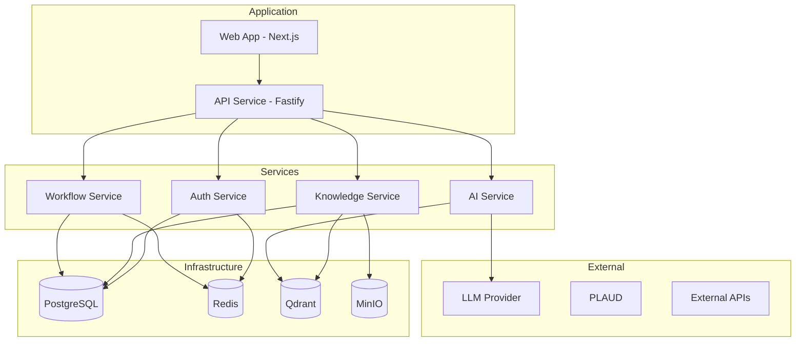
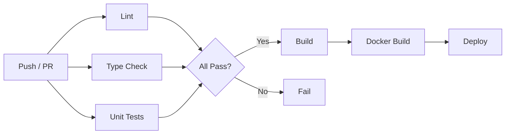
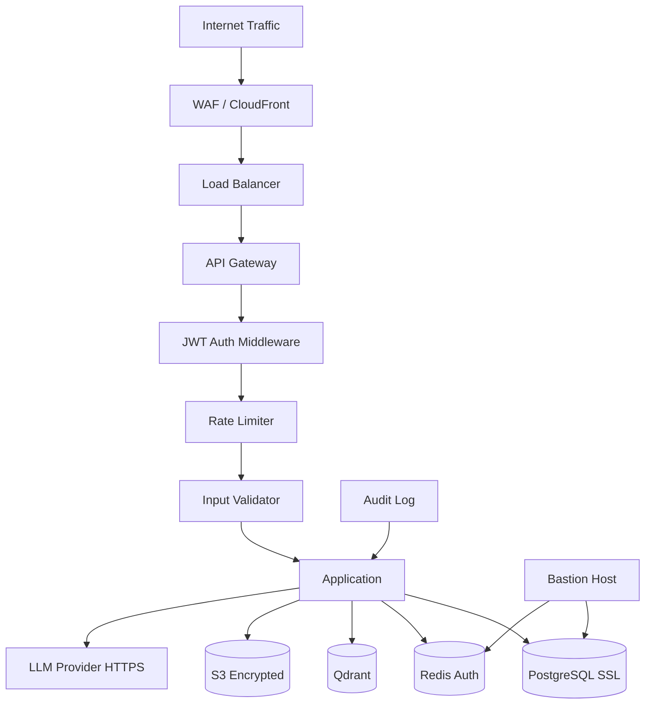
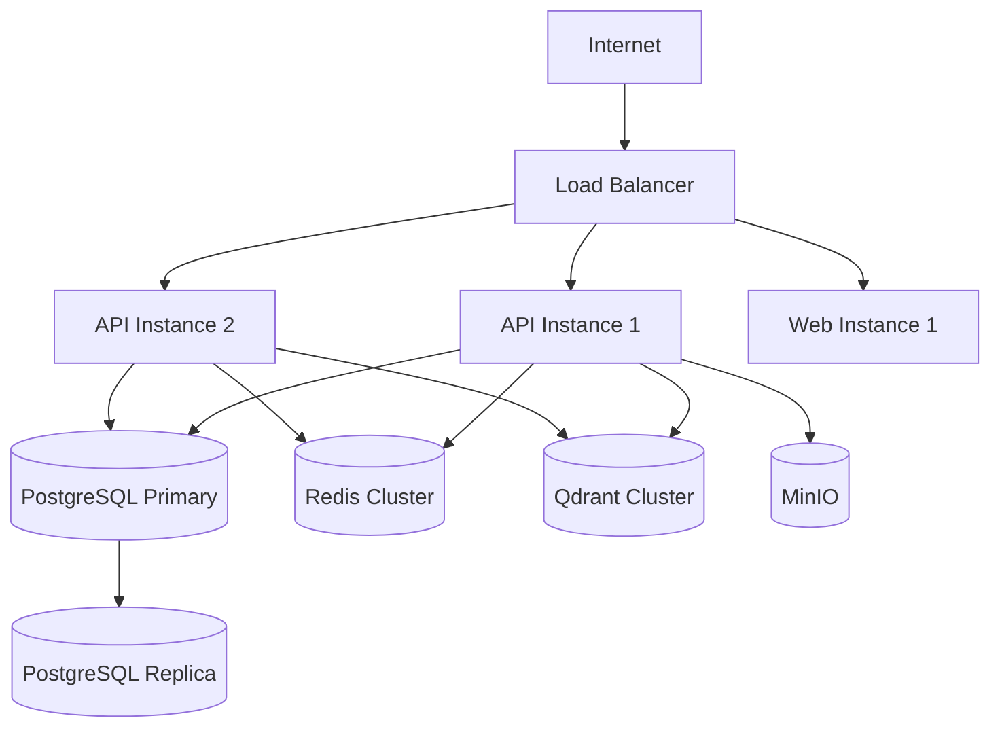
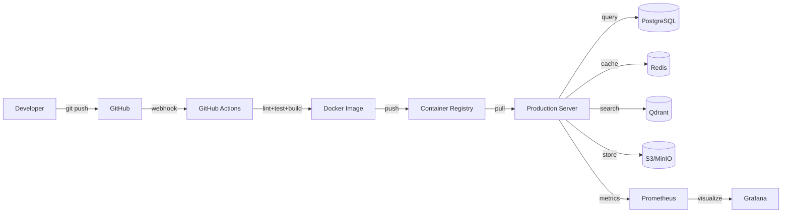

# Howard AIOS Infrastructure Layer Blueprint

版本：v1.0
目的：定义 AIOS 的基础设施层——从代码仓库到 CI/CD 到生产部署的完整技术栈。
状态：Active
创建日期：2026-07-07

依赖文档：
- [AIOS Constitution v1.0](../Constitution/AIOS-Constitution-v1.0.md)
- [00-Vision](./00-Vision.md)
- [01-Architecture](./01-Architecture.md)
- [02-Domain-Model](./02-Domain-Model.md)
- [05-Information-Engine](./05-Information-Engine.md)
- [06-Knowledge-Engine](./06-Knowledge-Engine.md)
- [07-Memory-Engine](./07-Memory-Engine.md)

---

## 1. Overview

Infrastructure Layer 是 Howard AIOS 的基础设施层，位于八层架构的底层（L8 与所有层平行的横切关注点）。它不直接参与业务逻辑，但为所有层提供运行基础——代码组织、构建系统、依赖管理、数据库、缓存、向量存储、容器化、CI/CD、监控和部署。

Infrastructure Layer 遵循 Constitution 的 Engineering Principles：TypeScript Full Stack、Single Source of Truth、Modular Monolith First、Event-Driven Architecture、AI-First Not AI-Only、Zero Downtime Migration。

---

## 2. Design Goals

**一致性**：开发环境和生产环境尽量一致。Docker 确保依赖版本统一。

**可复现**：任何团队成员可以在 10 分钟内搭建完整的开发环境。

**可观测**：所有服务产生结构化日志、链路追踪和指标数据。

**可扩展**：从单机开发到多节点生产，基础设施支持平滑扩展。

**安全优先**：Secrets 不进代码仓库，数据库连接使用 SSL，所有通信走内网。

---

## 3. Core Components

### 3.1 Monorepo（代码仓库）

AIOS 使用 Monorepo 管理所有代码，遵循 Modular Monolith 架构。

**目录结构**：
```
Howard-AIOS/
├── apps/                # 应用层
│   ├── api/             # Fastify API 服务
│   └── web/             # Next.js Web 应用
├── services/            # 服务层（引擎实现）
│   ├── ai/              # AI 服务
│   ├── auth/            # 认证授权
│   ├── knowledge/       # 知识引擎
│   ├── rbac/            # 角色权限
│   └── workflow/        # 工作流引擎
├── packages/            # 共享包
│   ├── config/          # 共享配置
│   ├── database/        # Prisma Schema + 迁移
│   ├── types/           # 共享类型定义
│   └── utils/           # 工具函数
├── connectors/          # 外部连接器
├── agents/              # AI Agent 定义
├── prompts/             # Prompt 模板
├── workflows/           # 工作流定义
├── scripts/             # 运维脚本
├── tests/               # 集成测试和 E2E 测试
├── docker/              # Docker 配置
├── docs/                # 文档
├── development/         # 开发管理（Reports, Reviews）
└── memory/              # AI 记忆文件
```

### 3.2 TurboRepo（构建系统）

TurboRepo 管理 Monorepo 的构建和任务编排。

**核心命令**：
| 命令 | 说明 |
|------|------|
| `pnpm turbo build` | 构建所有包和应用 |
| `pnpm turbo dev` | 启动所有开发服务器 |
| `pnpm turbo test` | 运行所有测试 |
| `pnpm turbo lint` | 运行所有 Lint |
| `pnpm turbo typecheck` | 运行所有类型检查 |
| `pnpm turbo --filter=@aiOS/api test` | 运行指定包的测试 |

**缓存策略**：Turbo 自动缓存构建和测试结果，未变更的包跳过重复执行。

**任务依赖**：Turbo 根据 package.json 的依赖关系自动确定执行顺序。

### 3.3 PNPM（包管理）

PNPM 作为包管理器，利用 workspace 和 content-addressable store 优化依赖管理。

**workspace 配置**（`pnpm-workspace.yaml`）：
```yaml
packages:
  - "apps/*"
  - "services/*"
  - "packages/*"
  - "connectors/*"
  - "tests"
```

**依赖规则**：
- `apps/*` 可依赖 `services/*` 和 `packages/*`
- `services/*` 可依赖 `packages/*`，不可依赖其他 service
- `packages/*` 只依赖外部 npm 包
- `connectors/*` 可依赖 `packages/*`

### 3.4 Node.js（运行时）

**版本**：Node.js 22 LTS（当前最新 LTS）。

**配置**：
- `engines.node: ">=22.0.0"` 在所有 package.json 中声明
- 使用 `.nvmrc` 锁定版本
- 启用 `--experimental-vm-modules`（如需 ESM 支持）

### 3.5 NestJS / Fastify（后端框架）

**API 服务**：使用 Fastify 作为 HTTP 框架。

**选择理由**：
- 性能——Fastify 是 Node.js 最快的 HTTP 框架之一
- Schema 验证——内置 JSON Schema 验证
- 插件系统——丰富的插件生态
- TypeScript 友好——完整的类型支持

**架构模式**：
```
apps/api/src/
├── index.ts           # 应用入口
├── routes/            # 路由定义
│   ├── health.ts      # 健康检查
│   └── inbox.ts       # 信息收件箱
├── middleware/         # 中间件
├── plugins/            # Fastify 插件
└── __tests__/          # 测试
```

### 3.6 Next.js（前端框架）

**版本**：Next.js 15（App Router）。

**选择理由**：
- App Router——基于 React Server Components 的现代架构
- 文件系统路由——自动基于文件结构生成路由
- Server/Client Components——灵活的服务端和客户端渲染策略
- 内置优化——图片优化、字体优化、脚本加载优化

**目录结构**：
```
apps/web/src/app/
├── layout.tsx          # 根布局
├── page.tsx            # 首页（Dashboard）
├── inbox/              # 信息收件箱
├── meeting/            # 会议管理
├── task/               # 任务管理
└── ...
```

### 3.7 Prisma（ORM）

Prisma 是 AIOS 的唯一数据访问层。所有数据库操作通过 Prisma Client 执行。

**Schema 位置**：`packages/database/prisma/schema.prisma`。

**当前模型**：User、Organization、Meeting、Task、Decision、Document、Message、Memory、Information。

**迁移管理**：
- `prisma migrate dev` — 开发环境迁移
- `prisma migrate deploy` — 生产环境迁移
- 迁移文件存放在 `packages/database/prisma/migrations/`

**设计原则**：
- Prisma Schema 是唯一真相来源
- 所有实体的类型从 Schema 推导
- Service 不直接写 SQL
- Schema 变更必须通过 migration

### 3.8 PostgreSQL（关系数据库）

PostgreSQL 是 AIOS 的主数据库，存储所有结构化数据。

**版本**：PostgreSQL 16。

**配置**：
- 连接池：PgBouncer（生产环境）
- SSL：生产环境强制 SSL 连接
- 字符集：UTF-8
- 时区：UTC

**表设计原则**：
- 所有表包含 `id`（UUID）、`createdAt`、`updatedAt`
- 业务表包含 `organizationId`（多租户隔离）
- 软删除使用 `deletedAt` 字段
- 索引策略：常用查询字段建立索引

### 3.9 Redis（缓存和队列）

Redis 提供缓存、会话存储和任务队列功能。

**使用场景**：
- **缓存**：热点数据缓存（知识查询结果、配置数据）
- **会话**：用户会话存储（JWT 黑名单）
- **队列**：Workflow Engine 的任务队列
- **限流**：API 请求限流计数器
- **实时**：WebSocket 消息的 Pub/Sub

**版本**：Redis 7。

### 3.10 Qdrant（向量数据库）

Qdrant 是 AIOS 的向量存储引擎，用于语义搜索。

**使用场景**：
- Memory Engine 的记忆向量存储和检索
- Knowledge Engine 的语义搜索
- Information Engine 的信息相似度匹配

**配置**：
- 集合：memories（1536 维，Cosine 距离）、knowledge（1536 维，Cosine 距离）
- 量化：支持 Scalar Quantization 减少内存占用
- 过滤：支持 payload 过滤（organizationId、标签等）

**版本**：Qdrant 1.x。

### 3.11 MinIO（对象存储）

MinIO 提供 S3 兼容的对象存储服务。

**使用场景**：
- 文件存储——上传的文档、图片、音频
- PLAUD 录音文件存储
- 备份存储
- 工作流附件

**版本**：MinIO 最新版。

---

## 4. Architecture



---

## 5. Containerization

### 5.1 Docker

所有基础设施组件通过 Docker 容器化。

**Docker Compose**（`docker/docker-compose.yml`）：
| 服务 | 镜像 | 端口 |
|------|------|------|
| postgres | postgres:16 | 5432 |
| redis | redis:7 | 6379 |
| qdrant | qdrant/qdrant:latest | 6333 |
| minio | minio/minio:latest | 9000/9001 |

**开发环境启动**：`docker compose -f docker/docker-compose.yml up -d`

### 5.2 Dockerfile

API 服务的 Dockerfile 使用多阶段构建：

```
阶段 1：构建（Node.js 22 + pnpm）
阶段 2：运行（Node.js 22 Alpine）
```

多阶段构建确保最终镜像最小化，不包含开发依赖和构建工具。

---

## 6. CI/CD

### 6.1 GitHub Actions

AIOS 使用 GitHub Actions 实现 CI/CD。

**CI 流程**（每次 Push/PR）：


**Pipeline 步骤**：
| 步骤 | 说明 |
|------|------|
| Checkout | 拉取代码 |
| Setup Node | 安装 Node.js 22 |
| Setup pnpm | 安装 pnpm |
| Install | `pnpm install --frozen-lockfile` |
| Lint | `pnpm turbo lint` |
| Type Check | `pnpm turbo typecheck` |
| Test | `pnpm turbo test` |
| Build | `pnpm turbo build` |
| Docker Build | 构建 Docker 镜像 |
| Deploy | 部署到目标环境 |

### 6.2 环境策略

| 环境 | 分支 | 部署方式 |
|------|------|----------|
| Development | feature/* | 手动 |
| Staging | develop | 自动（CI 通过后） |
| Production | main | 手动审批后自动部署 |

---

## 7. Observability

### 7.1 Logging（日志）

**日志格式**：结构化 JSON 日志。

```json
{
  "timestamp": "2026-07-07T09:00:00.000Z",
  "level": "info",
  "service": "api",
  "module": "inbox",
  "message": "Information created",
  "data": { "id": "uuid", "sourceType": "MANUAL" },
  "duration": 45,
  "traceId": "abc-123"
}
```

**日志级别**：
| 级别 | 使用场景 |
|------|----------|
| error | 运行时错误、未捕获异常 |
| warn | 需要注意但不影响功能的异常 |
| info | 关键业务事件（创建、更新、删除） |
| debug | 调试信息（开发环境） |

**日志存储**：
- 开发环境：控制台输出
- 生产环境：ELK Stack（Elasticsearch + Logstash + Kibana）或 Loki

### 7.2 Tracing（链路追踪）

**技术**：OpenTelemetry。

**追踪范围**：
- HTTP 请求的完整链路（从 API Gateway 到 Database）
- 异步任务的执行链路
- 外部 API 调用链路
- Engine 间的调用链路

**数据导出**：Jaeger 或 Grafana Tempo。

### 7.3 Monitoring（监控）

**指标采集**：Prometheus + Grafana。

**关键指标**：

| 类别 | 指标 |
|------|------|
| 应用 | 请求数、响应时间、错误率、活跃连接数 |
| 数据库 | 查询延迟、连接池使用率、慢查询数 |
| Redis | 命中率、内存使用、连接数 |
| Qdrant | 查询延迟、集合大小、索引数 |
| 系统 | CPU 使用率、内存使用率、磁盘使用率 |
| 业务 | 信息创建数、任务完成率、AI 调用次数 |

**告警规则**：
| 告警 | 条件 |
|------|------|
| 高错误率 | 错误率 > 5% 持续 5 分钟 |
| 高延迟 | P99 延迟 > 2 秒 |
| 数据库连接耗尽 | 连接池使用率 > 90% |
| 磁盘空间不足 | 磁盘使用率 > 85% |
| 服务宕机 | 健康检查连续失败 3 次 |

---

## 8. Configuration & Secrets

### 8.1 Config（配置管理）

**配置来源优先级**（从高到低）：
1. 环境变量
2. `.env.local`（本地覆盖，不提交 Git）
3. `.env`（默认配置）
4. 代码中的默认值

**配置分类**：
| 类别 | 示例 |
|------|------|
| 服务配置 | PORT、HOST、LOG_LEVEL |
| 数据库配置 | DATABASE_URL |
| Redis 配置 | REDIS_URL |
| 第三方 API | OPENAI_API_KEY、PLAUD_API_KEY |
| 应用配置 | JWT_SECRET、CORS_ORIGINS |

### 8.2 Secrets（密钥管理）

**原则**：Secrets 绝对不进入代码仓库。

**开发环境**：使用 `.env` 文件（.gitignore 排除）。

**生产环境**：
- Docker Secrets（Swarm 模式）
- AWS Secrets Manager / HashiCorp Vault（云部署）
- 环境变量注入（Kubernetes Secrets）

**密钥轮换**：
- JWT Secret：每月轮换
- API Keys：每季度轮换
- 数据库密码：每季度轮换
- 轮换时支持双密钥平滑过渡

---

## 9. Backup & Disaster Recovery

### 9.1 Backup（备份策略）

| 数据 | 备份方式 | 频率 | 保留期 |
|------|----------|------|--------|
| PostgreSQL | pg_dump 全量 + WAL 增量 | 每日全量 + 实时增量 | 30 天 |
| Redis | RDB 快照 + AOF 日志 | 每小时 | 7 天 |
| Qdrant | Snapshot API | 每日 | 30 天 |
| MinIO | 对象版本化 + 跨区域复制 | 实时 | 永久 |
| 代码 | Git 仓库 | 实时 | 永久 |

### 9.2 Disaster Recovery（灾难恢复）

**RPO（恢复点目标）**：1 小时（最多丢失 1 小时数据）。

**RTO（恢复时间目标）**：4 小时（4 小时内恢复服务）。

**恢复流程**：
1. 检测故障 → 触发告警
2. 评估影响范围
3. 切换到备用环境（如果有）
4. 从备份恢复数据
5. 验证数据完整性
6. 恢复服务
7. 根因分析
8. 改进措施

---

## 10. Scalability

### 10.1 水平扩展策略

| 组件 | 扩展方式 |
|------|----------|
| API Service | 多实例 + 负载均衡 |
| Web App | CDN + 多实例 |
| PostgreSQL | 读写分离（主写从读） |
| Redis | Redis Cluster（多节点） |
| Qdrant | Qdrant Cluster（分片 + 复制） |
| MinIO | 分布式模式（多节点） |

### 10.2 扩展阈值

| 指标 | 扩展触发条件 |
|------|-------------|
| CPU | 平均使用率 > 70% 持续 5 分钟 |
| 内存 | 使用率 > 80% |
| 请求队列 | 等待请求数 > 100 |
| 数据库连接 | 连接池使用率 > 80% |

---

## 11. Performance

### 11.1 性能目标

| 指标 | 目标值 |
|------|--------|
| API P50 延迟 | < 100ms |
| API P99 延迟 | < 500ms |
| Web 首屏加载 | < 2s |
| 数据库查询 P95 | < 50ms |
| 向量搜索 P95 | < 200ms |
| 构建时间 | < 5min |

### 11.2 性能优化策略

**应用层**：
- 请求结果缓存（Redis，TTL 按场景配置）
- 数据库查询优化（索引、连接池、查询分析）
- API 响应压缩（gzip/brotli）
- 静态资源 CDN 加速

**数据库层**：
- 连接池（PgBouncer，最大 100 连接）
- 索引优化（覆盖索引、部分索引）
- 查询缓存（应用层缓存，非数据库层）
- 大表分区（按 organizationId 或时间）

**向量搜索层**：
- HNSW 索引优化
- Scalar Quantization 减少内存
- Payload 过滤减少搜索范围

---

## 12. Security

### 12.1 网络安全

- 生产环境所有通信走 HTTPS
- 内网服务间通信使用 mTLS（可选）
- 防火墙规则限制端口访问
- API Gateway 作为唯一公网入口

### 12.2 数据安全

- 数据库连接强制 SSL
- 敏感字段加密存储（AES-256）
- 日志脱敏（PII 字段自动屏蔽）
- 备份数据加密

### 12.3 访问安全

- SSH 密钥认证（禁止密码登录）
- 堡垒机访问生产环境
- 操作审计日志
- 最小权限原则

### 12.4 安全架构图



---

## 13. Deployment

### 13.1 部署架构



### 13.2 部署流程

1. 代码合并到 main 分支
2. CI 自动运行（Lint + Type Check + Test + Build）
3. 构建 Docker 镜像并推送到 Registry
4. 手动审批部署
5. 滚动更新——逐个替换实例，确保零宕机
6. 健康检查通过 → 部署完成
7. 健康检查失败 → 自动回滚

### 13.3 零宕机部署

- **滚动更新**：新实例启动后旧实例才下线
- **数据库兼容**：Migration 在部署前执行，向后兼容
- **配置热更新**：非敏感配置支持热更新，无需重启

---

## 14. Cloud

### 14.1 云平台选择

**首选**：AWS（功能完整、生态成熟）。

**备选**：
- Google Cloud（AI/ML 生态更丰富）
- 阿里云（中国市场）
- Vercel（前端部署）

### 14.2 AWS 架构映射

| 组件 | AWS 服务 |
|------|----------|
| API + Web | ECS Fargate / EC2 |
| PostgreSQL | RDS PostgreSQL |
| Redis | ElastiCache Redis |
| Qdrant | EC2 自建 / Qdrant Cloud |
| MinIO | S3 |
| Load Balancer | ALB |
| CI/CD | GitHub Actions + ECR |
| Logging | CloudWatch Logs |
| Monitoring | CloudWatch + Grafana |
| Secrets | Secrets Manager |
| CDN | CloudFront |

### 14.3 成本优化

- 开发环境使用 Spot Instance
- 非工作时间自动缩容
- 数据库使用 Reserved Instance
- S3 生命周期策略自动降级存储

---

## 15. Data Flow



---

## 16. Lifecycle

### 16.1 基础设施生命周期

| 阶段 | 说明 |
|------|------|
| SETUP | 初始搭建开发环境 |
| DEV | 本地开发（Docker Compose） |
| STAGING | 预发布环境验证 |
| PROD | 生产环境运行 |
| MONITOR | 持续监控和告警 |
| MAINTAIN | 版本升级、安全补丁 |
| DECOMMISSION | 组件退役和数据迁移 |

### 16.2 当前状态

| 组件 | 状态 |
|------|------|
| Monorepo | SETUP（结构已建立） |
| TurboRepo | SETUP（配置完成） |
| PNPM | ACTIVE |
| Node.js 22 | ACTIVE |
| Fastify API | SKELETON |
| Next.js Web | SKELETON |
| Prisma | ACTIVE（Schema 已定义） |
| PostgreSQL | DEV（Docker） |
| Redis | PLANNED |
| Qdrant | PLANNED |
| MinIO | PLANNED |
| Docker Compose | SETUP |
| CI/CD | PLANNED |
| Monitoring | PLANNED |

---

## 17. Summary

Infrastructure Layer 为 AIOS 提供完整的技术基础设施，从 Monorepo 代码组织到 Docker 容器化，从 GitHub Actions CI/CD 到 Prometheus 监控，从 PostgreSQL 数据存储到 Qdrant 向量搜索。所有组件遵循一致性、可复现、可观测、可扩展的设计原则。生产环境首选 AWS 云平台，通过滚动更新实现零宕机部署，通过多层备份策略确保数据安全。

---

## 18. Future Evolution

### 短期

- 完善 Docker Compose 开发环境（所有组件）
- 配置 GitHub Actions CI Pipeline
- 部署 Staging 环境
- 配置基础监控（日志 + 健康检查）

### 中期

- 部署 Production 环境（AWS）
- 配置完整 Observability（Logging + Tracing + Monitoring）
- 实现自动扩缩容
- 实现备份和灾难恢复

### 长期

- 探索 Kubernetes 编排
- 多区域部署
- 边缘计算节点
- 基础设施即代码（Terraform/Pulumi）

---

> 本文档与 Constitution、Vision、Architecture、Domain Model 及三大引擎蓝图保持一致。
> 修改需在 CHANGELOG.md 中记录。
