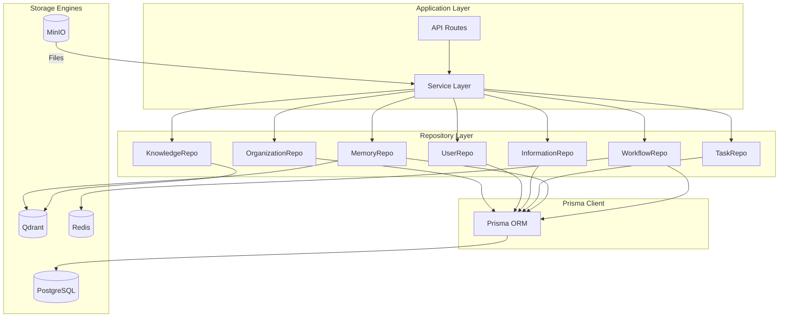
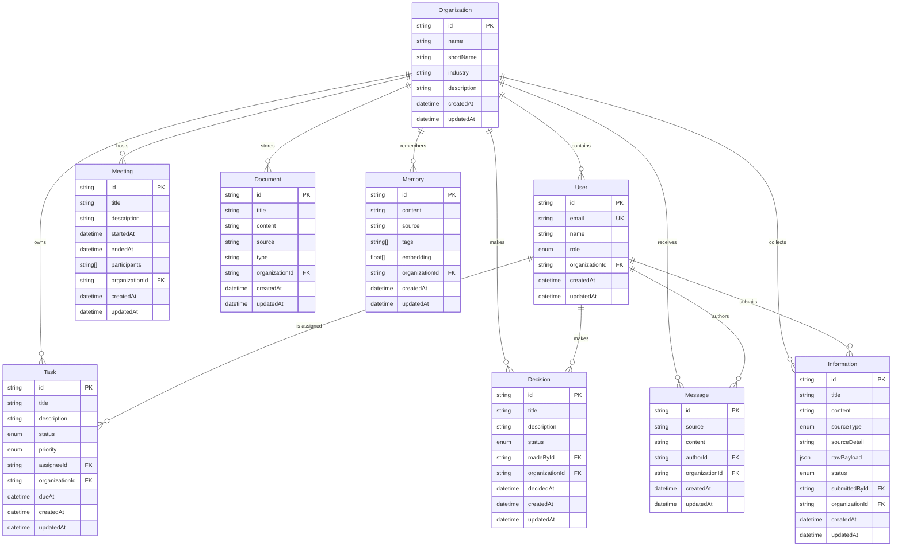
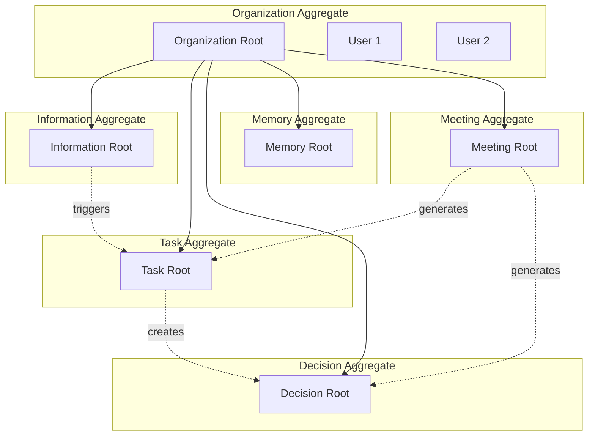
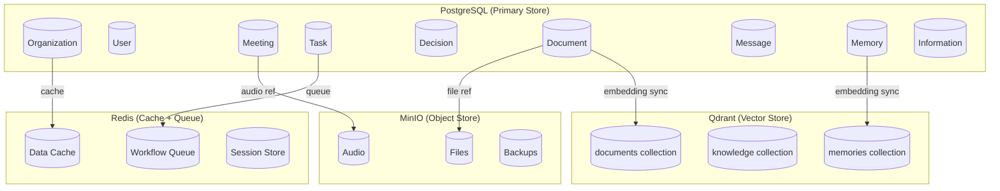

# Howard AIOS Data Model Blueprint

版本：v1.0
目的：定义 AIOS 的完整数据模型——从实体设计到数据库约定到存储策略。
状态：Active
创建日期：2026-07-07

依赖文档：
- [AIOS Constitution v1.0](../Constitution/AIOS-Constitution-v1.0.md)
- [00-Vision](./00-Vision.md)
- [01-Architecture](./01-Architecture.md)
- [02-Domain-Model](./02-Domain-Model.md)
- [05-Information-Engine](./05-Information-Engine.md)
- [06-Knowledge-Engine](./06-Knowledge-Engine.md)
- [07-Memory-Engine](./07-Memory-Engine.md)
- [08-Reasoning-Engine](./08-Reasoning-Engine.md)
- [09-Workflow-Engine](./09-Workflow-Engine.md)
- [10-Application-Layer](./10-Application-Layer.md)
- [11-Interface-Layer](./11-Interface-Layer.md)
- [12-Infrastructure-Layer](./12-Infrastructure-Layer.md)

---

## 1. Overview

Data Model Blueprint 是 Howard AIOS 的数据层设计文档。它定义了系统中所有数据的存储方式、关系结构、命名约定和生命周期管理。

AIOS 的数据存储在四个存储引擎中：PostgreSQL（结构化数据）、Qdrant（向量数据）、Redis（缓存和队列）、MinIO（对象存储）。Prisma Schema 是结构化数据的唯一真相来源（Single Source of Truth），所有实体的类型定义从 Prisma Schema 推导，不允许在其他位置重复定义。

本文档与 Domain Model Blueprint（02）互补：Domain Model 从 DDD 视角定义领域概念，本文档从数据库视角定义物理存储。

---

## 2. Design Goals

**Prisma 唯一真相来源**：所有结构化数据的类型定义来自 Prisma Schema。禁止在 TypeScript 代码中重复定义与 Prisma 模型相同或等价的类型。

**多租户隔离**：所有业务实体必须包含 `organizationId`，通过外键关联 Organization 表，确保数据隔离。

**软删除优先**：业务数据使用软删除（`deletedAt` 字段），不使用物理删除（DELETE）。软删除确保审计可追溯。

**审计追踪**：关键表记录创建者、修改者和删除时间，支持操作审计。

**命名一致**：表名、字段名、枚举名遵循统一约定，降低认知负荷。

---

## 3. Core Components

### 3.1 Entity（实体）

当前 Prisma Schema 定义 9 个核心模型：

| 模型 | 说明 | 所属领域 |
|------|------|----------|
| User | 用户 | Core |
| Organization | 组织（多租户根） | Core |
| Meeting | 会议 | Business |
| Task | 任务 | Business |
| Decision | 决策 | Business |
| Document | 文档 | Business |
| Message | 消息 | Business |
| Memory | 记忆 | AI |
| Information | 信息 | AI |

未来将新增的模型（按蓝图演进）：

| 模型 | 说明 | 目标蓝图 |
|------|------|----------|
| KnowledgeEntity | 知识图谱实体 | 06-Knowledge-Engine |
| KnowledgeRelation | 知识图谱关系 | 06-Knowledge-Engine |
| WorkflowDefinition | 工作流定义 | 09-Workflow-Engine |
| WorkflowInstance | 工作流实例 | 09-Workflow-Engine |
| Connector | 外部连接器 | 05-Information-Engine |
| Prompt | 提示词模板 | 08-Reasoning-Engine |
| AuditLog | 审计日志 | 15-Security |
| ReasoningChain | 推理链记录 | 08-Reasoning-Engine |

### 3.2 Aggregate（聚合）

聚合定义了领域内一致性的边界。每个聚合有一个聚合根（Aggregate Root），外部只能通过聚合根访问聚合内部实体。

| 聚合根 | 包含实体 | 一致性边界 |
|--------|----------|-----------|
| Organization | User | 组织内的用户管理 |
| Information | (独立聚合) | 信息创建和状态变更 |
| Task | (独立聚合) | 任务状态和分配 |
| Decision | (独立聚合) | 决策流程 |
| Memory | (独立聚合) | 记忆创建和检索 |

### 3.3 Value Object（值对象）

值对象没有唯一标识，通过属性值相等判断等价性。

| 值对象 | 属性 | 使用场景 |
|--------|------|----------|
| SourceType | 枚举 | Information.sourceType |
| InformationStatus | 枚举 | Information.status |
| TaskStatus | 枚举 | Task.status |
| TaskPriority | 枚举 | Task.priority |
| DecisionStatus | 枚举 | Decision.status |
| UserRole | 枚举 | User.role |
| Embedding | Float[] | Memory.embedding |
| Tags | String[] | Memory.tags |
| RawPayload | Json | Information.rawPayload |
| Participants | String[] | Meeting.participants |

### 3.4 Repository（仓储）

每个聚合对应一个 Repository，负责聚合根的持久化和检索。

| Repository | 聚合根 | 存储引擎 |
|-----------|--------|----------|
| OrganizationRepository | Organization | PostgreSQL |
| UserRepository | User | PostgreSQL |
| InformationRepository | Information | PostgreSQL |
| TaskRepository | Task | PostgreSQL |
| DecisionRepository | Decision | PostgreSQL |
| MeetingRepository | Meeting | PostgreSQL |
| DocumentRepository | Document | PostgreSQL |
| MessageRepository | Message | PostgreSQL |
| MemoryRepository | Memory | PostgreSQL + Qdrant |
| KnowledgeRepository | KnowledgeEntity | PostgreSQL + Qdrant |
| WorkflowRepository | WorkflowDefinition | PostgreSQL |

---

## 4. Architecture



---

## 5. ER Diagram



---

## 6. Aggregate Diagram



---

## 7. Database Convention

### 7.1 Naming Convention

| 元素 | 约定 | 示例 |
|------|------|------|
| 表名 | PascalCase 单数 | User、Organization、Information |
| 字段名 | camelCase | organizationId、createdAt |
| 枚举名 | PascalCase | UserRole、TaskStatus |
| 枚举值 | UPPER_SNAKE_CASE | FOUNDER、IN_PROGRESS |
| 主键 | id（UUID） | `@id @default(uuid())` |
| 外键 | `{relationName}Id` | organizationId、assigneeId |
| 时间戳 | createdAt / updatedAt | 所有表统一 |
| 软删除 | deletedAt | DateTime 可选 |
| 关联名 | 小写复数 | users、tasks、meetings |

### 7.2 ID 策略

所有实体的主键使用 UUID v4：

```
@id @default(uuid())
```

理由：
- 全局唯一，支持分布式生成
- 不暴露序列信息（安全性）
- 与前端和外部系统集成友好

未来可考虑迁移到 ULID（时间排序 + 全局唯一）。

### 7.3 时间戳策略

所有表包含标准时间戳：

```
createdAt DateTime @default(now())
updatedAt DateTime @updatedAt
```

时区统一使用 UTC。应用层负责时区转换。

---

## 8. Prisma Mapping

### 8.1 当前 Schema 映射

| Prisma 模型 | 数据库表 | 说明 |
|-------------|---------|------|
| User | "User" | 用户表 |
| Organization | "Organization" | 组织表 |
| Meeting | "Meeting" | 会议表 |
| Task | "Task" | 任务表 |
| Decision | "Decision" | 决策表 |
| Document | "Document" | 文档表 |
| Message | "Message" | 消息表 |
| Memory | "Memory" | 记忆表 |
| Information | "Information" | 信息表 |

### 8.2 枚举映射

| Prisma 枚举 | 数据库枚举 | 值 |
|-------------|-----------|-----|
| UserRole | "UserRole" | FOUNDER, ADMIN, MEMBER, VIEWER |
| TaskStatus | "TaskStatus" | 待办, IN_PROGRESS, DONE, CANCELLED |
| TaskPriority | "TaskPriority" | LOW, MEDIUM, HIGH, CRITICAL |
| DecisionStatus | "DecisionStatus" | PROPOSED, DISCUSSED, DECIDED, ARCHIVED |
| SourceType | "SourceType" | MANUAL, WECHAT, DINGTALK, FEISHU, EMAIL, PLAUD, FILE, OCR, API, WEBHOOK |
| InformationStatus | "InformationStatus" | RECEIVED, NORMALIZED, STORED, ARCHIVED |

---

## 9. Migration Strategy

### 9.1 开发环境

使用 `prisma migrate dev` 生成和执行迁移：

```bash
pnpm --filter @aiOS/database exec prisma migrate dev --name <migration_name>
```

迁移文件自动存放在 `packages/database/prisma/migrations/` 目录。

### 9.2 生产环境

使用 `prisma migrate deploy` 执行迁移：

```bash
pnpm --filter @aiOS/database exec prisma migrate deploy
```

生产迁移只执行已生成的 SQL，不自动检测变更。

### 9.3 迁移原则

- **向后兼容**：新迁移不破坏现有功能。添加列使用默认值或允许 NULL。
- **不删除数据**：删除列或表使用 `DROP COLUMN IF EXISTS` 并记录原因。
- **测试迁移**：Staging 环境先执行迁移，验证无问题后部署到 Production。
- **零宕机**：Schema 变更分两步执行——先加新列，再迁移数据，最后删旧列。

---

## 10. Soft Delete

### 10.1 策略

业务数据使用软删除：为表添加 `deletedAt DateTime?` 字段。删除时设置 `deletedAt = now()`，而非执行 DELETE。

### 10.2 适用范围

| 表 | 软删除 | 理由 |
|----|--------|------|
| User | 是 | 用户数据审计需要 |
| Task | 是 | 任务历史追溯 |
| Decision | 是 | 决策记录永久保留 |
| Information | 是 | 信息不可丢失 |
| Meeting | 是 | 会议记录完整保留 |
| Document | 是 | 文档历史保留 |
| Memory | 是 | 记忆可恢复 |
| Message | 是 | 消息历史保留 |

### 10.3 查询过滤

所有查询默认过滤已删除记录：

```typescript
const tasks = await prisma.task.findMany({
  where: { deletedAt: null, organizationId: orgId }
});
```

---

## 11. Audit

### 11.1 审计日志表

未来将新增 AuditLog 表记录所有关键操作：

```
AuditLog {
  id: UUID
  action: CREATE | UPDATE | DELETE | LOGIN | LOGOUT
  entityType: String
  entityId: String
  userId: String
  organizationId: String
  oldValue: Json?
  newValue: Json?
  ipAddress: String?
  userAgent: String?
  createdAt: DateTime
}
```

### 11.2 审计范围

以下操作记录审计日志：
- 用户登录/登出
- 用户角色变更
- 权限修改
- 数据创建、修改、删除
- 工作流定义发布
- 连接器配置变更
- 组织设置变更

---

## 12. Index Strategy

### 12.1 索引原则

- 主键自动创建唯一索引
- 外键字段创建索引（Prisma 自动处理部分）
- 常用查询条件字段创建索引
- 复合索引按查询频率排列字段

### 12.2 推荐索引

| 表 | 字段 | 类型 | 理由 |
|----|------|------|------|
| User | email | Unique | 登录查询 |
| User | organizationId | Index | 组织内用户查询 |
| Task | organizationId + status | Composite | 任务看板查询 |
| Task | assigneeId | Index | 个人任务查询 |
| Task | dueAt | Index | 截止日期排序 |
| Decision | organizationId + status | Composite | 决策列表查询 |
| Information | organizationId + status | Composite | 信息列表查询 |
| Information | sourceType | Index | 按来源过滤 |
| Information | createdAt | Index | 时间排序 |
| Meeting | organizationId + startedAt | Composite | 会议列表查询 |
| Memory | organizationId | Index | 组织内记忆查询 |
| Memory | tags | GIN | 标签过滤 |

---

## 13. Performance

### 13.1 查询优化

- **分页**：所有列表查询强制分页（默认 20 条/页）
- **选择字段**：使用 `select` 只查询需要的字段，避免 `SELECT *`
- **关联加载**：使用 `include` 一次性加载关联数据，避免 N+1 查询
- **批量操作**：使用 `createMany`、`updateMany` 减少数据库往返

### 13.2 连接池

生产环境使用 PgBouncer 管理数据库连接：

- 最大连接数：100
- 默认连接数：20
- 连接超时：30 秒

### 13.3 缓存策略

| 数据 | 缓存位置 | TTL |
|------|----------|-----|
| 组织配置 | Redis | 1 小时 |
| 用户权限 | Redis | 15 分钟 |
| 知识查询结果 | Redis | 5 分钟 |
| 工作流定义 | Redis | 30 分钟 |

---

## 14. Partition

### 14.1 分区策略

当表数据量超过 1000 万行时，考虑分区。

**按时间分区**：Information、Message、AuditLog 按月分区。

**按组织分区**：大客户的 Task、Decision 可按 organizationId 哈希分区。

### 14.2 分区实现

```sql
CREATE TABLE "Information" (
  ...
) PARTITION BY RANGE (createdAt);

CREATE TABLE "Information_2026_07" PARTITION OF "Information"
  FOR VALUES FROM ('2026-07-01') TO ('2026-08-01');
```

Prisma 对分区表的支持有限，分区操作通过原生 SQL 管理。

---

## 15. Tenant Isolation

### 15.1 隔离模型

AIOS 使用 **共享数据库 + organizationId 列** 的多租户隔离模型。

所有业务表包含 `organizationId` 外键，所有查询必须携带 `organizationId` 条件。

### 15.2 隔离保障

- **Repository 层**：所有 Repository 方法接受 `organizationId` 参数
- **Service 层**：Service 从认证上下文提取 `organizationId` 并传递给 Repository
- **中间件层**：全局中间件验证每个请求的 `organizationId` 与认证 Token 一致

### 15.3 隔离测试

每个 Repository 的测试必须验证：
- 用户 A 无法查询组织 B 的数据
- 跨组织操作被拒绝
- 组织删除不影响其他组织数据

---

## 16. Vector Storage

### 16.1 Qdrant 配置

| 参数 | 值 |
|------|-----|
| 向量维度 | 1536 |
| 距离度量 | Cosine |
| 索引类型 | HNSW |
| M | 16 |
| ef_construct | 100 |

### 16.2 Collection 设计

| Collection | 用途 | 维度 | Payload 过滤 |
|-----------|------|------|-------------|
| memories | 记忆向量存储 | 1536 | organizationId, tags |
| knowledge | 知识语义索引 | 1536 | organizationId, entityType |
| documents | 文档语义搜索 | 1536 | organizationId, type |

### 16.3 向量同步

向量数据与 PostgreSQL 数据保持同步：

1. 数据写入 PostgreSQL 后，调用 Embedding Service 生成向量
2. 向量写入 Qdrant，payload 中存储 `postId`（对应 PostgreSQL 的 id）
3. PostgreSQL 数据更新时，同步更新 Qdrant 向量
4. PostgreSQL 数据删除时，同步删除 Qdrant 向量

---

## 17. Embedding

### 17.1 Embedding 模型

默认使用 OpenAI `text-embedding-3-small`（1536 维）。

### 17.2 Embedding 策略

| 数据类型 | Embedding 内容 | 触发时机 |
|----------|---------------|----------|
| Memory | content + tags | 创建/更新时 |
| Information | content + title | NORMALIZED 状态时 |
| KnowledgeEntity | name + description | 创建/更新时 |
| Document | content 摘要 | 创建/更新时 |

### 17.3 批量 Embedding

- 单条数据：实时生成 Embedding
- 批量导入：异步队列处理，限制并发数（10 个/秒）
- 模型更新：触发全量重新 Embedding（后台异步）

---

## 18. Knowledge Storage

### 18.1 知识图谱存储

知识图谱使用属性图模型，存储在 PostgreSQL 中：

**KnowledgeEntity 表**（未来新增）：
```
KnowledgeEntity {
  id: UUID
  name: String
  type: String              // PERSON, COMPANY, PROJECT, CLIENT...
  description: String?
  properties: Json          // 自定义属性
  organizationId: UUID
  createdAt: DateTime
  updatedAt: DateTime
}
```

**KnowledgeRelation 表**（未来新增）：
```
KnowledgeRelation {
  id: UUID
  sourceEntityId: UUID      // → KnowledgeEntity
  targetEntityId: UUID      // → KnowledgeEntity
  type: String              // WORKS_AT, MANAGES, BELONGS_TO...
  properties: Json
  confidence: Float         // 0.0 - 1.0
  organizationId: UUID
  createdAt: DateTime
  updatedAt: DateTime
}
```

### 18.2 知识索引

- PostgreSQL 存储实体和关系的完整数据
- Qdrant 存储实体的语义向量，用于语义搜索
- PostgreSQL 索引优化图遍历查询（sourceEntityId + type 复合索引）

---

## 19. Memory Storage

Memory 同时存储在 PostgreSQL 和 Qdrant 中：

- **PostgreSQL**：存储结构化数据（content、source、tags、metadata）
- **Qdrant**：存储向量数据（embedding）和 payload 过滤

检索流程：
1. 语义搜索 → Qdrant 查询（cosine similarity）
2. 关键词搜索 → PostgreSQL 全文搜索
3. Hybrid Search → 加权合并两个结果集

---

## 20. Document Storage

Document 表存储文档的结构化数据。大文件（PDF、图片、音频）存储在 MinIO 中，Document 表只存储 MinIO 的引用路径。

| 存储位置 | 内容 |
|----------|------|
| PostgreSQL | 元数据（title、type、source） |
| PostgreSQL | 文本内容（提取后的纯文本） |
| MinIO | 原始文件（PDF、图片、音频） |
| Qdrant | 语义向量（用于搜索） |

---

## 21. Meeting Storage

Meeting 表存储会议的结构化数据。PLAUD 录音文件存储在 MinIO 中。

| 存储位置 | 内容 |
|----------|------|
| PostgreSQL | 会议元数据（title、participants、时间） |
| MinIO | PLAUD 录音文件 |
| MinIO | 转写文本文件 |
| PostgreSQL | 会议摘要（AI 生成） |

---

## 22. Task Storage

Task 表独立存储在 PostgreSQL 中。任务的状态变更通过事件通知 Workflow Engine。

---

## 23. Decision Storage

Decision 表存储在 PostgreSQL 中。决策关联的讨论记录存储在 Message 表中，通过 `decisionId` 关联。

---

## 24. Message Storage

Message 表存储所有来源的消息。消息按 organizationId 隔离，按 createdAt 排序。高频查询的消息缓存在 Redis 中。

---

## 25. Database Diagram



---

## 26. Backup Strategy

### 26.1 备份策略

| 存储引擎 | 备份方式 | 频率 | 保留期 |
|----------|----------|------|--------|
| PostgreSQL | pg_dump + WAL 归档 | 每日全量 + 实时 WAL | 30 天 |
| Qdrant | Snapshot API | 每日 | 30 天 |
| Redis | RDB + AOF | 每小时 | 7 天 |
| MinIO | 版本化 + 跨区域复制 | 实时 | 永久 |

### 26.2 恢复流程

1. 停止应用服务
2. 恢复 PostgreSQL（最新全量备份 + WAL 回放）
3. 恢复 Qdrant（最新 Snapshot）
4. 验证 PostgreSQL 与 Qdrant 数据一致性
5. 恢复 Redis 缓存（或等待自然预热）
6. 恢复 MinIO 对象存储
7. 启动应用服务
8. 验证数据完整性

---

## 27. Lifecycle

### 27.1 数据生命周期

| 阶段 | 说明 |
|------|------|
| CREATED | 数据刚创建 |
| ACTIVE | 数据正在使用 |
| ARCHIVED | 数据已归档（不再活跃但保留） |
| SOFT_DELETED | 数据已软删除 |
| PHYSICALLY_DELETED | 物理删除（仅合规要求时） |

### 27.2 Schema 生命周期

| 阶段 | 说明 |
|------|------|
| DRAFT | Schema 变更提案中 |
| MIGRATION_CREATED | 迁移文件已生成 |
| STAGING_TESTED | Staging 环境验证通过 |
| DEPLOYED | 生产环境已部署 |
| STABLE | 运行稳定 |

---

## 28. Security

### 28.1 数据安全

- 数据库连接强制 SSL
- 敏感字段（如个人信息）加密存储
- 备份数据加密
- 查询日志脱敏

### 28.2 访问安全

- 所有数据库访问通过 Prisma Client，不直接写 SQL
- 数据库凭证不进入代码仓库
- 生产数据库只通过堡垒机访问

---

## 29. Summary

Data Model Blueprint 定义了 AIOS 的完整数据存储体系。Prisma Schema 作为唯一真相来源管理 9 个核心模型和 6 个枚举。数据分布在 PostgreSQL（结构化）、Qdrant（向量）、Redis（缓存）和 MinIO（对象）四个存储引擎中。多租户隔离通过 organizationId 实现，软删除和审计追踪确保数据安全。命名约定、索引策略、分区方案和备份策略为系统的可扩展性和可靠性提供保障。

---

## 30. Future Evolution

### 短期

- 为 Information 和 Memory 添加软删除字段
- 创建推荐的复合索引
- 实现 Qdrant 向量同步机制

### 中期

- 新增 KnowledgeEntity 和 KnowledgeRelation 模型
- 新增 WorkflowDefinition 和 WorkflowInstance 模型
- 新增 AuditLog 审计日志表
- 实现 Information 表按月分区

### 长期

- 探索 PostgreSQL + Citus 分布式扩展
- 实现数据归档自动化（热/温/冷分层）
- 实现跨组织数据联邦查询

---

> 本文档与 Constitution、Vision、Architecture、Domain Model 及全部 Blueprint 保持一致。
> 修改需在 CHANGELOG.md 中记录。
