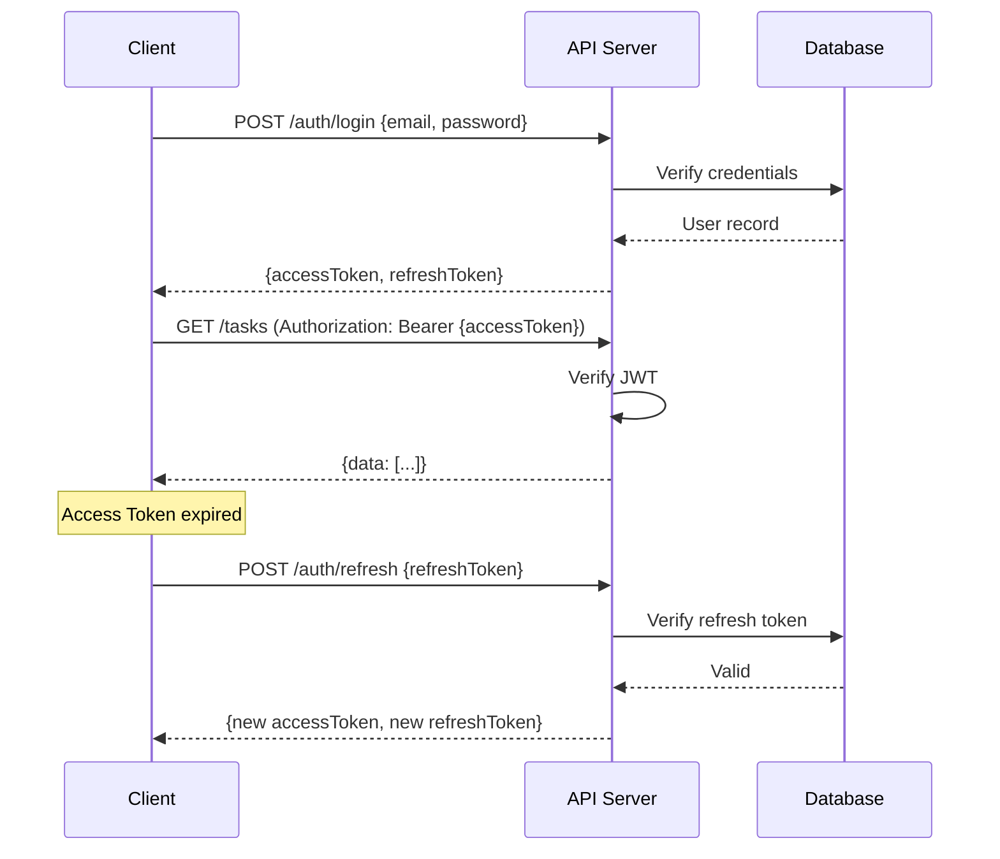
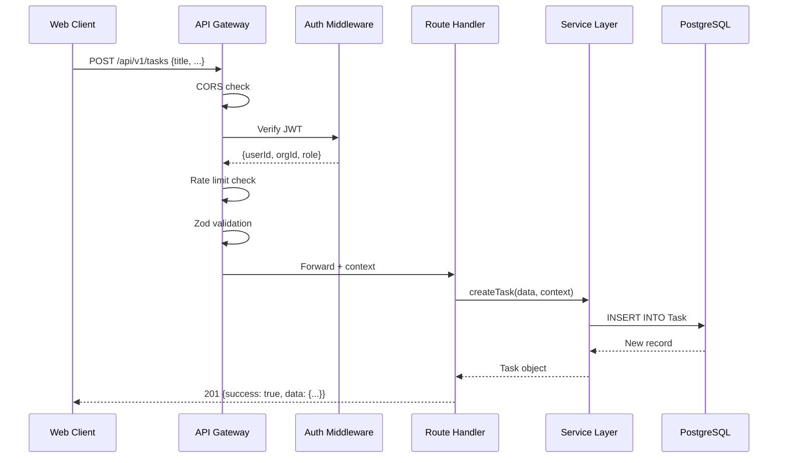
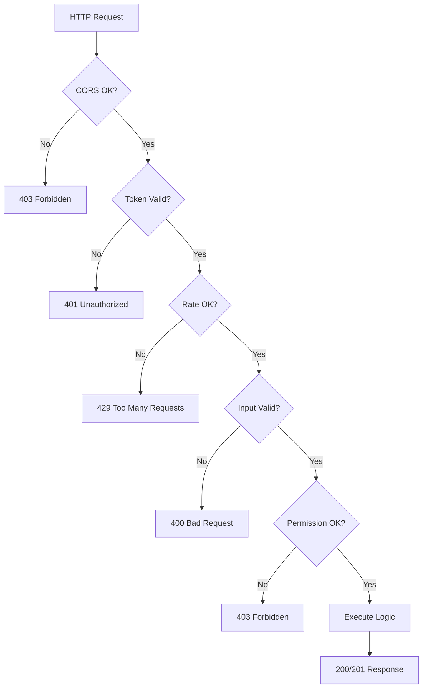

# Howard AIOS API Design Blueprint

版本：v1.0
目的：定义 AIOS 的完整 API 设计——从 RESTful 到 WebSocket 到 SDK 的全方位接口规范。
状态：Active
创建日期：2026-07-07

依赖文档：
- [AIOS Constitution v1.0](../Constitution/AIOS-Constitution-v1.0.md)
- [00-Vision](./00-Vision.md)
- [01-Architecture](./01-Architecture.md)
- [02-Domain-Model](./02-Domain-Model.md)
- [05-Information-Engine](./05-Information-Engine.md)
- [06-Knowledge-Engine](./06-Knowledge-Engine.md)
- [07-Memory-Engine](./07-Memory-Engine.md)
- [08-Reasoning-Engine](./08-Reasoning-Engine.md)
- [09-Workflow-Engine](./09-Workflow-Engine.md)
- [10-Application-Layer](./10-Application-Layer.md)
- [11-Interface-Layer](./11-Interface-Layer.md)
- [12-Infrastructure-Layer](./12-Infrastructure-Layer.md)
- [13-Data-Model](./13-Data-Model.md)

---

## 1. Overview

API Design Blueprint 定义了 Howard AIOS 的所有对外和对内接口规范。API 是 AIOS 与外部世界通信的唯一方式——Web 应用、移动端、桌面应用、第三方集成、CLI 工具都通过统一的 API 层与后端交互。

API 层位于 Interface Layer（L8）和 Application Layer（L7）之间，是安全边界的执行点、请求验证的入口、权限检查的关卡。

---

## 2. Design Goals

**RESTful 优先**：主 API 使用 REST 风格，简洁、直观、生态成熟。

**一致响应格式**：所有 API 使用统一的响应结构（success/data/error/meta），降低客户端处理复杂度。

**版本控制**：API 通过 URL 前缀（`/api/v1/`）进行版本管理，确保向后兼容。

**安全边界**：API 层执行认证、授权、限流、输入验证，是系统的第一道防线。

**自文档化**：通过 OpenAPI 3.0 规范自动生成 API 文档。

---

## 3. Core Components

### 3.1 REST API

REST 是 AIOS 的主要 API 风格，覆盖所有 CRUD 操作。

**URL 规范**：
```
/api/v1/{resource}          → 集合
/api/v1/{resource}/{id}     → 单个资源
/api/v1/{resource}/{id}/{sub-resource}  → 子资源
```

**HTTP 方法**：
| 方法 | 操作 | 幂等 | 示例 |
|------|------|------|------|
| GET | 查询 | 是 | GET /api/v1/tasks |
| POST | 创建 | 否 | POST /api/v1/tasks |
| PATCH | 部分更新 | 否 | PATCH /api/v1/tasks/{id} |
| PUT | 完全替换 | 是 | PUT /api/v1/tasks/{id} |
| DELETE | 删除 | 是 | DELETE /api/v1/tasks/{id} |

**完整路由表**：

| 路由 | 方法 | 说明 |
|------|------|------|
| `/api/v1/auth/login` | POST | 登录 |
| `/api/v1/auth/refresh` | POST | 刷新 Token |
| `/api/v1/auth/logout` | POST | 登出 |
| `/api/v1/auth/me` | GET | 当前用户信息 |
| `/api/v1/organizations` | GET/POST | 组织 CRUD |
| `/api/v1/organizations/{id}` | GET/PATCH/DELETE | 组织详情 |
| `/api/v1/organizations/{id}/users` | GET/POST | 组织成员 |
| `/api/v1/users` | GET/POST | 用户 CRUD |
| `/api/v1/users/{id}` | GET/PATCH/DELETE | 用户详情 |
| `/api/v1/information` | GET/POST | 信息 CRUD |
| `/api/v1/information/{id}` | GET/PATCH/DELETE | 信息详情 |
| `/api/v1/tasks` | GET/POST | 任务 CRUD |
| `/api/v1/tasks/{id}` | GET/PATCH/DELETE | 任务详情 |
| `/api/v1/meetings` | GET/POST | 会议 CRUD |
| `/api/v1/meetings/{id}` | GET/PATCH/DELETE | 会议详情 |
| `/api/v1/decisions` | GET/POST | 决策 CRUD |
| `/api/v1/decisions/{id}` | GET/PATCH/DELETE | 决策详情 |
| `/api/v1/knowledge/entities` | GET/POST | 实体 CRUD |
| `/api/v1/knowledge/entities/{id}` | GET/PATCH | 实体详情 |
| `/api/v1/knowledge/relations` | GET/POST | 关系 CRUD |
| `/api/v1/knowledge/search` | GET/POST | 知识搜索 |
| `/api/v1/memories` | GET/POST | 记忆 CRUD |
| `/api/v1/memories/{id}` | GET/PATCH/DELETE | 记忆详情 |
| `/api/v1/memories/search` | POST | 语义搜索 |
| `/api/v1/workflows/definitions` | GET/POST | 工作流定义 |
| `/api/v1/workflows/definitions/{id}` | GET/PATCH/DELETE | 定义详情 |
| `/api/v1/workflows/instances` | GET | 工作流实例 |
| `/api/v1/workflows/instances/{id}` | GET | 实例详情 |
| `/api/v1/ai/chat` | POST | AI 对话 |
| `/api/v1/ai/analyze` | POST | AI 分析 |
| `/api/v1/ai/suggest` | POST | AI 建议 |
| `/api/v1/prompts` | GET/POST | 提示词模板 |
| `/api/v1/prompts/{id}` | GET/PATCH/DELETE | 提示词详情 |
| `/api/v1/documents` | GET/POST | 文档 CRUD |
| `/api/v1/documents/{id}` | GET/PATCH/DELETE | 文档详情 |
| `/api/v1/upload` | POST | 文件上传 |
| `/api/v1/health` | GET | 健康检查 |

### 3.2 GraphQL（未来）

GraphQL 作为 REST 的补充，在 Phase 3 引入。适用于复杂的数据查询场景（Dashboard 聚合、知识图谱探索）。

**理由**：
- 客户端精确控制返回字段，减少数据传输
- 一次请求获取多个关联资源
- 适合前端复杂视图的数据组合

### 3.3 Webhook

**入站 Webhook**（外部 → AIOS）：
```
POST /api/v1/webhooks/incoming/{webhookId}
```

入站 Webhook 通过 HMAC-SHA256 签名验证请求来源。

**出站 Webhook**（AIOS → 外部）：
当特定事件发生时，AIOS 向注册的外部 URL 发送 POST 请求：
```
POST {externalUrl}
Headers: X-AIOS-Signature: {hmac_signature}
Body: { event: "task.created", data: { ... } }
```

### 3.4 Streaming

AI 对话和长时间推理使用 Server-Sent Events（SSE）流式返回：

```
POST /api/v1/ai/chat
Accept: text/event-stream

data: {"token": "根据"}
data: {"token": "您的"}
data: {"token": "问题"}
data: {"token": "，"}
data: {"done": true, "result": {...}}
```

### 3.5 WebSocket

实时通知使用 WebSocket：

```
ws://host/ws/notifications
```

事件类型：
| 事件 | 说明 |
|------|------|
| task.assigned | 任务被分配给你 |
| task.updated | 你关注的任务状态变更 |
| decision.proposed | 新决策提案 |
| workflow.completed | 工作流执行完成 |
| ai.insight | AI 主动推送洞察 |
| information.received | 新信息到达 |

---

## 4. Architecture

```mermaid
graph TB
    subgraph "Clients"
        WEB[Web App]
        MOBILE[Mobile]
        DESKTOP[Desktop]
        CLI[CLI]
        THIRD[Third Party]
    end

    subgraph "API Gateway"
        CORS[CORS]
        AUTH[JWT Auth]
        RATE[Rate Limiter]
        VALID[Zod Validator]
    end

    subgraph "Route Handlers"
        AUTH_R[/auth]
        ORG_R[/organizations]
        INFO_R[/information]
        TASK_R[/tasks]
        MTG_R[/meetings]
        DEC_R[/decisions]
        KNOW_R[/knowledge]
        MEM_R[/memories]
        WF_R[/workflows]
        AI_R[/ai]
    end

    subgraph "Service Layer"
        SVC[Services]
    end

    WEB --> CORS
    MOBILE --> CORS
    DESKTOP --> CORS
    CLI --> CORS
    THIRD --> CORS
    CORS --> AUTH
    AUTH --> RATE
    RATE --> VALID
    VALID --> AUTH_R
    VALID --> ORG_R
    VALID --> INFO_R
    VALID --> TASK_R
    VALID --> MTG_R
    VALID --> DEC_R
    VALID --> KNOW_R
    VALID --> MEM_R
    VALID --> WF_R
    VALID --> AI_R

    AUTH_R --> SVC
    ORG_R --> SVC
    INFO_R --> SVC
    TASK_R --> SVC
    MTG_R --> SVC
    DEC_R --> SVC
    KNOW_R --> SVC
    MEM_R --> SVC
    WF_R --> SVC
    AI_R --> SVC
```

---

## 5. Authentication

### 5.1 JWT 认证

所有 API（除 `/health` 和 `/auth/login`）需要 JWT Bearer Token。

**Token 类型**：
| Token | 有效期 | 用途 |
|-------|--------|------|
| Access Token | 15 分钟 | API 请求认证 |
| Refresh Token | 7 天 | 获取新 Access Token |

**认证流程**：


### 5.2 Token Payload

```json
{
  "sub": "user-uuid",
  "org": "organization-uuid",
  "role": "FOUNDER",
  "iat": 1688700000,
  "exp": 1688700900
}
```

---

## 6. Authorization

### 6.1 RBAC 权限模型

基于角色的访问控制（Role-Based Access Control），4 个预定义角色：

| 角色 | 说明 |
|------|------|
| FOUNDER | 最高权限，管理组织、成员、权限 |
| ADMIN | 管理数据和工作流 |
| MEMBER | 创建和查看自己相关数据 |
| VIEWER | 只读访问 |

### 6.2 权限矩阵

| 资源 | 操作 | FOUNDER | ADMIN | MEMBER | VIEWER |
|------|------|---------|-------|--------|--------|
| Organization | read | ✅ | ✅ | ✅ | ✅ |
| Organization | write | ✅ | ✅ | ❌ | ❌ |
| User | create | ✅ | ✅ | ❌ | ❌ |
| User | delete | ✅ | ❌ | ❌ | ❌ |
| Task | create | ✅ | ✅ | ✅ | ❌ |
| Task | assign | ✅ | ✅ | ❌ | ❌ |
| Task | delete | ✅ | ✅ | ❌ | ❌ |
| Information | create | ✅ | ✅ | ✅ | ❌ |
| Information | read all | ✅ | ✅ | ❌ | ❌ |
| Decision | create | ✅ | ✅ | ❌ | ❌ |
| Decision | propose | ✅ | ✅ | ✅ | ❌ |
| Knowledge | edit | ✅ | ✅ | ✅ | ❌ |
| Memory | manage | ✅ | ✅ | ❌ | ❌ |
| Workflow | define | ✅ | ✅ | ❌ | ❌ |
| Workflow | trigger | ✅ | ✅ | ✅ | ❌ |
| AI | full | ✅ | ✅ | ✅ | ❌ |
| Prompt | edit | ✅ | ✅ | ❌ | ❌ |

---

## 7. Pagination

### 7.1 游标分页

AIOS 使用游标分页（Cursor-Based Pagination），性能优于偏移分页：

```
GET /api/v1/tasks?cursor={lastId}&limit=20
```

响应：
```json
{
  "success": true,
  "data": [...],
  "meta": {
    "nextCursor": "uuid-of-last-item",
    "hasMore": true,
    "limit": 20
  }
}
```

### 7.2 偏移分页（兼容）

简单场景支持偏移分页：

```
GET /api/v1/tasks?page=2&limit=20
```

---

## 8. Search

### 8.1 全文搜索

```
GET /api/v1/information?q=关键词&sourceType=PLAUD&status=STORED
```

### 8.2 语义搜索

```
POST /api/v1/memories/search
{
  "query": "上个月和客户A讨论了什么",
  "limit": 10,
  "filters": { "tags": ["客户A"] }
}
```

### 8.3 混合搜索

```
POST /api/v1/knowledge/search
{
  "query": "项目A的负责人",
  "mode": "hybrid",
  "weights": { "keyword": 0.3, "semantic": 0.7 }
}
```

---

## 9. Upload

### 9.1 文件上传

```
POST /api/v1/upload
Content-Type: multipart/form-data
```

支持的文件类型：
| 类型 | 扩展名 | 最大大小 |
|------|--------|----------|
| 文档 | pdf, docx, xlsx | 50MB |
| 图片 | jpg, png, webp | 20MB |
| 音频 | mp3, wav, m4a | 100MB |
| 视频 | mp4 | 200MB |

上传流程：
1. 客户端分块上传到 API
2. API 校验文件类型和大小
3. 文件存储到 MinIO
4. 返回文件引用 URL
5. 触发 Information Engine 处理管道

### 9.2 下载

```
GET /api/v1/documents/{id}/download
```

返回预签名的 MinIO URL（有效期 15 分钟）。

---

## 10. OpenAPI

### 10.1 规范

AIOS API 遵循 OpenAPI 3.0 规范，提供自动生成的 API 文档。

**文档端点**：
- `/api/docs` — Swagger UI 交互式文档
- `/api/docs/json` — OpenAPI JSON 规范

### 10.2 自动生成

使用 Zod Schema 自动生成 OpenAPI 规范：
```typescript
import { zodToJsonSchema } from 'zod-to-json-schema';
```

---

## 11. Error Code

### 11.1 错误响应格式

```json
{
  "success": false,
  "error": {
    "code": "VALIDATION_ERROR",
    "message": "title is required",
    "details": [
      { "field": "title", "message": "Required field" }
    ]
  }
}
```

### 11.2 错误码表

| HTTP 状态码 | 错误码 | 说明 |
|-------------|--------|------|
| 400 | VALIDATION_ERROR | 请求参数验证失败 |
| 400 | INVALID_INPUT | 输入格式错误 |
| 401 | UNAUTHORIZED | 未提供有效 Token |
| 401 | TOKEN_EXPIRED | Token 已过期 |
| 403 | FORBIDDEN | 无操作权限 |
| 403 | TENANT_MISMATCH | 尝试访问其他组织数据 |
| 404 | NOT_FOUND | 资源不存在 |
| 404 | RESOURCE_DELETED | 资源已软删除 |
| 409 | CONFLICT | 资源冲突（如重复创建） |
| 413 | FILE_TOO_LARGE | 文件大小超限 |
| 415 | UNSUPPORTED_MEDIA_TYPE | 不支持的文件类型 |
| 422 | BUSINESS_ERROR | 业务逻辑错误 |
| 429 | RATE_LIMIT_EXCEEDED | 请求频率超限 |
| 500 | INTERNAL_ERROR | 服务器内部错误 |
| 503 | SERVICE_UNAVAILABLE | 服务暂不可用 |

---

## 12. Rate Limit

### 12.1 限流策略

| 级别 | 速率 | 说明 |
|------|------|------|
| 全局 | 60 次/分钟/IP | 防止 DDoS |
| 用户 | 120 次/分钟/User | 防止滥用 |
| AI 对话 | 20 次/分钟/User | LLM 成本控制 |
| 上传 | 10 次/分钟/User | 带宽保护 |

### 12.2 限流响应

```
HTTP/1.1 429 Too Many Requests
X-RateLimit-Limit: 60
X-RateLimit-Remaining: 0
X-RateLimit-Reset: 1688700120
Retry-After: 30
```

---

## 13. API Version

### 13.1 版本策略

API 通过 URL 前缀进行版本管理：

```
/api/v1/...  → 当前版本
/api/v2/...  → 下一版本（当有不兼容变更时）
```

### 13.2 版本规则

- 新增字段：不递增版本号（向后兼容）
- 废弃字段：标记 deprecated，保留 2 个版本
- 删除字段：递增版本号
- 行为变更：递增版本号

---

## 14. SDK

### 14.1 官方 SDK（未来）

| 平台 | 语言 | 包名 |
|------|------|------|
| Node.js | TypeScript | `@aiOS/sdk-node` |
| Web | TypeScript | `@aiOS/sdk-web` |
| Python | Python | `aios-sdk-python` |

### 14.2 SDK 设计原则

- 类型安全（TypeScript / Python type hints）
- 自动重试（网络错误和 429）
- 分页封装（自动处理 cursor）
- 认证封装（自动管理 Token 刷新）

---

## 15. Client

### 15.1 API Client 架构

Web 应用内置 API Client：

```typescript
class AiosClient {
  private baseUrl: string;
  private token: string;

  async get<T>(path: string, params?: object): Promise<ApiResponse<T>>;
  async post<T>(path: string, body: object): Promise<ApiResponse<T>>;
  async patch<T>(path: string, id: string, body: object): Promise<ApiResponse<T>>;
  async delete(path: string, id: string): Promise<void>;
}
```

---

## 16. Event API

### 16.1 事件总线

系统内部使用事件总线（Event Bus）进行模块间通信：

| 事件 | 发布者 | 订阅者 |
|------|--------|--------|
| InformationReceived | Information Engine | Knowledge Engine, Workflow Engine |
| KnowledgeUpdated | Knowledge Engine | Reasoning Engine |
| MemoryCreated | Memory Engine | Reasoning Engine |
| TaskCreated | Task Service | Workflow Engine |
| TaskCompleted | Task Service | Notification Service |
| MeetingCompleted | Meeting Service | Information Engine, Task Service |
| DecisionMade | Decision Service | Notification Service |
| WorkflowCompleted | Workflow Engine | Notification Service |
| UserLoggedIn | Auth Service | Audit Service |

### 16.2 事件格式

```json
{
  "eventId": "uuid",
  "eventType": "TaskCreated",
  "timestamp": "2026-07-07T09:00:00Z",
  "organizationId": "uuid",
  "payload": { "taskId": "uuid", "title": "..." },
  "metadata": { "userId": "uuid", "source": "api" }
}
```

---

## 17. Internal API

### 17.1 Service 间调用

Service 之间不直接导入，通过事件或内部 API 通信：

```typescript
// 内部 API（不对外暴露）
GET /internal/knowledge/entities/{id}
POST /internal/memory/recall
POST /internal/reasoning/analyze
```

内部 API 不经过认证中间件，但仍验证 organizationId。

---

## 18. External API

### 18.1 第三方集成 API

为第三方系统提供有限的 API 访问：

| 端点 | 说明 |
|------|------|
| POST /api/v1/information | 推送信息到 AIOS |
| GET /api/v1/tasks | 获取任务列表 |
| POST /api/v1/webhooks/incoming | Webhook 触发 |

第三方 API 使用 API Key 认证（非 JWT）：
```
Authorization: ApiKey {key}
```

---

## 19. Gateway Diagram

```mermaid
graph LR
    subgraph "External"
        WEB_C[Web Client]
        MOB_C[Mobile Client]
        EXT_C[External System]
        WH_C[Webhook Sender]
    end

    subgraph "API Gateway"
        LB[Load Balancer]
        CORS_M[CORS]
        AUTH_M[Auth]
        RATE_M[Rate Limit]
        VAL_M[Validator]
        LOG_M[Logger]
    end

    subgraph "Routes"
        V1[/api/v1/*]
        WH[/api/v1/webhooks]
        WS[/ws/*]
        HEALTH[/health]
    end

    WEB_C --> LB
    MOB_C --> LB
    EXT_C --> LB
    WH_C --> LB
    LB --> CORS_M
    CORS_M --> AUTH_M
    AUTH_M --> RATE_M
    RATE_M --> VAL_M
    VAL_M --> LOG_M
    LOG_M --> V1
    LOG_M --> WH
    WH_C --> WH
    WEB_C --> WS
    LB --> HEALTH
```

---

## 20. Sequence Diagram



---

## 21. API Flow



---

## 22. Lifecycle

### 22.1 API 生命周期

| 阶段 | 说明 |
|------|------|
| DESIGN | API 设计（OpenAPI 规范） |
| SKELETON | 路由骨架创建 |
| IMPLEMENTED | 完整实现 |
| TESTED | 单元测试 + 集成测试通过 |
| DOCUMENTED | OpenAPI 文档生成 |
| DEPLOYED | 生产环境部署 |
| DEPRECATED | 标记废弃，保留兼容 |
| REMOVED | 移除（新版本不再包含） |

---

## 23. Security

### 23.1 请求安全

- HTTPS 强制（生产环境）
- 请求签名（Webhook 入站）
- CSRF 防护（Web 客户端）
- XSS 防护（输出转义）

### 23.2 数据安全

- 敏感字段加密存储
- 响应中不包含密码等敏感字段
- 错误消息不泄露内部实现细节

---

## 24. Summary

API Design Blueprint 定义了 AIOS 的完整接口规范。REST API 覆盖 30+ 端点，支持 CRUD、搜索、上传、流式传输。认证使用 JWT（Access 15min + Refresh 7天），授权使用 RBAC 4 角色模型。统一响应格式、错误码表、分页策略和限流规则确保 API 的一致性和可靠性。事件总线实现模块间松耦合通信，WebSocket 提供实时通知推送。

---

## 25. Future Evolution

### 短期

- 完善所有 REST 路由和 Zod 验证
- 实现 JWT 认证中间件
- 实现 RBAC 权限中间件
- 实现限流中间件

### 中期

- 引入 GraphQL（Dashboard 聚合查询）
- 实现 WebSocket 实时通知
- 实现 SSE 流式 AI 对话
- 发布 OpenAPI 文档

### 长期

- 发布官方 SDK（Node.js / Python）
- 实现 API Marketplace（第三方 API 插件）
- 实现 gRPC 内部通信（性能优化）
- 实现 API 版本自动迁移

---

> 本文档与 Constitution、Vision、Architecture、Domain Model 及全部 Blueprint 保持一致。
> 修改需在 CHANGELOG.md 中记录。
