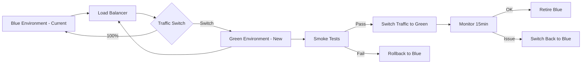
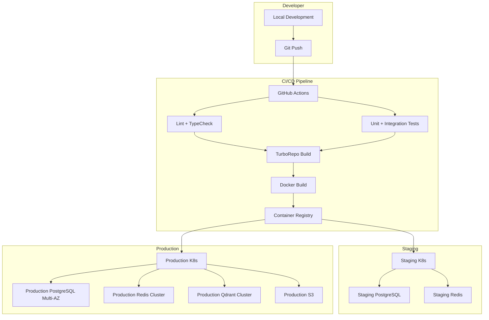
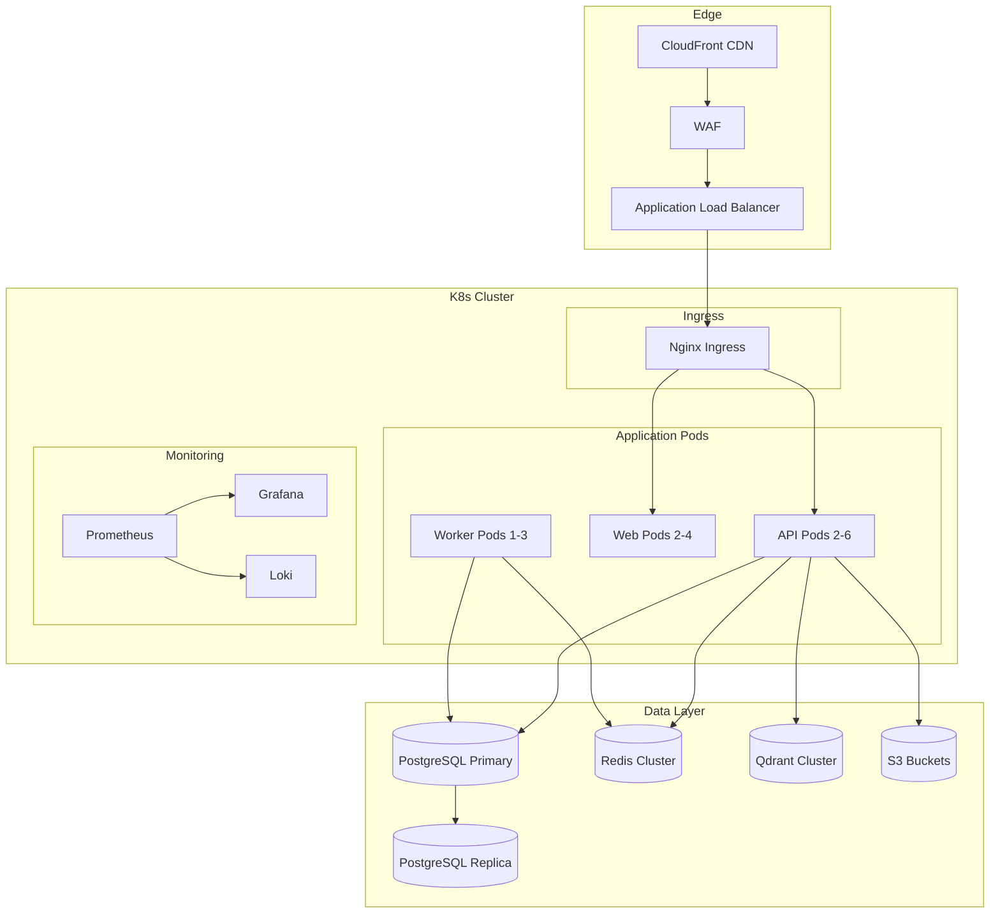
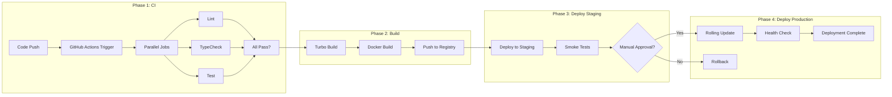
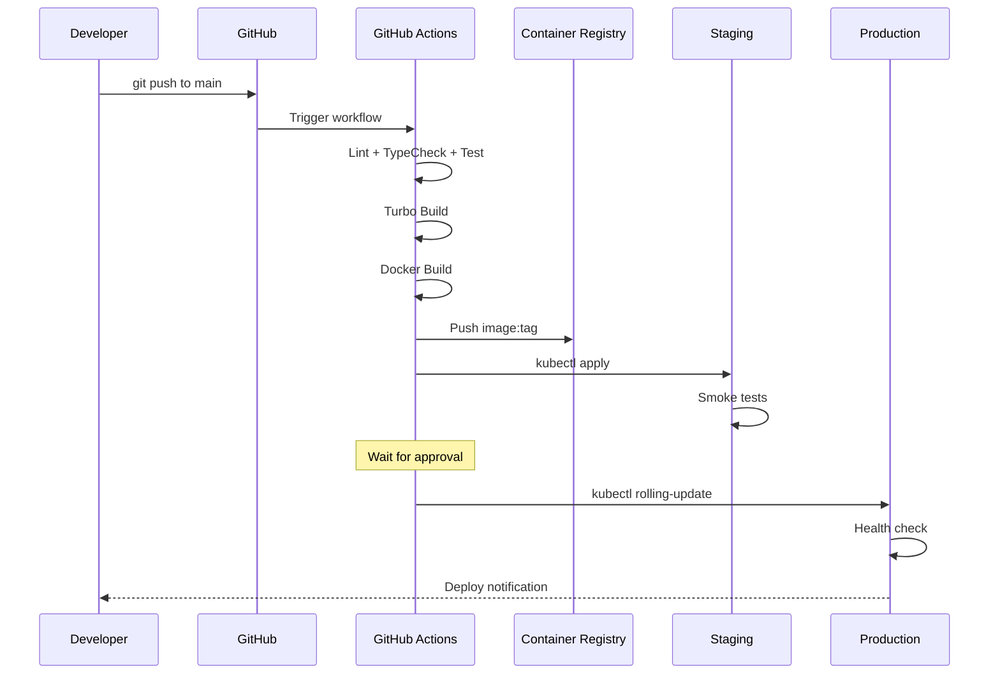

# Howard AIOS Deployment Blueprint

版本：v1.0
目的：定义 AIOS 的完整部署架构——从容器化到 CI/CD 到灾难恢复的端到端部署体系。
状态：Active
创建日期：2026-07-07

依赖文档：
- [AIOS Constitution v1.0](../Constitution/AIOS-Constitution-v1.0.md)
- [00-Vision](./00-Vision.md)
- [01-Architecture](./01-Architecture.md)
- [02-Domain-Model](./02-Domain-Model.md)
- [05-Information-Engine](./05-Information-Engine.md)
- [06-Knowledge-Engine](./06-Knowledge-Engine.md)
- [07-Memory-Engine](./07-Memory-Engine.md)
- [08-Reasoning-Engine](./08-Reasoning-Engine.md)
- [09-Workflow-Engine](./09-Workflow-Engine.md)
- [10-Application-Layer](./10-Application-Layer.md)
- [11-Interface-Layer](./11-Interface-Layer.md)
- [12-Infrastructure-Layer](./12-Infrastructure-Layer.md)
- [13-Data-Model](./13-Data-Model.md)
- [14-API-Design](./14-API-Design.md)
- [15-Security](./15-Security.md)

---

## 1. Overview

Deployment Blueprint 定义了 Howard AIOS 的完整部署架构和运维体系。它覆盖从开发者本地环境到生产云平台的全部部署场景，定义了容器化策略、CI/CD 流程、监控告警、扩缩容和灾难恢复方案。

AIOS 的部署目标是：任何团队成员可以在 10 分钟内搭建完整的开发环境，生产环境可以零宕机部署，系统在故障后 4 小时内恢复。

---

## 2. Design Goals

**可复现**：相同代码 + 相同配置 = 相同环境。Docker 确保开发、测试、生产环境一致。

**零宕机**：生产部署使用滚动更新或蓝绿部署，确保服务不中断。

**自动化**：从代码提交到生产部署，全流程自动化。人工干预仅限于审批环节。

**可观测**：所有服务产生结构化日志、链路追踪和指标数据，实现全方位可观测。

**弹性**：系统支持自动扩缩容，根据负载动态调整资源。

---

## 3. Core Components

### 3.1 Docker（容器化）

所有 AIOS 组件通过 Docker 容器化，确保环境一致性。

**API 服务 Dockerfile**：

多阶段构建，最终镜像基于 Node.js 22 Alpine：

| 阶段 | 基础镜像 | 内容 |
|------|----------|------|
| 构建 | node:22-slim | 安装依赖 + Turbo Build |
| 运行 | node:22-alpine | 仅包含生产代码 |

**镜像大小目标**：< 200MB

### 3.2 Compose（开发环境）

Docker Compose 编排开发环境的所有基础设施：

| 服务 | 镜像 | 端口 | 说明 |
|------|------|------|------|
| postgres | postgres:16 | 5432 | 关系数据库 |
| redis | redis:7 | 6379 | 缓存 + 队列 |
| qdrant | qdrant/qdrant:latest | 6333 | 向量数据库 |
| minio | minio/minio:latest | 9000/9001 | 对象存储 |

**启动命令**：`docker compose -f docker/docker-compose.yml up -d`

**数据持久化**：使用 Docker Volume 确保容器重启不丢数据。

### 3.3 Kubernetes（生产编排）

生产环境使用 Kubernetes（K8s）进行容器编排。

**命名空间**：
| 命名空间 | 用途 |
|----------|------|
| `aios-prod` | 生产应用 |
| `aios-staging` | 预发布环境 |
| `aios-monitoring` | 监控系统 |
| `aios-data` | 有状态服务（DB、Redis、Qdrant） |

**Deployment 配置**：
| 服务 | 副本数 | 资源限制 | 自动伸缩 |
|------|--------|----------|----------|
| API | 2-6 | 512Mi / 0.5 CPU | HPA |
| Web | 2-4 | 256Mi / 0.3 CPU | HPA |
| Worker | 1-3 | 1Gi / 1 CPU | HPA |

### 3.4 CI/CD（持续集成/持续部署）

**CI/CD 工具**：GitHub Actions

**Pipeline 阶段**：

```
Code Push → Lint → Type Check → Unit Test → Build → Docker Build → Push Registry → Deploy
```

| 阶段 | 工具 | 说明 |
|------|------|------|
| Lint | ESLint + Prettier | 代码风格检查 |
| Type Check | TypeScript | 类型安全检查 |
| Unit Test | Vitest | 单元测试 |
| Integration Test | Vitest + Test Containers | 集成测试 |
| Build | TurboRepo | 构建所有包 |
| Docker Build | Docker Buildx | 构建多架构镜像 |
| Push | Docker Registry | 推送到 ECR/GHCR |
| Deploy | kubectl / Helm | 部署到 K8s |

### 3.5 GitHub Actions

**Workflow 文件**：`.github/workflows/ci.yml`

**触发条件**：
| 事件 | 分支 | 动作 |
|------|------|------|
| push | main | 完整 CI + CD to Staging |
| push | develop | CI only |
| pull_request | * | CI only |
| release | tag v* | CD to Production |

**CI 并行化**：Lint、TypeCheck、Test 并行执行，总时间 < 5 分钟。

### 3.6 TurboRepo（构建编排）

TurboRepo 管理 Monorepo 的构建和缓存：

| 任务 | 依赖 | 缓存 |
|------|------|------|
| lint | 无 | 是 |
| typecheck | 无 | 是 |
| test | typecheck | 是 |
| build | typecheck, test | 是 |

**缓存策略**：
- 本地缓存：`.turbo/cache/`
- 远程缓存：Vercel Remote Cache（可选）

### 3.7 PNPM（依赖管理）

PNPM workspace 管理 Monorepo 依赖：

- `pnpm install --frozen-lockfile`：CI 中使用，确保依赖版本一致
- `pnpm turbo build`：Turbo 编排构建
- Content-addressable store：全局共享依赖，减少磁盘占用

### 3.8 Monitoring（监控）

**监控栈**：Prometheus + Grafana

**指标采集**：

| 组件 | 指标 | 采集方式 |
|------|------|----------|
| API | 请求数/延迟/错误率 | Prometheus Metrics 端点 |
| PostgreSQL | 查询延迟/连接数/慢查询 | pg_exporter |
| Redis | 命中率/内存/连接数 | redis_exporter |
| Qdrant | 查询延迟/集合大小 | Qdrant Metrics |
| Node.js | 事件循环延迟/GC/内存 | prom-client |

**关键 SLI/SLO**：

| SLI | SLO |
|-----|-----|
| API P50 延迟 | < 100ms |
| API P99 延迟 | < 500ms |
| API 可用性 | > 99.9% |
| 数据库查询 P95 | < 50ms |
| 向量搜索 P95 | < 200ms |

### 3.9 Logging（日志）

**日志栈**：Loki + Promtail（或 ELK Stack）

**日志格式**：结构化 JSON

```json
{
  "timestamp": "2026-07-07T09:00:00.000Z",
  "level": "info",
  "service": "api",
  "module": "information",
  "message": "Information created",
  "data": { "id": "uuid", "sourceType": "MANUAL" },
  "traceId": "abc-123",
  "organizationId": "uuid"
}
```

**日志级别策略**：
| 级别 | 开发环境 | 生产环境 |
|------|----------|----------|
| debug | 启用 | 禁用 |
| info | 启用 | 启用 |
| warn | 启用 | 启用 |
| error | 启用 | 启用（告警） |

### 3.10 Tracing（链路追踪）

**追踪栈**：OpenTelemetry + Jaeger（或 Grafana Tempo）

**追踪范围**：
- HTTP 请求全链路（Gateway → Route → Service → DB）
- 异步任务执行链路
- LLM 调用链路
- Engine 间调用链路

**采样率**：
- 正常请求：10%
- 错误请求：100%
- 慢请求（> 1s）：100%

### 3.11 Alert（告警）

**告警渠道**：Slack、Email、PagerDuty

| 告警 | 条件 | 严重级别 |
|------|------|----------|
| 高错误率 | 错误率 > 5% 持续 5 分钟 | Critical |
| 高延迟 | P99 > 2s 持续 3 分钟 | Warning |
| 服务宕机 | 健康检查连续失败 3 次 | Critical |
| 磁盘空间 | 使用率 > 85% | Warning |
| 数据库连接 | 连接池 > 90% | Warning |
| 队列堆积 | 待处理 > 100 | Warning |
| 证书过期 | < 30 天 | Warning |

### 3.12 PostgreSQL 部署

| 环境 | 部署方式 | 配置 |
|------|----------|------|
| 开发 | Docker 容器 | 默认配置 |
| Staging | RDS（AWS） | db.t3.medium, 50GB |
| 生产 | RDS（AWS） | db.r6g.large, 200GB, Multi-AZ |

**生产配置**：
- Multi-AZ 高可用
- 自动备份（每日）
- 读取副本（读写分离）
- 连接池（PgBouncer）
- SSL 强制

### 3.13 Redis 部署

| 环境 | 部署方式 | 配置 |
|------|----------|------|
| 开发 | Docker 容器 | 默认配置 |
| Staging | ElastiCache | cache.t3.micro |
| 生产 | ElastiCache | cache.r6g.large, Cluster Mode |

**生产配置**：
- Cluster Mode（多分片）
- 自动故障转移
- 加密传输和静态加密
- 快照（每小时）

### 3.14 Qdrant 部署

| 环境 | 部署方式 | 配置 |
|------|----------|------|
| 开发 | Docker 容器 | 默认配置 |
| 生产 | K8s StatefulSet | 3 节点集群 |

**生产配置**：
- 3 节点集群（高可用）
- Persistent Volume 持久化
- 定期 Snapshot 备份
- Scalar Quantization 节省内存

### 3.15 MinIO 部署

| 环境 | 部署方式 | 配置 |
|------|----------|------|
| 开发 | Docker 容器 | 单节点 |
| 生产 | S3（AWS）或 MinIO 分布式 | 多节点 |

**生产配置**（MinIO 自建时）：
- 4 节点分布式模式
- Erasure Coding（数据冗余）
- 版本化（对象历史）
- 生命周期策略（自动降级存储）

### 3.16 Scaling（扩缩容）

**水平自动伸缩（HPA）**：

```yaml
apiVersion: autoscaling/v2
kind: HorizontalPodAutoscaler
spec:
  minReplicas: 2
  maxReplicas: 6
  metrics:
    - type: Resource
      resource:
        name: cpu
        target:
          type: Utilization
          averageUtilization: 70
```

| 服务 | 最小副本 | 最大副本 | 扩展指标 |
|------|----------|----------|----------|
| API | 2 | 6 | CPU > 70% |
| Web | 2 | 4 | CPU > 70% |
| Worker | 1 | 3 | 队列深度 |

### 3.17 Cloud（云平台）

**首选云平台**：AWS

| 组件 | AWS 服务 |
|------|----------|
| 容器编排 | EKS (Kubernetes) |
| 关系数据库 | RDS PostgreSQL |
| 缓存 | ElastiCache Redis |
| 对象存储 | S3 |
| 负载均衡 | ALB |
| CDN | CloudFront |
| 密钥管理 | Secrets Manager |
| 日志 | CloudWatch + Loki |
| 监控 | CloudWatch + Grafana |
| CI/CD | GitHub Actions + ECR |

**备选云平台**：
- Google Cloud（GKE + Cloud SQL + Memorystore）
- 阿里云（ACK + RDS + Tair）
- Vercel（Next.js 前端部署）

### 3.18 Disaster Recovery（灾难恢复）

| 指标 | 目标值 |
|------|--------|
| RPO（恢复点目标） | 1 小时 |
| RTO（恢复时间目标） | 4 小时 |

**备份策略**：

| 数据 | 备份方式 | 频率 | 保留期 |
|------|----------|------|--------|
| PostgreSQL | pg_dump + WAL | 每日 + 实时 | 30 天 |
| Redis | RDB + AOF | 每小时 | 7 天 |
| Qdrant | Snapshot API | 每日 | 30 天 |
| MinIO/S3 | 版本化 + 跨区域复制 | 实时 | 永久 |

**恢复流程**：
1. 检测故障 → 触发告警
2. 评估影响范围
3. 切换到备用区域（如果有）
4. 从备份恢复数据
5. 验证数据完整性
6. 恢复服务
7. 根因分析
8. 改进措施

### 3.19 Blue Green（蓝绿部署）

蓝绿部署用于关键版本发布：

1. 部署新版本到 Green 环境
2. 运行冒烟测试验证 Green 环境
3. 切换负载均衡器流量到 Green
4. 监控 Green 环境 15 分钟
5. 无问题 → 退役 Blue 环境
6. 有问题 → 立即切回 Blue



### 3.20 Rolling Update（滚动更新）

滚动更新用于常规部署：

1. K8s 逐个替换 Pod
2. 新 Pod 就绪后旧 Pod 才下线
3. `maxSurge: 1`（同时多 1 个新 Pod）
4. `maxUnavailable: 0`（不允许服务降级）
5. 健康检查失败 → 自动回滚

---

## 4. Architecture



---

## 5. Infrastructure Diagram



---

## 6. Deployment Diagram



---

## 7. Deployment Flow



---

## 8. Lifecycle

### 8.1 环境生命周期

| 阶段 | 说明 |
|------|------|
| SETUP | 环境初始化（IaC / Terraform） |
| ACTIVE | 环境运行中 |
| MAINTENANCE | 维护窗口（补丁/升级） |
| TEARDOWN | 环境拆除 |

### 8.2 部署生命周期

| 阶段 | 说明 |
|------|------|
| CODED | 代码编写完成 |
| CI_PASS | CI 全部通过 |
| BUILT | Docker 镜像构建完成 |
| STAGING_DEPLOYED | Staging 部署完成 |
| STAGING_VERIFIED | Staging 验证通过 |
| APPROVED | 生产部署审批通过 |
| PROD_DEPLOYED | 生产部署完成 |
| MONITORED | 生产监控正常 |

---

## 9. Security

### 9.1 部署安全

- Docker 镜像扫描（漏洞检测）
- K8s RBAC（命名空间级别权限）
- Network Policy（Pod 间网络隔离）
- Pod Security Standards（禁止 root 运行）
- Secrets 使用 K8s Secrets 或外部 Vault

### 9.2 供应链安全

- 依赖审计（`pnpm audit`）
- 镜像基础镜像固定版本
- 构建过程可追溯（CI 日志）
- 签名验证（镜像签名）

---

## 10. Summary

Deployment Blueprint 定义了 AIOS 从开发到生产的完整部署体系。开发环境使用 Docker Compose，生产环境使用 Kubernetes。GitHub Actions 实现自动化 CI/CD，TurboRepo 编排 Monorepo 构建。监控使用 Prometheus + Grafana，日志使用 Loki，追踪使用 OpenTelemetry。支持滚动更新和蓝绿部署实现零宕机，备份策略确保 RPO < 1h、RTO < 4h。

---

## 11. Future Evolution

### 短期

- 完善 Docker Compose 开发环境
- 配置 GitHub Actions CI Pipeline
- 部署 Staging 环境
- 配置基础监控

### 中期

- 部署 Production K8s 集群
- 配置完整 Observability 栈
- 实现自动扩缩容
- 实现备份自动化

### 长期

- 多区域部署（多 AZ / 多 Region）
- 基础设施即代码（Terraform/Pulumi）
- GitOps 部署（ArgoCD / Flux）
- 混沌工程（Chaos Engineering）

---

> 本文档与 Constitution、Vision、Architecture、Domain Model 及全部 Blueprint 保持一致。
> 修改需在 CHANGELOG.md 中记录。
