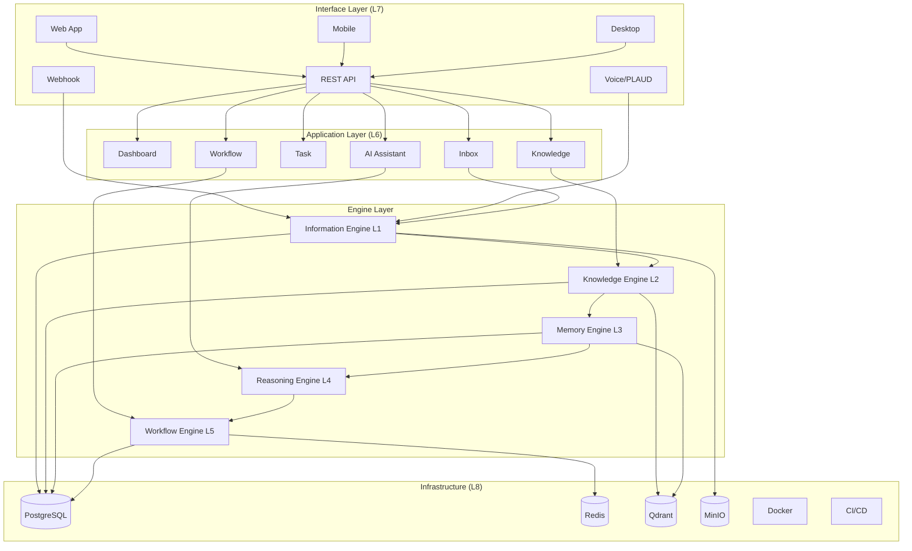
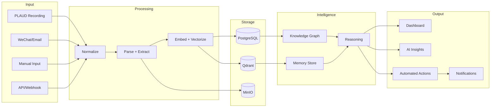
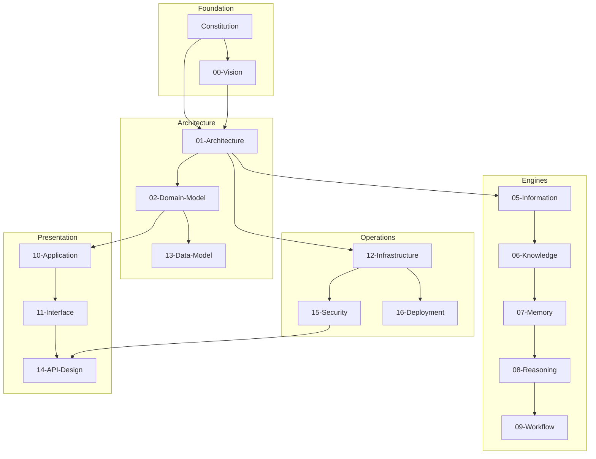
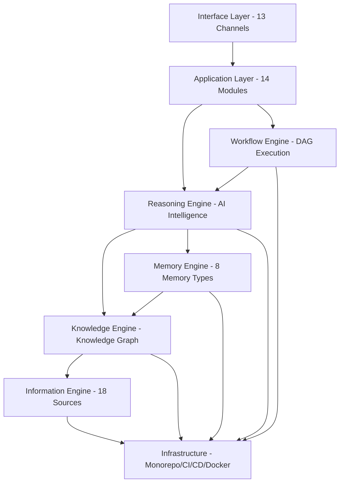

# Howard AIOS Master Blueprint

版本：v1.0
目的：AIOS 的总设计文档——汇总全部 Blueprint，定义系统全局视图和演进路线。
状态：Active
创建日期：2026-07-07

依赖文档（全部 Blueprint）：
- [AIOS Constitution v1.0](../Constitution/AIOS-Constitution-v1.0.md)
- [00-Vision](./00-Vision.md)
- [01-Architecture](./01-Architecture.md)
- [02-Domain-Model](./02-Domain-Model.md)
- [05-Information-Engine](./05-Information-Engine.md)
- [06-Knowledge-Engine](./06-Knowledge-Engine.md)
- [07-Memory-Engine](./07-Memory-Engine.md)
- [08-Reasoning-Engine](./08-Reasoning-Engine.md)
- [09-Workflow-Engine](./09-Workflow-Engine.md)
- [10-Application-Layer](./10-Application-Layer.md)
- [11-Interface-Layer](./11-Interface-Layer.md)
- [12-Infrastructure-Layer](./12-Infrastructure-Layer.md)
- [13-Data-Model](./13-Data-Model.md)
- [14-API-Design](./14-API-Design.md)
- [15-Security](./15-Security.md)
- [16-Deployment](./16-Deployment.md)

---

## 1. Overview

Howard AIOS Master Blueprint 是整个 AIOS 系统的总设计文档。它不是任何单一蓝图的替代品，而是所有蓝图的索引、汇总和全局协调者。

本文档的目标是：任何人（新成员、审查者、创始人）阅读本文档后，能够在 15 分钟内理解 AIOS 的全貌——它是什么、怎么工作、如何构建、将走向哪里。

AIOS 的核心使命：**让 Founder 用更少的时间做出更好的决策，同时让系统自动执行那些不需要人类判断的工作。**

---

## 2. Architecture Summary

### 2.1 八层架构

AIOS 采用八层分层架构，数据从底层向上流动：

| 层级 | 名称 | 核心职责 | 蓝图 |
|------|------|----------|------|
| L1 | Information Layer | 信息采集、标准化、存储 | 05-Information-Engine |
| L2 | Knowledge Layer | 知识图谱、实体关系、语义搜索 | 06-Knowledge-Engine |
| L3 | Memory Layer | 长期记忆、召回、压缩 | 07-Memory-Engine |
| L4 | Reasoning Layer | 意图识别、推理、决策支持 | 08-Reasoning-Engine |
| L5 | Workflow Layer | 工作流编排、执行、监控 | 09-Workflow-Engine |
| L6 | Application Layer | 14 个功能模块 | 10-Application-Layer |
| L7 | Interface Layer | 13 种接入渠道 | 11-Interface-Layer |
| L8 | Infrastructure Layer | Monorepo、CI/CD、监控 | 12-Infrastructure-Layer |

### 2.2 架构风格

**Modular Monolith**：所有模块在同一仓库、同一部署单元，通过严格的模块边界保持松耦合。

**Event-Driven**：模块间通过事件通信，不直接导入其他模块的代码。

**Hexagonal Architecture**：核心业务逻辑与外部适配（数据库、API、AI）分离。

### 2.3 数据流

```
信息输入 → 信息标准化 → 知识提取 → 记忆存储 → AI 推理 → 工作流执行 → 用户界面
```

---

## 3. Domain Summary

### 3.1 三大领域

| 领域 | 核心概念 | 聚合根 |
|------|----------|--------|
| Core Domain | Organization, User, Role, Permission | Organization |
| Business Domain | Meeting, Task, Decision, Document, Message | Task, Decision, Meeting |
| AI Domain | Information, Knowledge, Memory, Reasoning, Workflow | Information, Memory |

### 3.2 核心实体

当前 Prisma Schema 定义 9 个模型：User、Organization、Meeting、Task、Decision、Document、Message、Memory、Information。

未来将新增：KnowledgeEntity、KnowledgeRelation、WorkflowDefinition、WorkflowInstance、AuditLog、ReasoningChain、Connector、Prompt。

### 3.3 领域事件

系统定义 28+ 领域事件，覆盖信息创建、知识更新、任务变更、决策流程、工作流执行等核心业务场景。

### 3.4 多租户隔离

所有业务实体通过 `organizationId` 关联 Organization。RBAC 四角色模型（FOUNDER/ADMIN/MEMBER/VIEWER）控制访问权限。

---

## 4. AI Summary

### 4.1 AI 引擎矩阵

| 引擎 | 层级 | 核心能力 |
|------|------|----------|
| Information Engine | L1 | 18 种信息源采集、8 步处理管道、元数据管理 |
| Knowledge Engine | L2 | 知识图谱、NER、实体消歧、Hybrid Search、RAG |
| Memory Engine | L3 | 8 种记忆类型、向量存储、语义召回、记忆压缩 |
| Reasoning Engine | L4 | 意图识别、多步规划、置信度评估、自我反思 |
| Workflow Engine | L5 | DAG 执行、事件触发、重试补偿、监控日志 |

### 4.2 AI 数据流

```
Information → Knowledge → Memory → Reasoning → Action
   (采集)      (提取)      (存储)     (推理)     (执行)
```

### 4.3 AI 安全

- Prompt Injection 防护（输入清洗 + 角色隔离）
- LLM 输出安全过滤（有害内容检测）
- RAG 检索受多租户隔离
- 推理链可追溯（满足"AI Must Be Explainable"原则）

---

## 5. Engineering Summary

### 5.1 技术栈

| 层次 | 技术 |
|------|------|
| 语言 | TypeScript |
| 运行时 | Node.js 22 LTS |
| 包管理 | pnpm + workspace |
| 构建 | TurboRepo |
| 后端 | Fastify |
| 前端 | Next.js 15 (App Router) |
| ORM | Prisma |
| 数据库 | PostgreSQL 16 |
| 缓存 | Redis 7 |
| 向量 | Qdrant |
| 对象存储 | MinIO / S3 |
| 测试 | Vitest |
| 验证 | Zod |
| 容器 | Docker + Compose |
| CI/CD | GitHub Actions |
| 部署 | Kubernetes (EKS) |
| 监控 | Prometheus + Grafana |
| 日志 | Loki |
| 追踪 | OpenTelemetry |

### 5.2 代码组织

```
Howard-AIOS/
├── apps/          → api (Fastify), web (Next.js)
├── services/      → ai, auth, knowledge, rbac, workflow
├── packages/      → config, database, types, utils
├── connectors/    → 外部连接器
├── agents/        → AI Agent 定义
├── prompts/       → Prompt 模板
├── workflows/     → 工作流定义
├── tests/         → 集成测试
├── docker/        → Docker 配置
├── docs/          → 文档体系
└── development/   → 开发管理
```

### 5.3 依赖规则

- `apps/*` → `services/*` → `packages/*`
- Service 之间不直接导入，通过事件通信
- `packages/*` 只依赖外部 npm 包
- Prisma Schema 是数据类型的唯一真相来源

---

## 6. Overall Architecture



---

## 7. Overall Data Flow



---

## 8. Overall Dependency



---

## 9. Overall Layer



---

## 10. Roadmap

### Phase 1：信息基础设施（第 1 年）

| 里程碑 | 内容 | 对应 Blueprint |
|--------|------|---------------|
| M1.1 | Monorepo + 基础设施搭建 | 12-Infrastructure |
| M1.2 | Information Engine MVP | 05-Information-Engine |
| M1.3 | PLAUD 连接器 | 11-Interface-Layer |
| M1.4 | Inbox + Task Dashboard | 10-Application-Layer |
| M1.5 | REST API + Auth | 14-API-Design + 15-Security |
| M1.6 | Staging 部署 | 16-Deployment |

### Phase 2：知识引擎（第 2 年）

| 里程碑 | 内容 | 对应 Blueprint |
|--------|------|---------------|
| M2.1 | Knowledge Engine MVP | 06-Knowledge-Engine |
| M2.2 | Memory Engine MVP | 07-Memory-Engine |
| M2.3 | Meeting 管理 + PLAUD 集成 | 10-Application-Layer |
| M2.4 | Knowledge 图谱可视化 | 10-Application-Layer |
| M2.5 | Mobile + Desktop 应用 | 11-Interface-Layer |
| M2.6 | Production 部署 | 16-Deployment |

### Phase 3：智能决策（第 3 年）

| 里程碑 | 内容 | 对应 Blueprint |
|--------|------|---------------|
| M3.1 | Reasoning Engine MVP | 08-Reasoning-Engine |
| M3.2 | AI Assistant 对话界面 | 10-Application-Layer |
| M3.3 | Workflow Engine MVP | 09-Workflow-Engine |
| M3.4 | 第三方集成（Slack/钉钉） | 11-Interface-Layer |
| M3.5 | GraphQL API | 14-API-Design |
| M3.6 | ABAC 细粒度权限 | 15-Security |

### Phase 4：自动化执行（第 4 年）

| 里程碑 | 内容 | 对应 Blueprint |
|--------|------|---------------|
| M4.1 | 端到端工作流自动化 | 09-Workflow-Engine |
| M4.2 | AI Agent 框架 | 08-Reasoning-Engine |
| M4.3 | MCP 集成 | 11-Interface-Layer |
| M4.4 | 多区域部署 | 16-Deployment |

### Phase 5：数字孪生（第 5 年）

| 里程碑 | 内容 | 对应 Blueprint |
|--------|------|---------------|
| M5.1 | Founder Memory Profile | 07-Memory-Engine |
| M5.2 | 自主决策 Agent | 08-Reasoning-Engine |
| M5.3 | AIOS 生态市场 | 10-Application-Layer |
| M5.4 | 联邦学习 | 06-Knowledge-Engine |

---

## 11. Technical Debt

### 当前技术债务

| 债务 | 影响 | 优先级 | 计划偿还时间 |
|------|------|--------|-------------|
| 八层架构命名在不同文档中不完全一致 | 低 | P2 | Phase 1 结束时统一 |
| 部分 Blueprint 缺少代码骨架实现 | 低 | P3 | Phase 1-2 逐步实现 |
| 缺少 E2E 测试 | 中 | P2 | Phase 1 结束时 |
| 缺少性能基准测试 | 中 | P3 | Phase 2 |
| 文档与代码同步机制 | 低 | P3 | Phase 2 |

### 技术债务管理原则

- 新功能开发不引入新技术债务
- 每个 Sprint 预留 20% 时间偿还债务
- 技术债务记录在 CHANGELOG 和待办事项中
- 高优先级债务在下一个 Sprint 中解决

---

## 12. Future Plan

### 短期（6-12 个月）

- 完成所有 Blueprint 的代码骨架
- Information Engine 完整实现（CRUD + PLAUD + 10 种信息源）
- Inbox + Task Dashboard 上线
- REST API + JWT Auth + RBAC 中间件
- Staging 环境部署

### 中期（1-3 年）

- Knowledge Engine + Memory Engine 上线
- Reasoning Engine MVP
- Workflow Engine 基础版
- Mobile 和 Desktop 应用
- Production 部署（AWS）
- 第三方集成（Slack/钉钉/企业微信）

### 长期（3-5 年）

- AI Agent 框架和多 Agent 协同
- MCP 集成和生态市场
- 多区域部署和联邦学习
- Founder Digital Twin
- SOC 2 / ISO 27001 认证

---

## 13. Enterprise Evolution

### 从工具到平台到生态

| 阶段 | 定位 | 特征 |
|------|------|------|
| 工具 | 个人效率工具 | 信息管理 + 任务管理 |
| 系统 | 团队操作系统 | 知识引擎 + 协作 + 自动化 |
| 平台 | AI 运营平台 | AI 推理 + Agent + 工作流 |
| 生态 | 创始人生态 | 多 Agent + 联邦 + 市场 |

### 从单体到服务到生态

| 阶段 | 架构 | 特征 |
|------|------|------|
| Modular Monolith | 单仓库单部署 | 当前阶段 |
| Service-Oriented | 按层拆分服务 | Phase 3-4 |
| Platform | API 市场 + 插件 | Phase 5 |
| Ecosystem | 第三方开发者生态 | 长期愿景 |

---

## 14. AIOS Vision 2035

**2035 年的 AIOS**：

AIOS 不再是一个"软件"。它是创始人数字存在的操作系统——管理信息、知识、决策、执行和协作的完整数字基础设施。

**AIOS 的能力**：
- 自动从所有渠道采集、理解、组织信息
- 维护完整的知识图谱，随时可以回答任何业务问题
- 拥有创始人风格的长期记忆，理解上下文和历史
- 主动识别风险、机会和趋势，提供前瞻性建议
- 自动执行不需要人类判断的工作流程
- 在创始人不在时维持系统的正常运转
- 持续学习、持续进化、永不遗忘

**AIOS 的边界**：
- 最终决策永远由人类完成（Human Always Wins）
- AI 必须可解释（AI Must Be Explainable）
- 信息永远不消失（Information Never Disappears）
- 数据主权属于创始人（Data Sovereignty）

---

## 15. Blueprint Index

| 编号 | 文档 | 说明 | 状态 |
|------|------|------|------|
| - | Constitution | 项目最高纲领 | ✅ |
| 00 | Vision | 产品愿景蓝图 | ✅ |
| 01 | Architecture | 八层架构蓝图 | ✅ |
| 02 | Domain Model | DDD 领域模型 | ✅ |
| 05 | Information Engine | 信息引擎 | ✅ |
| 06 | Knowledge Engine | 知识引擎 | ✅ |
| 07 | Memory Engine | 记忆引擎 | ✅ |
| 08 | Reasoning Engine | 推理引擎 | ✅ |
| 09 | Workflow Engine | 工作流引擎 | ✅ |
| 10 | Application Layer | 应用层 | ✅ |
| 11 | Interface Layer | 接入层 | ✅ |
| 12 | Infrastructure Layer | 基础设施 | ✅ |
| 13 | Data Model | 数据模型 | ✅ |
| 14 | API Design | API 设计 | ✅ |
| 15 | Security | 安全架构 | ✅ |
| 16 | Deployment | 部署架构 | ✅ |
| 17 | Master Blueprint | 总设计文档 | ✅ |

---

## 16. Lifecycle

### 16.1 Blueprint 生命周期

| 阶段 | 说明 |
|------|------|
| DRAFT | 蓝图中定义，尚未开始实现 |
| SKELETON | 代码骨架已创建 |
| ACTIVE | 核心功能实现 |
| STABLE | 稳定运行 |
| EVOLVING | 功能演进中 |

### 16.2 当前 Blueprint 状态

所有 17 份 Blueprint 已完成，处于 DRAFT 阶段（文档完成，等待代码实现）。

---

## 17. Security

### 全局安全原则

- **纵深防御**：六层安全架构（Network → API → Application → Data → AI → Audit）
- **零信任**：所有请求必须认证和授权
- **最小权限**：RBAC + 多租户隔离
- **AI 安全**：Prompt Injection 防护 + LLM 输出过滤
- **数据主权**：创始人拥有全部数据控制权

详细设计参见 [15-Security](./15-Security.md)。

---

## 18. Summary

Howard AIOS Master Blueprint 汇总了全部 17 份 Blueprint，定义了 AIOS 的全局视图。八层架构（Information → Knowledge → Memory → Reasoning → Workflow → Application → Interface → Infrastructure）构成了系统的骨架。五大 AI 引擎（Information/Knowledge/Memory/Reasoning/Workflow）提供了从信息采集到自动执行的完整智能管道。14 个应用模块和 13 种接入渠道覆盖创始人的所有工作场景。完整的安全架构、部署体系和监控方案确保系统可靠运行。五年路线图从信息基础设施逐步演进到创始人数字孪生。

**AIOS 不只是软件。它是创始人的第二大脑和第二执行系统。**

---

## 19. Future Evolution

### AIOS 演进时间线

| 时间 | 里程碑 |
|------|--------|
| 2026 Q3 | Blueprint 体系完成，开始 Coding Sprint |
| 2026 Q4 | Information Engine MVP + Inbox + Task |
| 2027 H1 | Knowledge Engine + Memory Engine |
| 2027 H2 | Reasoning Engine + AI Assistant |
| 2028 | Workflow Engine + 第三方集成 |
| 2029 | Multi-Agent + MCP |
| 2030 | Founder Digital Twin |
| 2035 | AIOS Ecosystem |

---

> 本文档是 AIOS 的总设计文档。所有 Blueprint 必须与本文档保持一致。
> 修改需在 CHANGELOG.md 中记录。
