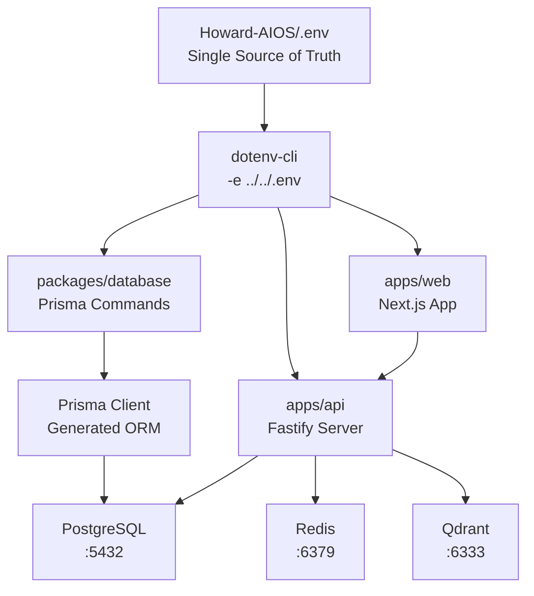
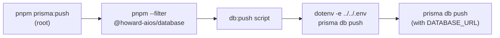
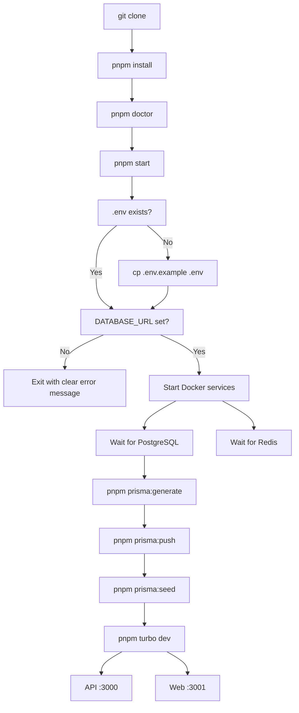

# Development Environment Architecture

> Howard AIOS Monorepo Environment Design

---

## Environment Variable Flow



---

## Command Resolution Path



---

## Directory Layout

```
Howard-AIOS/
├── .env                          ← ALL environment variables live here
├── .env.example                  ← Template for new developers
├── package.json                  ← Root scripts: prisma:*, doctor, start
├── dev.sh                        ← Auto-checks DATABASE_URL before Prisma
│
├── packages/
│   └── database/
│       ├── package.json          ← db:* scripts with dotenv -e ../../.env
│       ├── prisma/
│       │   └── schema.prisma     ← Database schema (uses env("DATABASE_URL"))
│       └── src/
│           ├── index.ts          ← PrismaClient export
│           └── seed.ts           ← Demo data seeder
│
├── apps/
│   ├── api/                      ← Reads DATABASE_URL from process.env
│   └── web/                      ← Reads NEXT_PUBLIC_* from process.env
│
└── scripts/
    ├── doctor.sh                 ← Environment health checker
    ├── check.sh                  ← Guardian checks
    └── smoke-test.sh             ← Smoke test
```

---

## Startup Sequence



---

## Why Root `.env`?

| Approach | Problem |
|----------|---------|
| `packages/database/.env` | Duplicate config, easy to forget to sync |
| `export DATABASE_URL` | Manual, error-prone, lost on terminal close |
| Root `.env` + dotenv-cli | **Single source of truth, automatic, zero-config** |

### How It Works

1. **Root `.env`** contains `DATABASE_URL=postgresql://...`
2. **`packages/database/package.json`** scripts use `dotenv -e ../../.env -- prisma ...`
3. **`dotenv-cli`** loads the root `.env` into the subprocess environment
4. **Prisma** reads `DATABASE_URL` from the environment
5. **No export, no copy, no manual steps**

---

## Doctor Health Checks

`pnpm doctor` verifies 8 components:

| # | Check | What It Tests |
|---|-------|---------------|
| 1 | Docker | Docker daemon running |
| 2 | PostgreSQL | Database reachable via Docker or local |
| 3 | Redis | Cache reachable via Docker or local |
| 4 | Qdrant | Vector DB reachable via Docker or local |
| 5 | DATABASE_URL | Root `.env` contains valid URL |
| 6 | Prisma Client | Client generated in node_modules |
| 7 | API | Health endpoint responding |
| 8 | Web | Frontend serving pages |

Each failure provides a **specific fix command**, not just an error message.

---

## Prisma Configuration Evolution

| Version | Config Location | Status |
|---------|----------------|--------|
| Prisma 5 | `package.json#prisma` | Working |
| Prisma 6 | `package.json#prisma` | **Deprecated warning** |
| Prisma 7 | `package.json#prisma` | **Removed** |
| Howard AIOS | `dotenv-cli` + root scripts | **Future-proof** |

The project uses `dotenv-cli` instead of Prisma's config file mechanism because:
- Works across all Prisma versions
- No dependency on `prisma.config.ts` (Prisma 7+ only)
- Explicit and transparent — each script shows exactly what it does
